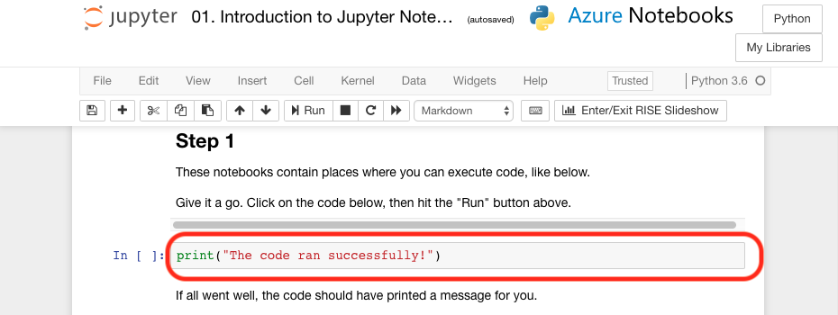
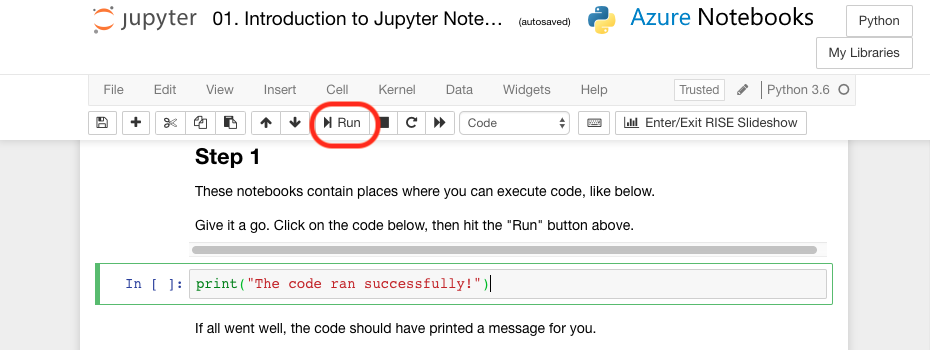
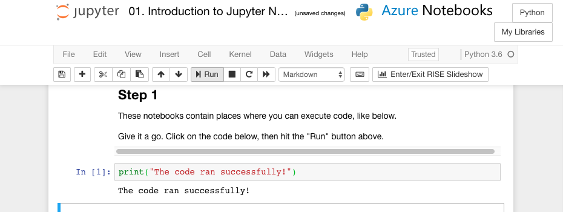

**Python users** click __[here](https://notebooks.azure.com/home/libraries/Python "here")__ to go to your library.  
Select the exercise `01. Introduction to Jupyter Notebooks and Data - Python.ipynb`.  
Then click then click __'Run on Free Compute'__.  

**R users** click __[here](https://notebooks.azure.com/home/libraries/R-Exercises "here")__ to go to your library.  
Select the exercise `01. Introduction to Jupyter Notebooks and Data - R.ipynb`.  
Then click then click __'Run on Free Compute'__.  

If you haven’t set up your library and Azure Notebooks account the link above won't work. For instructions to get started click [__here__](https://aischool.microsoft.com/en-us/machine-learning/learning-paths/ml-crash-course/introduction-to-ai/introduction-to-azure-notebooks).  

__Please remember: to run a code block you need to click on block.__  

A green border will then appear around the block, and you can press '__Run__' to run the code block.  

And now the output should have appeared.

