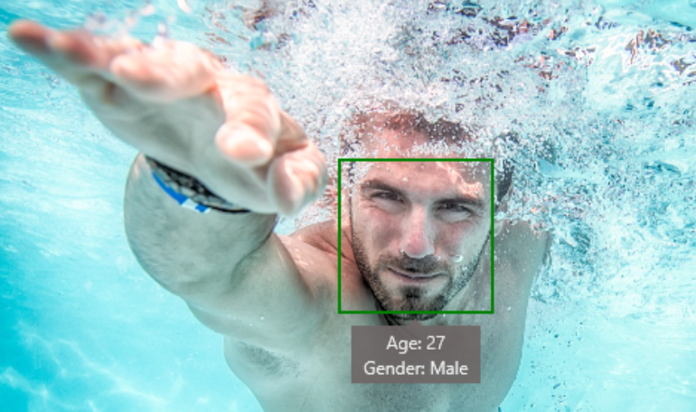

Every time you use a voice assistant on your mobile phone, or there’s a suggestion to tag a friend in a photo on social media, that’s deep learning.

### Natural language processing

Natural language processing (NLP) uses AI models to analyze language for you. NLP includes spell checking, translation between languages, speech recognition, chatbots, sentiment analysis, key phrases extraction, and many other areas.  

![Image showing a video of a person talking directly to the camera. A box is underneath the video that reads: "Hi I'm Doug from office. I want to give you a quick overview of what is office 2016" - 0:00:01. Several words are bolded - Doug, office and the final office. Underneath this there are three italicized phrases - "Microsoft Office", "Microsoft Office Home", and "Office 2016". Underneath this reads: "Office 365 and Office online Office 2016 is like the disk ways to get input in our one computer at home" - 0:00:06, with all "office"'s, computer, and home bolded. Beneath this is "Office 365" italicized. On the right-hand side of the image, there are three boxes showing "72 key words", "12 labels", and "Sentiments". In the "72 keywords" box, it shows keywords as buttons - latest version, security updates, updates, tools, and a "+68" button, indicating there are 68 more key words left. The "latest version" keyword is highlighted, and there is a progress bar indicating where "latest version" appears in the video. In the "12 labels" box, it shows labels as buttons - person, 'man', wearing shirt, purple, and a +7 button, indicating there are seven more labels left. The "person" keyword is highlighted, and there is a progress bar indicating where "person" appears in the video. In the "sentiments" box, it shows  a progress bar indicating where negative sentiments (in red) and positive sentiments (in green) appear in the video. It also states the video has 15.14% positive, and 14.18% negative sentiments.](../media/62-nlp.png)

### Computer vision

Computer vision, sometimes known as image recognition, can analyze images and extract features from them (such as objects, colors, locations, or animals). Computer vision can be extended to videos for real-time information. Some services combine computer vision with speech recognition for video analytics.

Computer vision has significantly enhanced the ability to use search engines for images. Custom vision allows users to easily train their own computer vision models in the browser. Users can then use these models in their own individual applications, such as checking for hard-hat compliance in dangerous work areas.

### Recommendations

TV shows you may be interested in, new products based on your previous purchases, friends to add to your networks, and advertisements that appear when you browse the web are all applications of deep learning recommendation systems.

Next up is an introduction to convolutional neural networks (CNNs).
