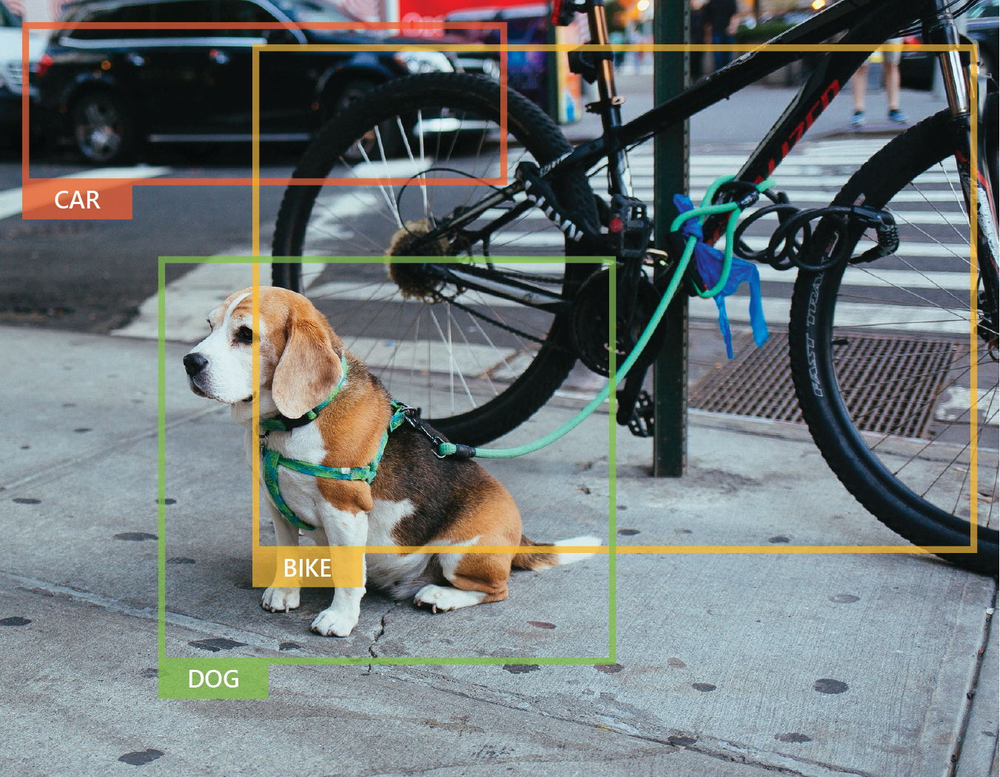

Convolutional neural networks (CNNs) are a class of deep neural networks, most commonly used in computer vision applications. 

Convolutional refers to the network pre-processing data for you. This task was traditionally programmed by data scientists. The neural network can learn how to do pre-processing, applying filters for things such as edge detection.

![Image showing the structure of a CNN. On the left-hand side, there is a box with the image of a dog, and it is labeled 'image input'. Following this is three layers of squares, titled convolutional layers, with a label 'preprocess images'. The layers are linked by squares that are highlighted and joined with black lines. The far-right square is joined to a neural network to the right of it. In this network, there are three layers of circles (nodes) - a left-hand layer with three nodes, a center layer with five nodes labeled 'hidden layer' and an output layer with four nodes labeled 'output layer'. There are arrows linking each node with each node on the adjacent layers. To the right of the neural network is a rectangle titled 'softmax', with the label 'outputs classification probabilities', and 'categorical outputs (e.g. dog breeds)'.](../media/63-cnn.png)

In the image above, the convolutional layers prepare the data from the image before a large neural network analyzes it.

Pre-processing allows the data to be transformed into a state where the neural network can analyze it more easily - providing very accurate results.

## You Only Look Once - YOLO

YOLO is a popular CNN algorithm written in Python that is used for real-time object detection. YOLO uses a single neural network on an image - predicting bounding boxes and class probabilities.

Having the entire detection pipeline in a single neural network gives YOLO major performance benefits. YOLO can perform accurate analysis of over 9000 different object categories in real time.

YOLO can analyze every frame from most cameras. You are able to make a tradeoff - increasing the speed of analysis for a slight decrease in accuracy. However YOLO performs quite well analyzing between 30 and 60 images per second.

### Softmax

Softmax is an activation function used in neural networks. CNNs commonly use softmax in the final layers of a classification model because softmax outputs probabilities for multiple classes. This has proven to be quite successful for multiclass classifications using CNNs and other deep neural networks.  
  
![Image showing the structure of a CNN. On the left-hand side, there is a box with the image of a dog, and it is labeled 'image input'. Following this is three layers of squares, titled convolutional layers, with a label 'preprocess images'. The layers are linked by squares that are highlighted and joined with black lines. The far-right square is joined to a neural network to the right of it. In this network, there are three layers of circles (nodes) - a left-hand layer with three nodes, a center layer with five nodes labeled 'hidden layer' and an output layer with four nodes labeled 'output layer'. There are arrows linking each node with each node on the adjacent layers. To the right of the neural network is a rectangle titled 'softmax', with the label 'outputs classification probabilities'. To the right of this is some text which aligns with each arrow from the output layer, with the title 'categorical outputs'. Each arrow has text: 1. Labrador Retriever (likelihood = 0.007), 2. German Shepherd (likelihood = 0.015, 3. French Bulldog (likelihood = 0.003), 4. Husky (likelihood - 0.975).](../media/63-cnn-2.png)
  
As you can see above, Softmax outputs multiple probabilities adding up to 1. The probability that the data softmax has analyzed represents a lion is given as 0.98, whereas the next closest  is a wolf at 0.008 - we will predict the original image is a lion.  

### Validation sets

It can be time consuming and computationally expensive to use a large training dataset only to find out at the end of training that overfitting has occurred and you have low accuracy on your test set. Validation sets are used alongside your training set *during training*, rather than test sets which are used after training.

The validation set gives an unbiased result for your algorithm to use to detect overfitting as it is occurring. If the validation sets error begins to increase by a certain amount, overfitting may be occurring, and training can be stopped. This process is called early stopping.

The size of your validation set varies depending upon your application. A good starting point is to allocate 60% of your data to a training set, 20% to a validation set, and 20% to a test set.

Next up we'll build your first CNN in Azure Notebooks, using softmax and validation sets.
