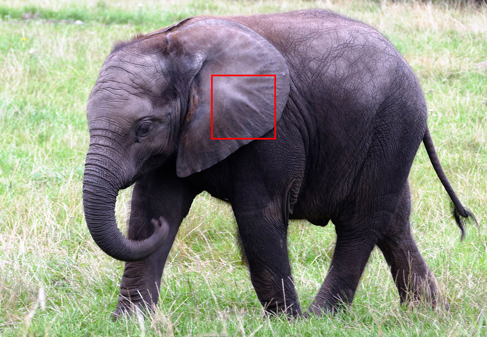

## Neural networks

Now we’ve covered the fundamentals and core algorithms of machine learning, we’ll look at one of the hottest topics in computer systems - neural networks. We’ll work through the core principles behind neural networks, how to make them easily with TensorFlow, and how to implement them effectively.

Originally hypothesised in the 1940s, neural networks are now one of the main tools used in modern machine learning. Neural networks can be used for both regression and categorization applications. Recent advances with storage, processing power, and open-source tools have allowed many successful applications of neural networks in medical diagnosis, filtering explicit content, speech recognition and machine translation.

### Nodes

Neural networks are made up of connected __nodes__, which data passes through. A node combines data sent to it from other nodes, then outputs the combined data to nodes further down the neural network. (Like brain pathways made up of neurons connected together by synapses.)

Nodes are contained in __layers__. Like other AI models we have used in this course, neural networks have an input layer (our features) and an output layer (our labels). Where neural networks differ is what is in between the input and output layers - __hidden layers__.

These layers are considered ‘hidden’ because they are not seen in the training set. Like our previous examples in this course, training sets for neural networks only contain our input (features) and output (labels).

Deep learning and other variations of neural networks are very similar. The difference is in how the nodes are arranged and which nodes are connected to other nodes. For example, computer vision looks at the pixels close to a data point.

So to predict that what’s in this red square is part of a elephants’s ear, the neural network would look closely around the red square, and not at the grass at the bottom of the image.

## Summary

Neural networks aren't difficult if we break them down to their individual components. Here we introduced:

* __Nodes__ - parts of the neural network which combine data from other nodes, and output the combined data to nodes further down the neural network.
* __Input layer__ - the features from an example we input into the model, the same as we have used previously in the course.
* __Output layer__ - where we apply the labels to the examples.
* __Hidden layers__ - where nodes are contained and data travels through. These layers are not seen in the training set.

Don't worry if that didn't completely make sense - the next section is on layers and how they connect. Click __'Next Step'__ and let's go!

We will cover deep learning applications, such as computer vision and text analysis in the next module.