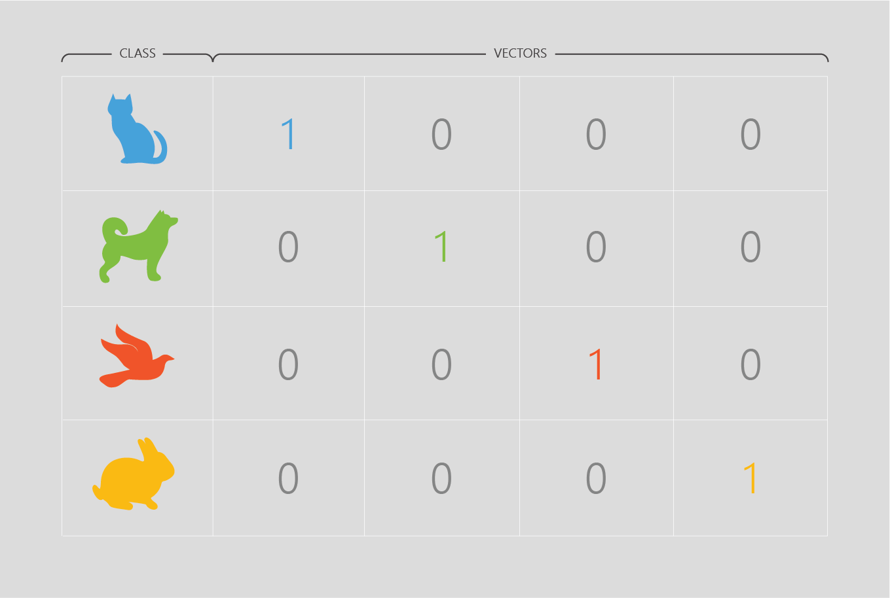

When data travels through the edges, it is multiplied by a value that we call a weight. Each edge has a different weight that starts off as a random value. The value of weights can be positive or negative. Weights are then optimized by gradient descent to give accurate outcomes.

## Cost function refresher

* __Cost__ is our error metric, which we want to get as low as possible.
* We determine our cost with the __cost function__.
* Different AI models have different cost functions.

### Gradient descent

Gradient descent optimizes the AI models to minimize their cost. It is the most widely used optimization algorithm in AI and is used in some form in almost all model training set-ups. There are several variations for different applications, but they all use the same core concepts.

Gradient descent alters model predictions to decrease the error by using calculus, but you don’t have to dive into the mathematics to do AI.

![3-dimensional plot showing gradient descent. The Y-axis represents Cost, the X-axis represents Variable 1, and the Z-axis represents variable 2. There are two peaks for cost at different sides of the graph, which decrease variably into two minima. One minimum is labeled as a local minimum, and the other is labeled as the minimum. As the decrease in Cost is variable, there is no way to get from the local minimum to the actual minimum without increasing cost. On one of the peaks, there is a starting point shown in white, with small linear jumps represented by a black line, as the variables 1 and 2 change, showing the decrease in cost at different values. However, the starting points of the variables dictate if the gradient descent will reach the local minimum (and thus not the minimum possible cost), or the actual minimum. This is why gradient descent runs multiple times and starts with random values to find the actual minimum.](../media/a-1.png)

### Using a category as a feature - one-hot vectors

Often you may have a category in your dataset you want to use as a feature – such as a products country of origin. To use a category as a feature you represent the category as a __one-hot vector__.

A one-hot vector is a vector (list) where each position in the list represents a different category. The vector is filled with 0’s and with one 1. In the example above we are representing 4 animals, where a 1 in the first position represents a cat, and a 1 in the fourth position represents a rabbit. Now your category is useable by a machine learning model.

In the previous module, you saw the logistic regression algorithm optimize the number of correctly classified examples. Optimization is achieved by two methods that happen behind the scenes in AI: cost function and gradient descent.

Up next we've got an exercise where you will code a simple neural network.
