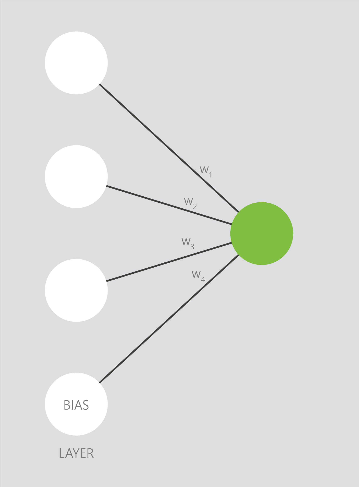
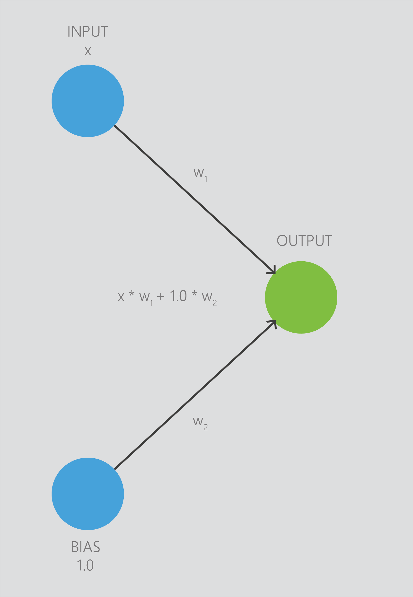
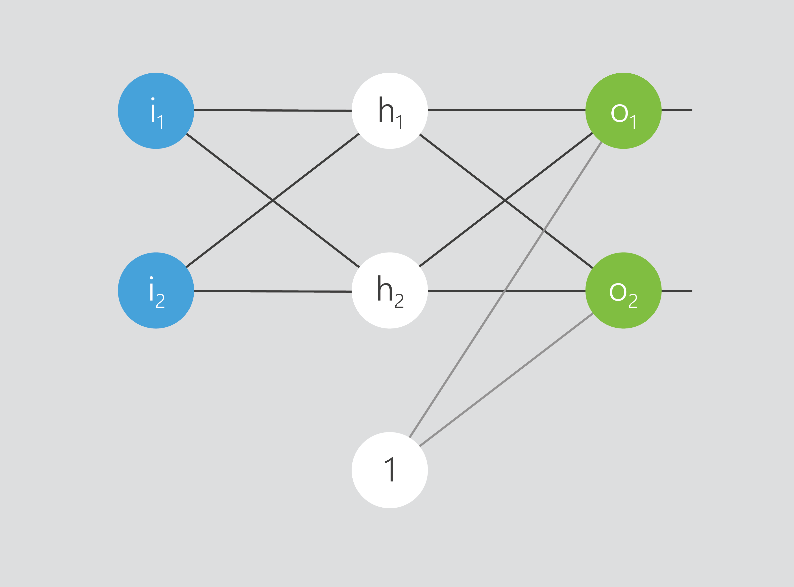

## Activation functions

Edges are not always active - nodes can turn themselves “off” if all the value of the data that has arrived at the node is too low. Nodes are turned on and off by an activation function - which is chosen by the user.

Activation functions are similar in practice to using different kernels in support vector machines. You don’t need to know the details of how they work, you just need to know that you need to try different activation functions and see which one gives you the best result.

When you have a large neural network, it might seem that a lot of data will be travelling through it. However, many times a node is not passing through any data at all - it is turned off. This is because activation functions regulate the output from nodes. Users choose activation functions for different layers.

### Choosing an activation function

There are many activation functions that we can apply to a neural network. ReLu and tanh are two of the most popular activation functions used with neural networks today.

### Optional: activation functions explained
:::tutorial-optional-section {tutorial-optional-section=Optional:&nbsp;Activation&nbsp;functions&nbsp;explained}

Based on the output of the node, an activation function determines if the node should be turned “on”. It evaluates the value of the output, and if it is below a certain threshold it stops the output - turning the node “off”.  
  
Different activation functions have different thresholds for turning a node off. Many activation functions will limit the value of the output to a maximum of 1.  
  
Some modern algorithms, such as reptile, can automatically test different activation functions and give you the best result.
:::
  
:::tutorial-optional-section {tutorial-optional-section=Optional:&nbsp;Bias}
Each layer in a neural network can optionally contain a bias. A bias is a node which does not take in any data, but is always “on”. This allows for more flexibility of neural networks.  
  

  
Bias is commonly represented by the number 1 (i.e. they are always “on”). The value of the bias is added onto the value that the node receives from all connections.  
  

  
In the picture above, the bias the the node receives is 1 * w1. Bias nodes always output 1, so the blue node will always receive the weight of the edge that connects itself with the bias.
  

  
As data comes into a node, it is changed by the weight of the edge and the bias.  
  
This result is evaluated by the activation function as it is leaving the node, when the result is due to be sent to the next layer. 

### Bias summary

Edges connect nodes from different layers together, and contain a weight. Weights are a value which is multiplied to the data coming into the node. The weights are initially random, and are optimized by gradient descent.  
  
Each layer in a neural network can optionally contain a bias - a single node which does not take input and is always “on”.
:::