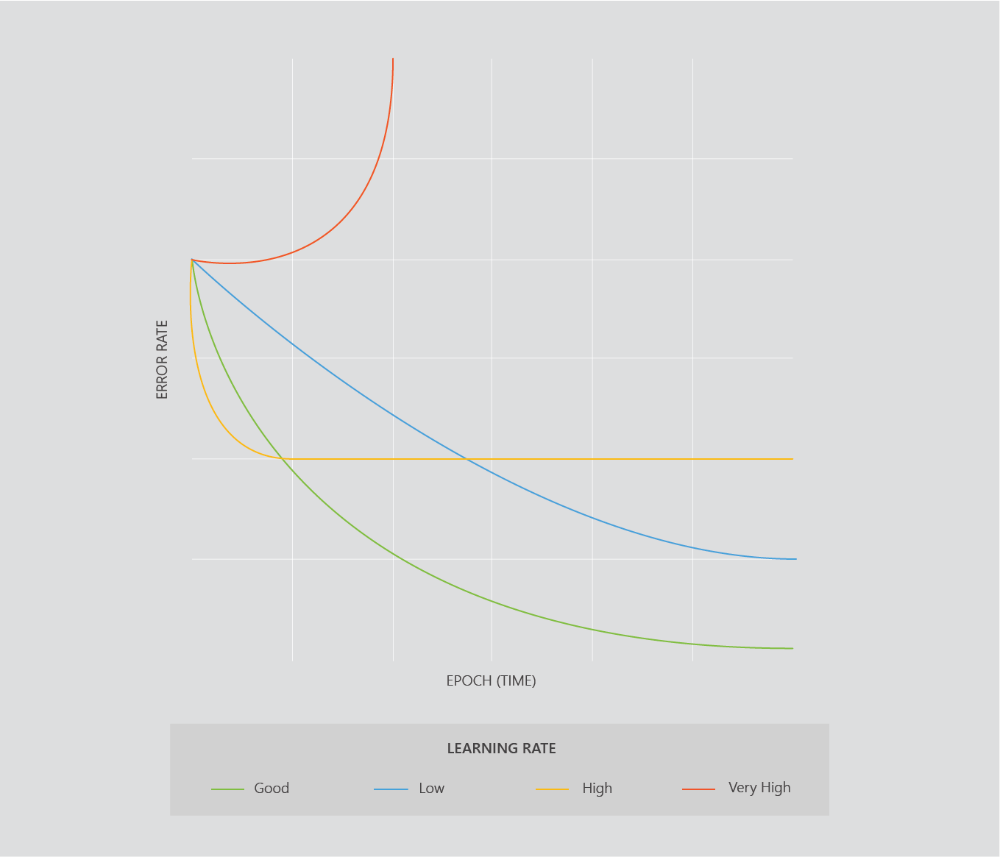

Edges are not always active - nodes can turn themselves “off” if all the value of the data that has arrived at the node is too low. Nodes are turned on and off by an activation function - which is chosen by the user.

Activation functions are similar in practice to using different kernels in support vector machines. You don’t need to know the details of how they work, you just need to know that you need to try different activation functions and see which one gives you the best result.

When you have a large neural network, it might seem that a lot of data will be travelling through it. However, many times a node is not passing through any data at all - it is turned off. This is because activation functions regulate the output from nodes. Users choose activation functions for different layers.

### Choosing an activation function

There are many activation functions that we can apply to a neural network. ReLu and tanh are two of the most popular activation functions used with neural networks today.

## Opimizers

As you might imagine, gradient descent can be very computationally expensive on a large neural network, as you’re trying to optimize so many weights. Even with modern increases in processing power, normal gradient descent is often impractical with neural networks.

We can use a variation of gradient descent called __stochastic gradient descent__ (__SGD__) to make this faster.

### SGD

SGD uses only one random example from the training set to calculate the cost (normal gradient descent uses all the examples in the training set). This is computationally much faster, and it can give better results than normal gradient descent over the same amount of time.

There are different variations of SGD you can try, such as __Adam__ and __RMSProp__. Again you do not need to know how they work - you just need to know they exist and you can try different types of SGD to improve your models.

If a neural network model is taking a long time to train, you can try SGD instead. Using SGD instead of normal gradient descent is similar to changing the kernel in a SVM - it’s a built in option that you need to select.

### Forward propagation and backpropagation

Forward propagation and backpropagation are how neural networks optimize their weights and produce accurate output. Don't worry about the details - here’s a nice diagram showing how they work!

That's it! Next up we'll do a programming exercise in Azure notebooks - advanced neural networks (don't worry, we'll easily walk you through it).

### Learning rate

Using calculus, gradient descent repeatedly changes the variables models use to decrease the error rate. How much the variables change each time is called the __learning rate__.  

Learning rates are particularly important in complex models - if a learning rate is too small, the training will take a long time. If it is too large, it is not likely to ever train to be accurate.

In practice it’s a good idea to find an adequate learning rate, rather than spending time trying to find an optimal one. An adequate learning rate is large enough that your model is trained efficiently, but not so small that you cannot find a minima. It is perfectly acceptable to find an appropriate learning rate, or any other hyperparameter, through trial and error.

