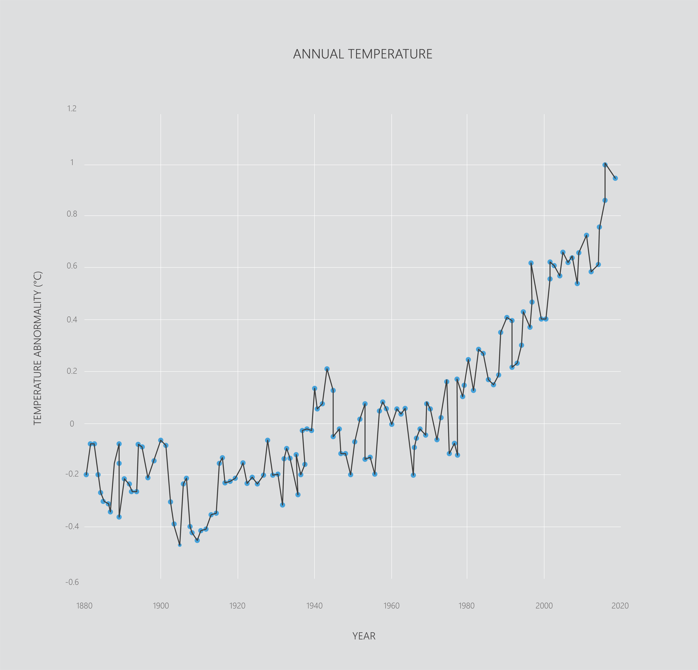
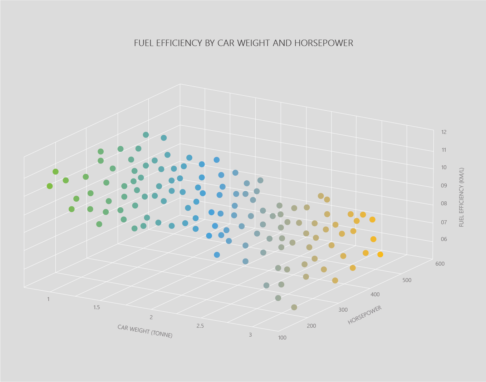
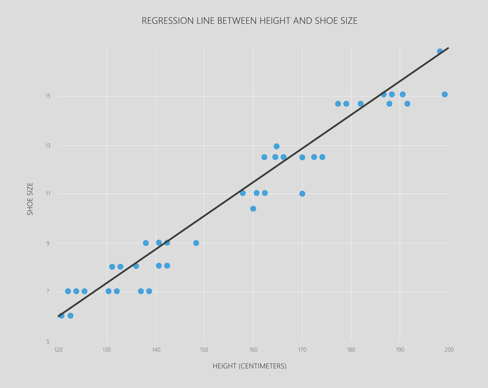

Now you’ve had an overview of the fundamentals of AI, we’ll go over more commonly-used models, as well as introducing some best practices that will help you get good results from your AI models.

In this section, we’ll work through using a simple regression algorithm - linear regression.

## Regression

Regression can be thought of as looking for a trend in data, or looking at relationships between features. For example we might want to know:

* Are temperatures changing over time?
  In this case the features are __temperature__ and __year__.

* Do tall people have bigger feet?
  In this case the features are people’s __height__ and __shoe size__.

* Can we estimate fuel efficiency based on car weight and horsepower?
  In this case the features are __car weight__, __horsepower__, and __fuel efficiency__.

This is all a complicated way of saying that __regression fits a line through data__. For example:

Because these __regression models__ let us understand relationships like height in relation to shoe size, we can also use them to predict future events or estimate features of things we haven’t seen before. From the three examples above we might be able to:

* predict the average temperature next year.
* estimate the shoe size of a person based on how tall they are.
* estimate the fuel efficiency of a car based on its weight and horsepower.

In this section we will cover two kinds of simple regression. These work in a similar way, but fit differently shaped lines:

* __Linear regression__ fits *straight* lines.
* __Polynomial regression__ fits *curved* lines.

## Summaries

That's the introduction done! In this, we covered: 

* __Regression__ - looking for a trend in data, predicting a number.
* __Linear regression__ - fits straight line relationships.
* __Polynomial regression__ - fits curved line relationships.

Next we'll look at simple linear regression - predicting a value using one feature.