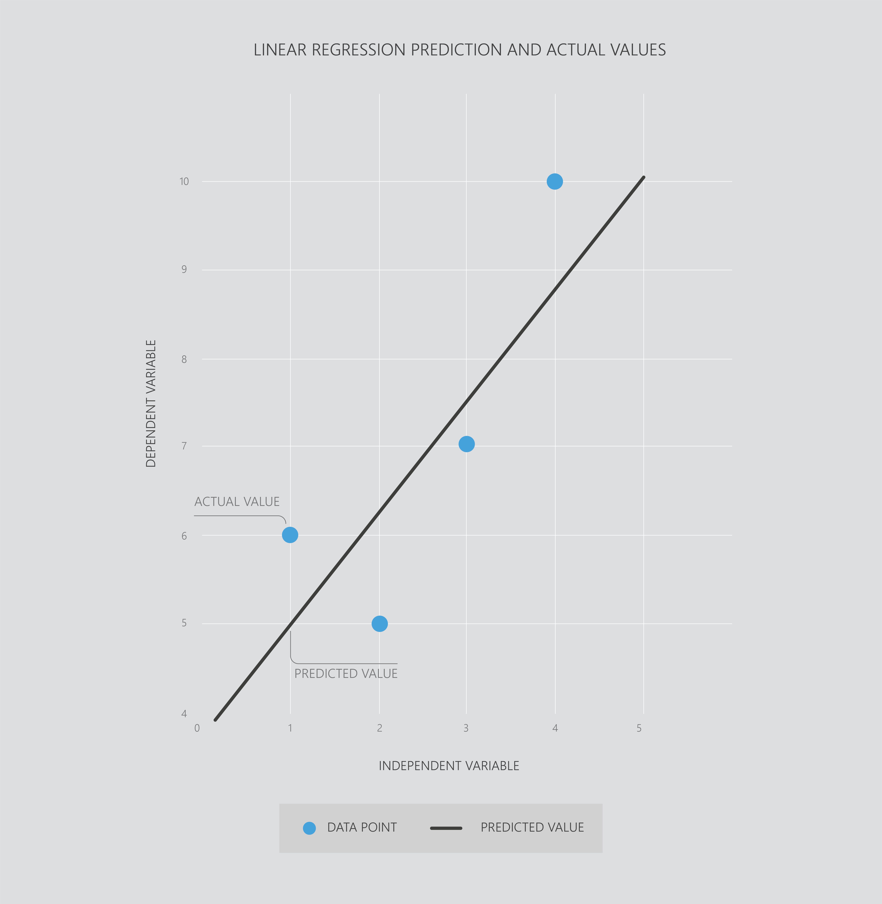
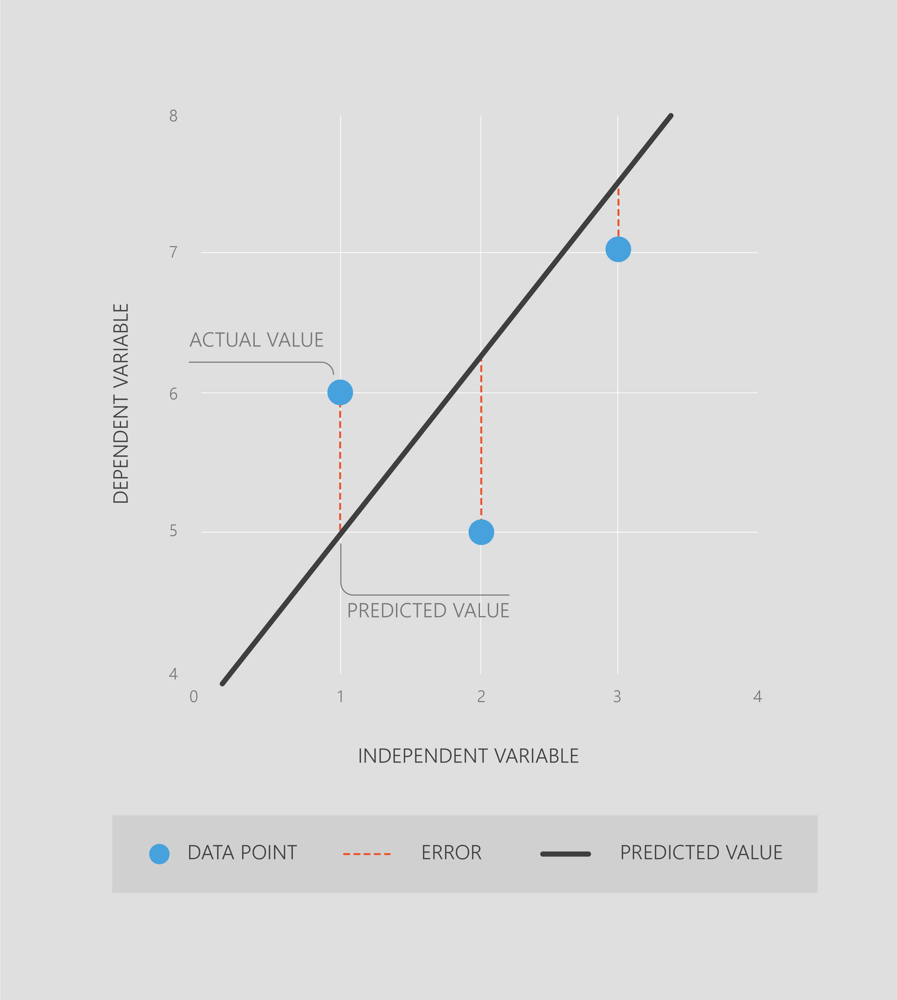

Simple linear regression tries to draw a straight line as near to the data points as possible. The plot below gives an example of simple linear regression, using one feature (x) to predict y.

### How it knows where to put the line

All data contains variability. This means that a straight-line prediction will almost never perfectly pass through every data point. In the graph below, the dashed red lines show the error in our model. For example, at x = 1, the model predicts that y = 5. We have a data point, however, at x=1 and can see that the value is actually 6. This means the predicted error for this data point is 1.

Error is a natural part of building a model. In AI, it’s a tool rather than something to avoid. *Simple linear regression finds a best line by calculating which straight line would give the least amount of error*.

In this course, we don’t need to get into the math, but understanding the error function can be helpful with interpreting results. If you’d like to get into how the math works, go through the optional sections below.

## Optional - The math behind linear regression

To calculate the error for regression, we calculate the __difference__ between each __data point__ and the __predicted value__ given by the model (green lines). We then square each of these numbers, then add them together.  
  
__Why square the numbers?__ Using a squared value ensures that the model pays attention to data that are far from the average. Without this, values that are particularly high or low can be mostly ignored by the model, or the model can end up biased (not pass through the average position of all data points). A side effect of this is that our models can sometimes be ruined by bad data points - for example, data that wasn’t collected properly, or an outlier measurement that is unlikely to occur again. There are also other, more complex mathematical reasons for using a squared value, but these go beyond the scope of this course.
:::

### Programming exercise

> Let's try out simple linear regression in Azure Notebooks. We’re going to try to predict the customer’s satisfaction with certain chocolate bar recipes.    
>  
> **Python users** click __[here](https://notebooks.azure.com/home/libraries/Python "here")__ to go to your library.  
> Select the exercise `02. Linear Regression - Python.ipynb`.  
> Then click then click __'Run on Free Compute'__.  
>  
> **R users** click __[here](https://notebooks.azure.com/home/libraries/R-Exercises "here")__ to go to your library.  
> Select the exercise `02. Linear Regression - R.ipynb`.  
> Then click then click __'Run on Free Compute'__.  
>  
> If you haven’t set up your library and Azure Notebooks account the links above won't work. For instructions to get started click [__here__](https://aischool.microsoft.com/en-us/machine-learning/learning-paths/ml-crash-course/introduction-to-ai/introduction-to-azure-notebooks).

## Summary

Phew. That's your first AI model done! Here we covered:

* __Simple linear regression__ - uses one feature to predict a value.
* __Linear regression__ - fits the line which gives the least amount of error.

Next up we're going to do more linear regression - using multiple features.