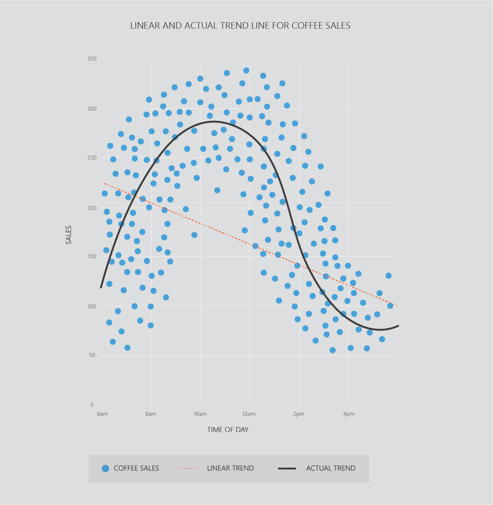
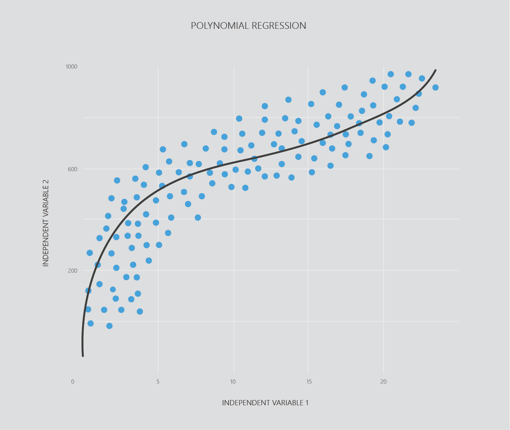

## Non-linear data sets

Linear regression is easy to use, but more complex data sets may require more complex algorithms. Many real life data sets require a non-linear model. For example, in the plot below you can see that a straight line does not accurately predict coffee sales. 

For a regression analysis in the plot above, the straight line would not produce very accurate predictions. We can use a non-linear regression algorithm to model this data - __polynomial regression__. 

## Polynomial regression

Polynomial regression is actually a simple modification of multiple linear regression, allowing linear regression to fit non-linear data sets. 

As polynomial regression and multiple linear regression are easy and quick to use, it is common to approach regression problems by using both algorithms to get an idea of how different algorithms may perform on your data set.

### Programming exercise

> Next up we'll go through a programming exercise on polynomial regression. 
>    
> **Python users** click __[here](https://notebooks.azure.com/home/libraries/Python "here")__ to go to your library.  
> Select the exercise `04. Polynomial Regression - Python.ipynb` exercise.  
> Then click then click __'Run on Free Compute'__.  
>  
> **R users** click __[here](https://notebooks.azure.com/home/libraries/R-Exercises "here")__ to go to your library.  
> Select the exercise `04. Polynomial Regression - R.ipynb`.  
> Then click then click __'Run on Free Compute'__.  
>  
> If you haven’t set up your library and Azure Notebooks account the links above won't work. For instructions to get started click [__here__](https://aischool.microsoft.com/en-us/machine-learning/learning-paths/ml-crash-course/introduction-to-ai/introduction-to-azure-notebooks).