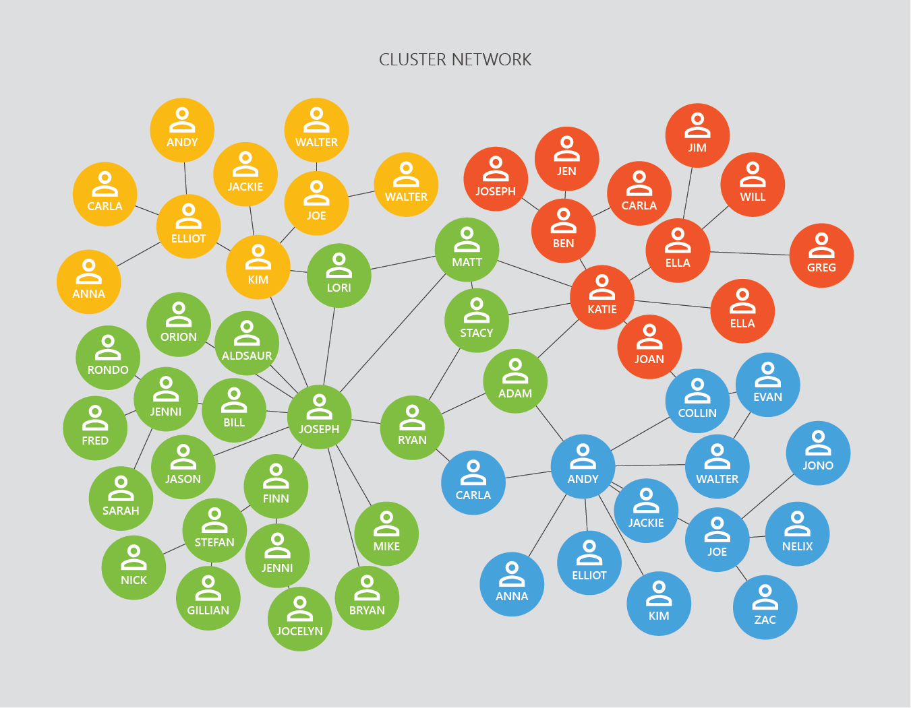

You may have previously used supervised learning algorithms - where we have labels for our examples. When a dataset doesn’t have labels, we can use unsupervised learning to find some kind of structure in the data - discovering patterns or groupings.

Supervised learning is much more common than unsupervised learning, but unsupervised learning can help us quickly get some analysis on a dataset with little effort.

In the example above the model finds four groups in the unlabeled data - commonly referred to as clusters.

Unsupervised learning is commonly used in science and industry for cluster analysis and anomaly detection.

### Cluster analysis

Cluster analysis is a method of finding groupings, known as clusters, in datasets. As the datasets are unlabeled, cluster analysis tries to group similar examples using the examples features.

In practice clustering tends to be used for social network analysis, computer clustering, scientific analysis in biology and astronomy, and customer analysis.

There many types of cluster analysis, but AI practitioners tend to use k-means clustering for quick analysis. For in-depth unsupervised learning, there are many tools - you can use support vector machines (support vector clustering), neural networks, and so on. Next we’ll look at k-means clustering.

We’ll cover the fundamentals of unsupervised learning, as well as introducing some new unsupervised learning models.

**In this module, you will learn to:**

* Describe unsupervised learning.
* Articulate practical applications of unsupervised learning.
* Use k-means clustering to predict groupings in data.

Next up we'll cover k-means clustering.
