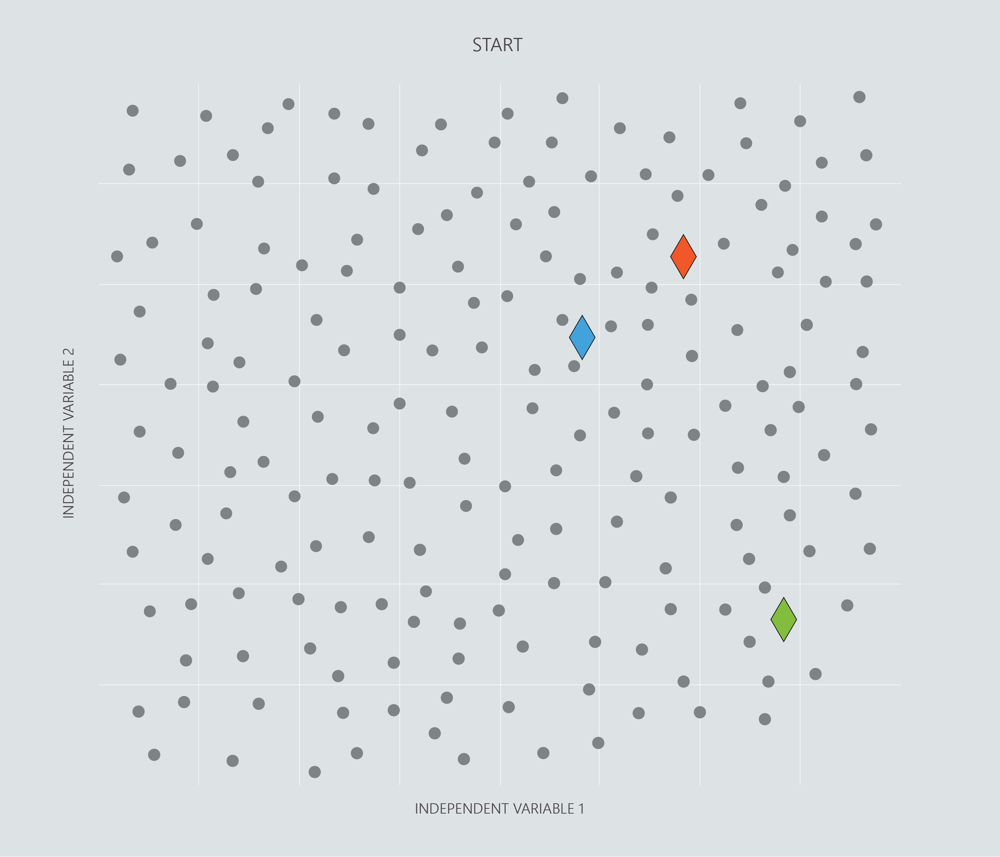

### k-means clustering

K-means clustering lives true to its name - it separates examples into k number of clusters (so if k is 5, it will divide the examples into 5 clusters) and it partitions the examples by the average (mean) of the clusters.

All k-means needs to run is the dataset and the number of clusters the user wants to map out.

It is very common for AI practitioners to decide the number of clusters by running k-means with several different numbers of clusters. The results are then visualised for the users decision. There is a cost function to determine an error rate but analyzing cost for k-means is often ambiguous as to the correct number of clusters.

The starting points of the clusters begin at random, then k-means has two steps:
1. Examples are assigned to the cluster that they is closest to.
2. The starting points of the clusters move to the average value of the examples grouped to that cluster.

These steps then repeat several times and the clustering is complete.

### Programming exercise
 
> Let's try out k-means clustering in Azure Notebooks.  
>  
> **Python users** click __[here](https://notebooks.azure.com/home/libraries/Python "here")__ to go to your library.  
> Select the exercise `12. Clustering - Python.ipynb`.  
> Then click then click __'Run on Free Compute'__.  
>  
> **R users** click __[here](https://notebooks.azure.com/home/libraries/R-Exercises "here")__ to go to your library.  
> Select the exercise `12. Clustering - R.ipynb` exercise.  
> Then click then click __'Run on Free Compute'__.  
>  
> If you haven’t set up your library and Azure Notebooks account the links above won't work. For instructions to get started click [__here__](https://aischool.microsoft.com/en-us/machine-learning/learning-paths/ml-crash-course/introduction-to-ai/introduction-to-azure-notebooks).