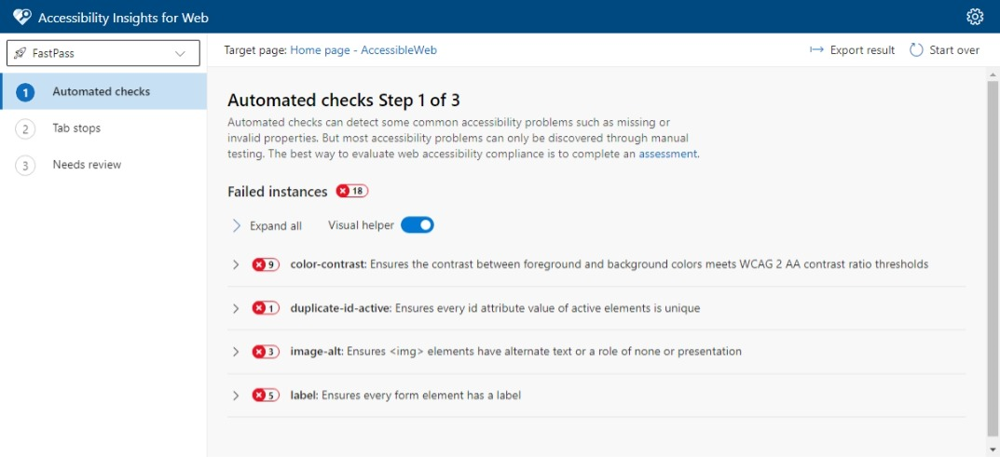
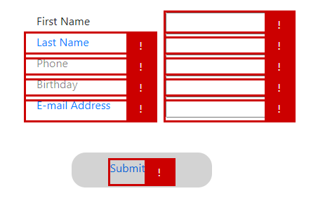
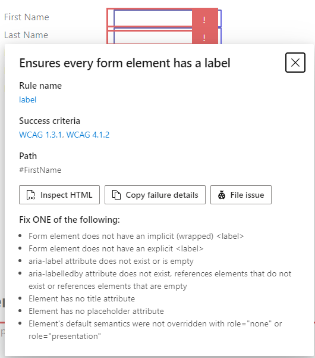

In this exercise, you will use Accessibility Insights for web to identify and fix forms accessibility issues.

## Install Accessibility Insights for Web browser extension

1. Browse to the [Accessibility Insights for Web](https://accessibilityinsights.io/docs/en/web/overview/) page in either Chrome or Microsoft Edge.
1. Click install button that corresponds to your browser. 
1. When the extension page is displayed, click the appropriate button for your browser ("Get" for Edge, "Add to Chrome" for Chrome) to install the extension.

## Inspect the form using Fast Pass

Accessibility Insights for Web includes three different tools:

- **FastPass** - Run three tests to find the most common accessibility issues in less than 5 minutes.
- **Assessment** - Walk through a guided process for assessing accessibility compliance.
- **Ad hoc tools** - Get quick access to visualizations that help you identify accessibility issues.

For this exercise, we will be using the FastPass tool.

1. Open the Launch Pad for Accessibility Insights for Web by clicking on the extension toolbar button in the browser. You can also open  or by using the keyboard shortcuts Ctrl+Shift+K (⌘+Shift+K for macOS)

   

1. Click on the **FastPass** link. A second window will open, which will list the accessibility issues that FastPass has detected using automated checks.

    

   Automated Checks have detected a number of errors. We're going to focus on the form in this exercise.

1. There are two different ways to interact with the error message - we can use the list in the FastPass tool, or we can click on the error messages in the web page. In this case, the FastPass tool lists errors across the entire page, which can be a little overwhelming when we want to focus on the form. We'll use the in-page error message for now. Click on the exclamation point to the right of the *First Name* label.

    

   This shows that this label has low contrast, and also brings to our attention the fact that we're using color coding to indicate required fields in this form. By clicking on the error icons for the other labels, we can see that they all have low contrast. Let's look at the HTML for the the First Name section of the form to understand the color contrast issue:

   ```html
   <div class="row">
     <div class="col-4 text-primary">
       First Name
     </div>
     <div class="col-8">
       <input type="text" id="Name">
     </div>
   </div>
   ```

   Here we can see that the *First Name* label is using a Bootstrap `text-primary` class to show a light blue text color, indicating a required field. Remove the `text-primary` class and add a `required` attribute to the `<input>` tag instead, like this:

   ```html
   <div class="row">
     <div class="col-4">
       First Name
     </div>
     <div class="col-8">
       <input type="text" id="Name" required>
     </div>
   </div>
   ```

1. Run the application again, then launch the *FastPass* as before. We can see that the error for the *First Name* label has been cleared.

    

    Great! That wasn't too hard, and now that we know the fix we can do the same thing for the rest of the labels, too. 

1. Reviewing the HTML for the rest of the form, we can see that the labels are using either `text-primary` or `text-black-50` to color the labels. Remove these attributes, and add the `required` attribute to the *Last Name* and *E-mail Address" input fields:

   ```html
   <form name="CustomerInfo">
     <div class="container w-50 p-3">
       <div class="row">
         <div class="col-4">
           First Name
         </div>
         <div class="col-8">
           <input type="text" id="Name" required>
         </div>
       </div>
       <div class="row">
         <div class="col-4">
           Last Name
         </div>
         <div class="col-8">
           <input type="text" id="Name" required>
         </div>
       </div>
       <div class="row">
         <div class="col-4">
           Phone
         </div>
         <div class="col-8">
           <input type="text" id="Phone">
         </div>
       </div>
       <div class="row">
         <div class="col-4">
           Birthday
         </div>
         <div class="col-8">
           <input type="text" id="Birthday">
         </div>
       </div>
       <div class="row">
         <div class="col-4">
           E-mail Address
         </div>
         <div class="col-8">
           <input type="text" id="E-mail" required>
         </div>
       </div>
       <div class="button">
         <a href="#" onclick="document.getElementById('CustomerInfo').Submit();">
           Submit Form
         </a>
       </div>
     </div>
   </form>
   ```

   Running the application and viewing **FastPass** again, we can see that all of the label error messages have been cleared.

1. While not strictly required, we can continue to show an indication for the required fields. Update the `<style>` block near the top of the page to include rules for required and optional fields: 

   ```css
   input:optional {
     border-color: #ccc;
   }
   input:required {
     border-color: mediumblue;
   }
   ```

   This will now show a blue border around the required fields.

1. We're now ready to fix up the form element. Clicking on the error indication for the *First Name* field shows that there are two errors. The first error indicates that the form `<input>` tag does not have a unique attribute. This is a problem, since HTML ID's are always assumed to be unique, and assistive technologies will often only act on the first element. Looking at the source code, we can see that we used `Name` as the ID for both the *First Name* and *Last Name* fields:

   ```html
   <div class="col-8">
       <input type="text" id="Name" required>
     </div>
   </div>
   <div class="row">
     <div class="col-4">
       Last Name
     </div>
     <div class="col-8">
       <input type="text" id="Name" required>
     </div>
   </div>
   ```

   Change the ID's to `FirstName` and `LastName` respectively:

   ```html
   <div class="col-8">
       <input type="text" id="FirstName" required>
     </div>
   </div>
   <div class="row">
     <div class="col-4">
       Last Name
     </div>
     <div class="col-8">
       <input type="text" id="LastName" required>
     </div>
   </div>
   ```

1. Run the application and check **FastPass** again. Clicking on the error indication for each of the input fields shows that we're getting really close now, each has the same error message: each form field should have a label.

    