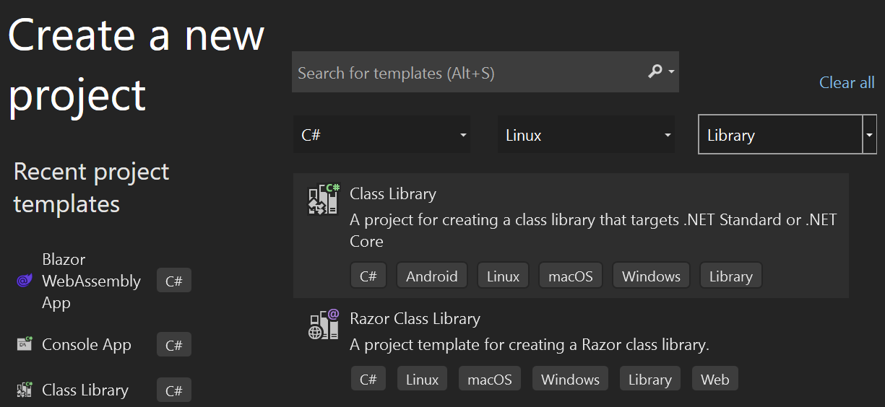
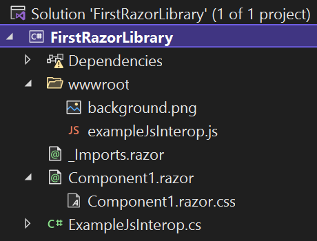

Components in web applications give developers the ability to reuse portions of an application user interface throughout the application. By using Razor class libraries, developers can share and reuse these components across many applications.

In this unit, you'll learn how to create a Razor class library and then use it to share rendered and static content for Blazor applications to customize and display.

## About Razor class libraries

A Razor class library is a .NET project type that contains Razor components, pages, HTML, Cascading Style Sheet (CSS) files, JavaScript, images, and other static web content that can be referenced by a Blazor application. Like other .NET class library projects, Razor class libraries can be bundled as a NuGet package and shared on NuGet package repositories such as NuGet.org.

Let's look at the default template for creating a Razor class library.

## Create a project by using the default template

You can optionally begin creating a Razor class library in Visual Studio by selecting **File** > **New Project**.



You can also create projects on a command-line interface by running the following command:

```dotnetcli
dotnet new razorclasslib -o MyProjectName
```

This template delivers an initial component named *Component1*, which contains several important features that your components can use:

- An isolated cascading style sheet named *Component1.razor.css*, which is stored in the same folder as *Component1.razor*. The *Component1.razor.css* file is conditionally included in a Blazor application that references *Component1*.
- Static content, such as images and JavaScript files, which is available to a Blazor application at runtime and referenced within *Component1*. This content is delivered in a *wwwroot* folder that behaves in the same way as a *wwwroot* folder in an ASP.NET Core or Blazor application.
- .NET code, which executes functions that reside in the included JavaScript file.



### Differences between a class library and a Razor class library

A class library is a common package delivery structure in .NET applications, and a Razor class library is similar in structure with a few other features configured in the project file.

```xml
<Project Sdk="Microsoft.NET.Sdk.Razor">

  <PropertyGroup>
    <TargetFramework>net8.0</TargetFramework>
    <Nullable>enable</Nullable>
    <ImplicitUsings>enable</ImplicitUsings>
  </PropertyGroup>

  
  <ItemGroup>
    <SupportedPlatform Include="browser" />
  </ItemGroup>

  <ItemGroup>
    <PackageReference Include="Microsoft.AspNetCore.Components.Web" Version="8.0.0" />
  </ItemGroup>

</Project>
```

- The project file contains an SDK reference to *Microsoft.NET.Sdk.Razor* to declare that it contains and creates Razor content as a Razor class library.
- The `SupportedPlatform` entry declares that this library can be used in a `browser` platform, namely WebAssembly.
- The `PackageReference` to the `Microsoft.AspNetCore.Components.Web` library gives access to the base Blazor components that are shipped with the framework. This lets you use those simple components to help you build more complex components.

### Razor component contents

The initial Razor component that's delivered is simple. It contains only an HTML `div` element with a short block of text:

```razor
<div class="my-component">
    This component is defined in the <strong>FirstRazorLibrary</strong> library.
</div>
```

This component interacts with other Blazor components and pages that reference it in the same way that you would expect a component delivered in the same project to behave. That is, the CSS isolated script in the *Component1.razor.css* file is rendered inline with the rest of the application's CSS in the *application.css* file.

### Static asset delivery

You can reference the contents of the *wwwroot* folder relatively among the other contents of that folder and the components' individual CSS files, such as *Component1.razor.css*, as files in the same base folder. For example, the default CSS adds a 2 pixel dashed red border and a background image style that uses the *background.png* image in the *wwwroot* folder. No path is required to make this reference from the CSS to the content that resides in the *wwwroot* folder.

```css
.my-component {
    border: 2px dashed red;
    padding: 1em;
    margin: 1em 0;
    background-image: url('background.png');
}
```

The contents of the *wwwroot* folder are available to be referenced by hosted Blazor applications with an absolute folder reference in the format:

```dotnetcli
/_content/{PACKAGE_ID}/{PATH_AND_FILENAME_INSIDE_WWWROOT}
```

### Reference a Razor class library

In a .NET solution, where the Razor class library resides on the disk next to a Blazor application that references the library, you can update the Blazor application to reference the Razor class library by using the standard Visual Studio **Add Reference** dialog and by using the .NET CLI `add reference` command, as shown here:

```dotnetcli
dotnet add reference ../MyClassLibrary
```

For libraries that are delivered in NuGet package form, you can add a reference by using the Visual Studio NuGet package installer or by using the .NET CLI `add package` command, as shown here:

```dotnetcli
dotnet add package MyClassLibrary
```
