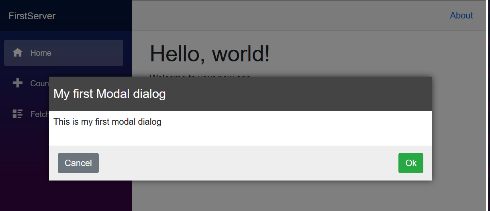

In this exercise, you'll create a modal dialog in a Razor class library that you can reuse in the default Blazor template application.



## Create the Razor class library project

[!include[](../../../includes/dotnet6-sdk-version.md)]

To begin, create the Razor class library project for a modal dialog component. You can use Visual Studio to create a new project, or you can create the project in a new folder with the .NET command-line tool, as shown here:

```dotnetcli
dotnet new razorclasslib -o FirstClassLibrary -f net8.0
```

## Build the modal dialog component

Next, build the modal component in your project with an appropriate CSS file to go with it, and provide an initial format.

1. Rename the *Component1.razor* file to *Modal.razor* and the `Component1.razor.css` file to *Modal.razor.css*. The *Modal.razor* file contains the component you'll create, and in the future you can add blank text files to your project and format them with content for Razor or CSS appropriately.
1. Add the following Razor content to the *Modal.razor* file:

    ```razor
    @if (Show) {
    
     <div class="dialog-container">
      <div class="dialog">
       <div class="dialog-title">
        <h2>@Title</h2>
       </div>
    
       <div class="dialog-body">
        @ChildContent
       </div>
    
       <div class="dialog-buttons">
        <button class="btn btn-secondary mr-auto" @onclick="OnCancel">@CancelText</button>
        <button class="btn btn-success ml-auto" @onclick="OnConfirm">@ConfirmText</button>
       </div>
    
      </div>
     </div>
    
    }
    
    @code {
    
     [Parameter]
     public string Title { get; set; }
    
     [Parameter]
     public string CancelText { get; set; } = "Cancel";
    
     [Parameter]
     public string ConfirmText { get; set; } = "Ok";
    
     [Parameter]
     public RenderFragment ChildContent { get; set; }
    
     [Parameter]
     public bool Show { get; set; }
    
    
     [Parameter] public EventCallback OnCancel { get; set; }
     [Parameter] public EventCallback OnConfirm { get; set; }
    
    }
    ```

    This component has several nice features that you can share between your projects: 
    * A title.
    * **Cancel** and **Confirm** buttons, with labels you can configure and click events you can manage.
    * You can set the inner content of the component through the `ChildContent` parameter.
    * You can control the display state of the dialog with the `Show` parameter.
    
1. To provide default formatting for the component, add the following CSS to the *Modal.razor.css* file:

    ```css
    .dialog-container {
     position: absolute;
     top: 0;
     bottom: 0;
     left: 0;
     right: 0;
     background-color: rgba(0,0,0,0.5);
     z-index: 2000;
     display: flex;
     animation: dialog-container-entry 0.2s;
    }
    
    @keyframes dialog-container-entry {
     0% {
       opacity: 0;
     }
    
     100% {
       opacity: 1;
     }
    }
    
    .dialog {
     background-color: white;
     box-shadow: 0 0 12px rgba(0,0,0,0.6);
     display: flex;
     flex-direction: column;
     z-index: 2000;
     align-self: center;
     margin: auto;
     width: 700px;
     max-height: calc(100% - 3rem);
     animation: dialog-entry 0.4s;
     animation-timing-function: cubic-bezier(0.075, 0.820, 0.165, 1.000);
    }
    
    @keyframes dialog-entry {
     0% {
       transform: translateY(30px) scale(0.95);
     }
    
     100% {
       transform: translateX(0px) scale(1.0);
     }
    }
    
    .dialog-title {
     background-color: #444;
     color: #fff2cc;
     padding: 1.3rem 0.5rem;
    }
    
     .dialog-title h2 {
       color: white;
       font-size: 1.4rem;
       margin: 0;
       font-family: Arial, Helvetica, sans-serif;
       line-height: 1.3rem;
     }
    
    .dialog-body {
     flex-grow: 1;
     padding: 0.5rem 3rem 1rem 0.5rem;
    }
    
    .dialog-buttons {
     height: 4rem;
     flex-shrink: 0;
     display: flex;
     align-items: center;
     background-color: #eee;
     padding: 0 1rem;
    }
    ```

This Markup gives some default coloring to a title bar and button bar at the bottom, making it more interesting than a simple set of gray-colored HTML elements.

## Reference and use the modal component

With the modal component now residing in the *FirstClassLibrary* project, add a new Blazor server application and start using the modal component. 

1. Create a new Blazor server project called *MyBlazorApp* in a folder next to the *FirstClassLibrary* project either by using the Visual Studio Add New Project feature or by running the following command:

    ```dotnetcli
    dotnet new blazor -o MyBlazorApp -f net8.0
    ```

1. In the *MyBlazorApp* project, add a reference to the *FirstClassLibrary* project either by using the Visual Studio Add Reference feature or by running the following command from the *MyBlazorServer* folder:

    ```dotnetcli
    dotnet add reference ../FirstClassLibrary
    ```

With this project reference in place, the *MyBlazorApp* application can interact with the components in the *FirstClassLibrary* project.

1. Make it easier to reference the modal component by adding an entry to the end of the *_Imports.razor* file in the *Components* folder of the *MyBlazorApp* application. By doing so, you can reference the modal component without having to specify the entire namespace for the component.

    ```dotnetcli
    @using FirstClassLibrary
    ```

1. Add a modal component to the opening page of this application, the *Components/Pages/Home.razor* file

    ```razor
    <Modal Title="My first Modal dialog" Show="true">
     <p>
       This is my first modal dialog
     </p>
    </Modal>
    ```
   a. Give the component a title, "My first Modal dialog."  
   b. Add a short paragraph to be displayed inside the dialog. This content describes the purpose of the dialog.  
   c. Set the dialog to be visible by using the `Show` parameter.

## Check your work

Start the *MyBlazorApp* application with `dotnet run` and navigate to it in your browser. The **My first Modal dialog** dialog should be displayed in front of the rest of the content on the screen.

