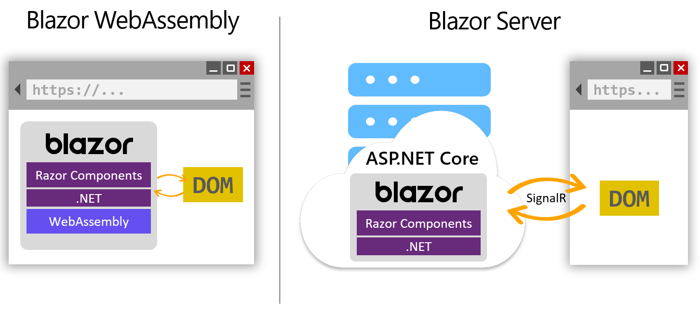

Building applications for the web is a complex effort. The ever changing collection of JavaScript frameworks can be challenging for developers to follow and integrate with their favorite frameworks.  The Blazor framework from the .NET team provides you with a concise, component-driven user-interface framework.  Blazor allows you to build applications with C# and .NET.  With Blazor, your applications can share business objects and services with the cloud-based services you already manage.

## Example scenario

You're preparing to launch a new website for your pizza shop and want customers to easily see the collection of fresh pizza specials available to order.  Customers should have a clear path to place their order and track their pizza delivery.

## What will we be doing?

We'll learn what the Blazor framework is and how it works with your existing .NET code to extend business logic and interactions.  You'll learn that Blazor applications are composed of common HTML and techniques that you already know as a .NET developer.

## What is the main goal?

At the conclusion of this module, you'll understand how Blazor applications are structured and where they can run.  With this knowledge, you can decide if Blazor is the right framework for your next application.
