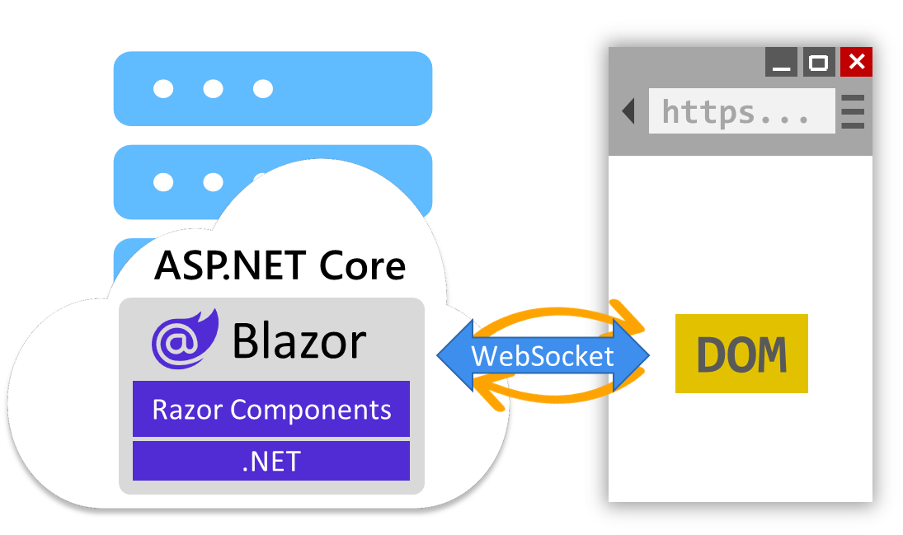
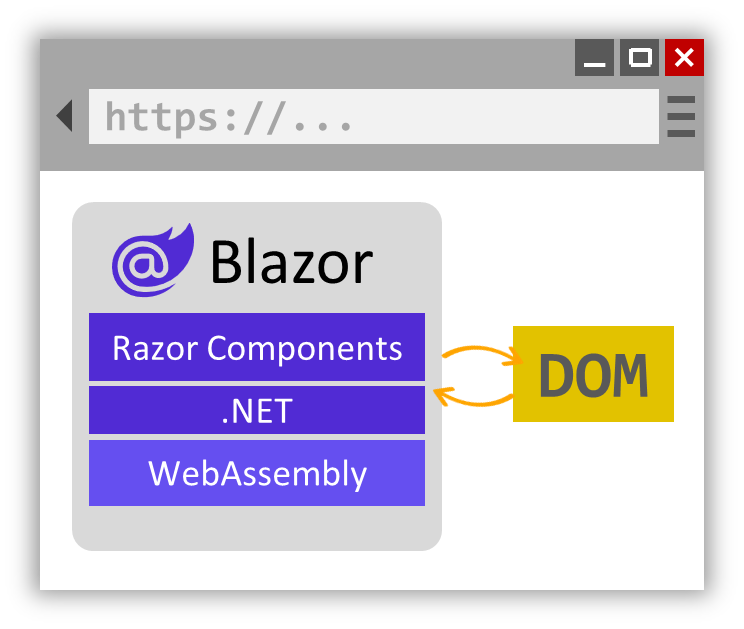

Blazor provides many features to help you get started and deliver your next web app project fast. Let's take a tour of the core capabilities of Blazor to help you decide whether you should use Blazor for your next great web app.

## Blazor components

Blazor apps are built from components. A Blazor component is a reusable piece of web UI. A Blazor component encapsulates both its rendering and UI event handling logic. Blazor includes various built-in components for form handling, user input validation, displaying large data sets, authentication, and authorization. Developers can also build and share their own custom components, and many prebuilt Blazor components are available from the Blazor ecosystem.

## Use standard web technologies

You author Blazor components using Razor syntax, a convenient mixture of HTML, CSS, and C#. A Razor file contains plain HTML and then C# to define any rendering logic, like for conditionals, control flow, and expression evaluation. Razor files are then compiled into C# classes that encapsulate the component's rendering logic. Because Blazor components authored in Razor are just C# classes, you can call arbitrary .NET code from your components.

## UI event handling and data binding

Interactive Blazor components can handle standard web UI interactions using C# event handlers. Components can update their state in response to UI events and adjust their rendering accordingly. Blazor also includes support for two-way data binding to UI elements as a way to keep component state in sync with UI elements.

Below is an example of a simple Blazor counter component implemented in Razor. Most of the content is HTML, while the `@code` block contains C#. Every time the button is pressed the `IncrementCount` C# method is invoked, which increments the `currentCount` field, and then the component renders the updated value:

```razor
<h1>Counter</h1>

<p role="status">Current count: @currentCount</p>

<button class="btn btn-primary" @onclick="IncrementCount">Click me</button>

@code {
    private int currentCount = 0;

    private void IncrementCount()
    {
        currentCount++;
    }
}
```

## Server and client-side rendering

Blazor supports both server and client-side rendering of components to handle various web UI architectures. Components rendered from the server can access server resources, like databases and backend services. By default, Blazor components are rendered statically from the server, generating HTML in response to requests.

You can also configure server components to be interactive, so they can handle arbitrary UI events, maintain state across interactions, and render updates dynamically. Interactive server components handle UI interactions and updates over a WebSocket connection with the browser.



Alternatively, Blazor components can be rendered interactively from the client. The component is downloaded to the client and run from the browser via WebAssembly. Interactive WebAssembly components can access client resources through the web platform, like local storage and hardware, and can even function offline once downloaded.



You can choose to render different components from the server or the client within the same app. Many of the pages in your app might not require any interactivity at all, and can be rendered statically from the server, while other more interactive parts of your app can be handled from the server or client. You can decide which component render mode to use at design time or runtime. With Blazor, you have the flexibility to build the web app architecture that's right for your scenario.

## Using Blazor to build a pizza shop

The UI of the pizza shop app breaks down into many reusable components: a page layout with a navbar, individual pages, a pizza catalog and editor, an order component, and so on. Blazor provides build-in support for many of these components, like components for forms and validation. Many of the pages in the app can be handled from the server using static server-side rendering so that the site is mostly stateless and ready to scale. Where more interactivity is needed, the components are made interactive by applying an interactive render mode. To offload work from the server, interactive components are rendered on the client via WebAssembly. By building the entire app with a single web development stack, the app comes together quickly and soon the pizza orders are flowing in.
