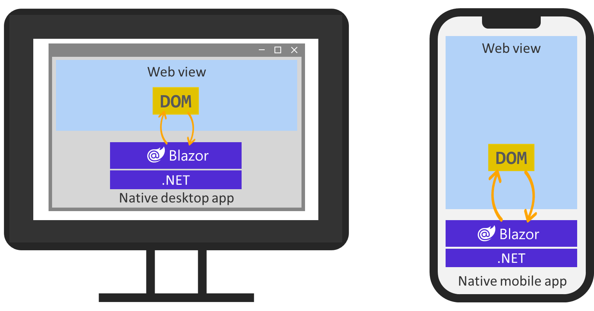

Companies that build web apps and clients apps commonly hire developers for different roles. Some developers create back-end, server-side logic. Some build client-side web apps. Others build native-client apps for mobile and desktop platforms. These developers often use different development languages and technologies.

C# and .NET are popular choices for building server-side logic. Client-side web apps are often built with web UI frameworks using JavaScript. When it comes to native-client apps for desktop and mobile, there are several options available, including many for .NET and C#. Using multiple languages and toolsets requires multiple sets of skills and often requires two separate teams. Also, code to transfer and represent data must be built in both languages and kept in sync. Blazor Hybrid can simplify your development team's tasks, code, and processes by allowing you to use your existing skills and code in building web applications in C# and .NET to build native-client applications using these same technologies.

In this unit, you'll start with an introduction to Blazor Hybrid, .NET MAUI, and Razor Components.

## What is Blazor?

Blazor apps are composed of reusable web UI components built using C#, HTML, and CSS. With Blazor, developers can build client and server code with C#. They can also share code and libraries with the front-end client code and back-end logic. Using C# for all code simplifies sharing data between the front end and back end, enables code reuse to accelerate development, and reduces maintenance.

## What is Blazor Hybrid?

Blazor Hybrid allows developers to blend desktop and mobile native client frameworks with .NET and Blazor.

In a Blazor Hybrid app, Razor components run natively on the device. Components render to an embedded Web View control through a local interop channel. Components don't run in the browser, and WebAssembly isn't involved. Razor components load and execute code quickly, and components have full access to the native capabilities of the device through the .NET platform.

## What is .NET MAUI?

.NET Multi-platform App UI (.NET MAUI) is a cross-platform framework for creating native mobile and desktop apps with C# and XAML. Using .NET MAUI, you can develop apps that can run on Android, iOS, macOS, and Windows from a single shared codebase. One of the key aims of .NET MAUI is to allow you to implement as much of your app logic and UI layout as possible in a single codebase. .NET MAUI unifies Android, iOS, macOS, and Windows APIs into a single API that allows a write-once, run-anywhere developer experience, while additionally providing deep access to every aspect of each native platform.

## Blazor Hybrid apps with .NET MAUI

Blazor Hybrid support is built into the .NET MAUI framework. .NET MAUI includes the BlazorWebView control, which permits rendering Razor components into an embedded Web View. By using .NET MAUI and Blazor together, you can reuse one set of web UI components across mobile, desktop, and web.

## Blazor Hybrid development requirements

You can build Blazor Hybrid apps by using the latest version of Visual Studio 2022 or [Visual Studio Code (with the .NET SDK, .NET MAUI workload, C# Dev Kit extension, and .NET MAUI extension installed)](/dotnet/maui/get-started/installation?tabs=visual-studio-code). In this module, we'll be using Visual Studio 2022 or Visual Studio Code to build our Blazor Hybrid application.

Whatever your development environment, you need to install the **.NET MAUI** workload to ensure the .NET 8.0 SDK and tools are available in Visual Studio.  After installation, you'll have everything you need to start building Blazor Hybrid apps. You'll build your first Blazor Hybrid app in the next exercise.
