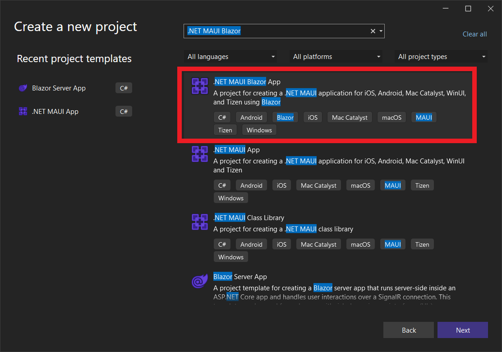
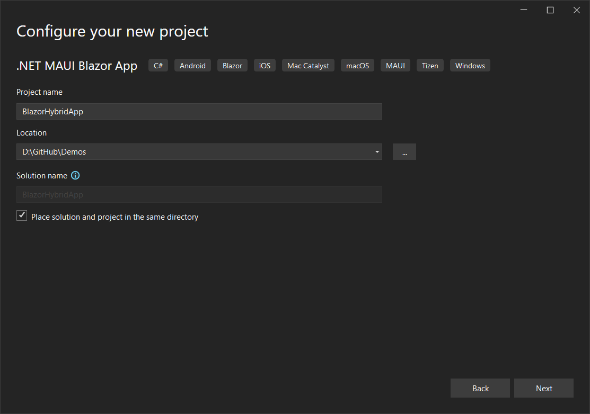
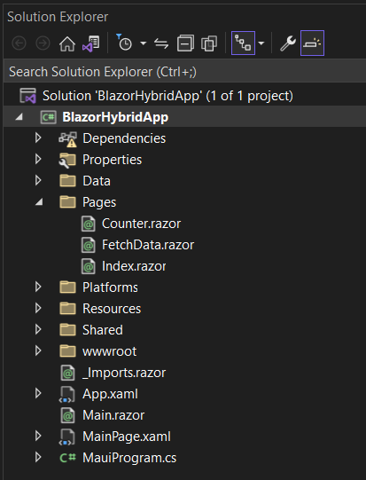
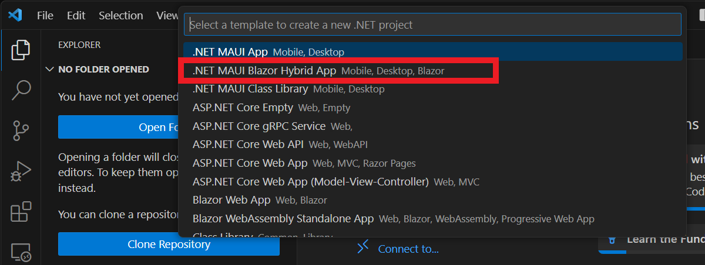
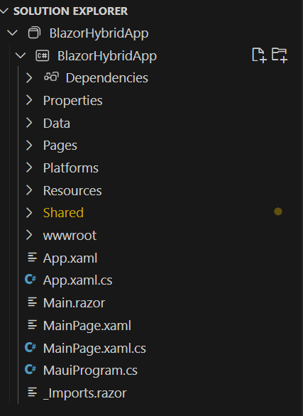
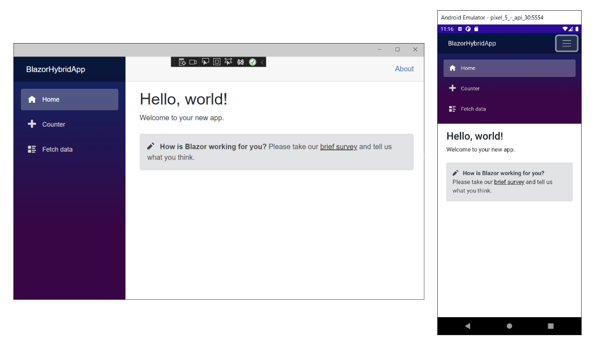

Let's start by creating our first Blazor web app.

This module uses Visual Studio 2022 for local development. After you complete this module, you can apply its concepts using a development environment like Visual Studio Code.

[!include[](../../../includes/install-dotnet-maui-workload.md)]


## Create a new Blazor Hybrid app

::: zone pivot="vstudio"

To set up a Blazor Hybrid project to work with, we use Visual Studio 2022.

1. In Visual Studio 2022, select **File** > **New Project**, or select **Create a new project** from the launcher.

2. In the search box at the top of the *Create a new project* dialog, enter *.NET MAUI Blazor*, select **.NET MAUI Blazor Hybrid App**, and select **Next**.

    

3. On the subsequent screen, name your project *BlazorHybridApp* and specify a location on your computer to store the project. Check the box next to **Place solution and project in the same directory**, then select **Next**.

     

4. On the *Additional Information* screen, select **.NET 8.0 (Long-term support)** in the *Framework* drop-down, then select **Create**.

5. This command creates a basic Blazor Hybrid project powered by .NET MAUI with all required files and pages.

    You should now have access to these files, and your Solution Explorer in Visual Studio 2022 looks similar to the following example:

    

::: zone-end

::: zone pivot="vscode"

To set up a Blazor Hybrid project to work with, we use Visual Studio Code.

1. In Visual Studio Code, open the **Explorer** and select **Create .NET Project** .

2. Select **.NET MAUI Blazor Hybrid App** in the dropdown list.

    

3. Create a new folder in the pop-up named **BlazorHybridApp** and select **Select Folder**.

4. Name the project **BlazorHybridApp** and press **Enter** to confirm.

5. This creates a basic Blazor Hybrid project powered by .NET MAUI with all required files and pages.

    You should now have access to these files and your solution explorer in Visual Studio Code looks similar to:

    

::: zone-end

## Blazor Hybrid with .NET MAUI project structure and startup

The project is a normal .NET MAUI project with some more Blazor related content.

### Blazor project files

- **wwwroot**: This folder includes static web assets Blazor uses, including HTML, CSS, JavaScript, and image files.

- **Components**: This folder containers several subfolder and razor components for the app.

    - **Layout**: This folder contains shared Razor components, including the app's main layout and navigation menu.

    - **Pages**: This folder contains three Razor components—`Counter.razor`, `Home.razor`, and `Weather.razor`—that define the three pages that make up the Blazor user interface.

    - `_Imports.razor`: This file defines namespaces that are imported into each Razor component.

    - `Routes.razor`: The root Razor component for the app that sets up the Blazor router to handle page navigation within the web view.

### .NET MAUI project files

- **App.xaml**: This file defines the application resources that the app uses in the XAML layout. The default resources are located in the `Resources` folder and define app-wide colors and default styles for every built-in control of .NET MAUI.

- **App.xaml.cs**: The App.xaml file's code-behind. This file defines the App class. This class represents your application at runtime. The constructor in this class creates an initial window and assigns it to the `MainPage` property; this property determines which page is displayed when the application starts running. Additionally, this class lets you override common platform-neutral application lifecycle event handlers. Events include `OnStart`, `OnResume`, and `OnSleep`.

- **MainPage.xaml**: This file contains the user interface definition. The sample app the .NET MAUI Blazor App template generates comprises a `BlazorWebView` that loads the `Components.Routes` component in the specified host HTML page (`wwwroot/index.html`) at a location specified by the CSS selector (`#app`).

    ```xml
    <?xml version="1.0" encoding="utf-8" ?>
    <ContentPage xmlns="http://schemas.microsoft.com/dotnet/2021/maui"
                xmlns:x="http://schemas.microsoft.com/winfx/2009/xaml"
                xmlns:local="clr-namespace:BlazorHybridApp"
                x:Class="BlazorHybridApp.MainPage"
                BackgroundColor="{DynamicResource PageBackgroundColor}">

        <BlazorWebView x:Name="blazorWebView" HostPage="wwwroot/index.html">
            <BlazorWebView.RootComponents>
                <RootComponent Selector="#app" ComponentType="{x:Type local:Components.Routes}" />
            </BlazorWebView.RootComponents>
        </BlazorWebView>

    </ContentPage>
    ```

- **MainPage.xaml.cs**: The page's code-behind. In this file, you define the logic for the various event handlers and other actions the .NET MAUI controls on the page trigger. The example code in the template only has the default constructor as all of the user interface and events are located in the Blazor components.

    ```csharp
    namespace BlazorHybridApp;

    public partial class MainPage : ContentPage
    {
        public MainPage()
        {
            InitializeComponent();
        }
    }
    ```

- **MauiProgram.cs**: Each native platform has a different starting point that creates and initializes the application. You can find this code under the **Platforms** folder in the project. This code is platform-specific, but at the end it calls the `CreateMauiApp` method of the static `MauiProgram`class. You use the `CreateMauiApp` method to configure the application by creating an app builder object. At a minimum, you need to specify which class describes your application. You can do this with the `UseMauiApp` generic method of the app builder object; the type parameter specifies the application class. The app builder also provides methods for tasks such as registering fonts, configuring services for dependency injection, registering custom handlers for controls, and more. The following code shows an example of using the app builder to register a font, register the weather service, and add support for Blazor Hybrid with the `AddMauiBlazorWebView` method:

    ```csharp
    using Microsoft.AspNetCore.Components.WebView.Maui;
    using BlazorHybridApp.Data;

    namespace BlazorHybridApp;

    public static class MauiProgram
    {
        public static MauiApp CreateMauiApp()
        {
            var builder = MauiApp.CreateBuilder();
            builder
            .UseMauiApp<App>()
            .ConfigureFonts(fonts =>
            {
                fonts.AddFont("OpenSans-Regular.ttf", "OpenSansRegular");
            });

            builder.Services.AddMauiBlazorWebView();

            #if DEBUG
            builder.Services.AddBlazorWebViewDeveloperTools();
            builder.Logging.AddDebug();
            #endif

            return builder.Build();
        }
    }
    ```

## Run the app

::: zone pivot="vstudio"

In Visual Studio, select **Debug** > **Start Debugging**

::: zone-end

::: zone pivot="vscode"

In Visual Studio Code, select the **Run** > **Start Debugging**. Select the **.NET MAUI** debugger from the dropdown list to start the application.

:::zone-end

This builds and starts the app on Windows, and then rebuilds and restarts the app whenever you make code changes. The app should automatically open on Windows. You can also change the deployment target through the debug drop-down menu to deploy to Android or other platforms.



You use this Blazor Hybrid app in the next few exercises.
