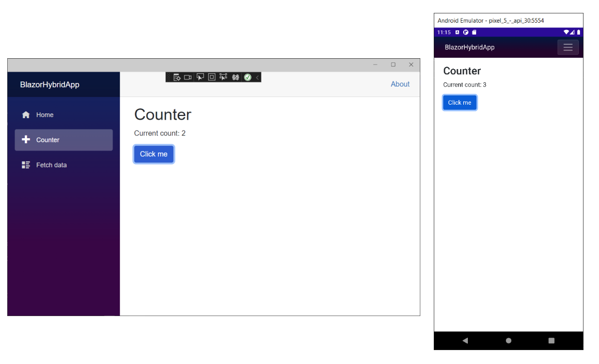

Now that you have your development environment set up, you'll explore the structure of a Blazor Hybrid project and learn how to add new pages.

## What is Razor?

Razor is a markup syntax for embedding .NET based code into webpages. The Razor syntax consists of HTML, C#, and Razor-specific syntax that typically begins with an `@` character. Files containing Razor generally have a `.cshtml` file extension (used in server-side development with Razor Pages and MVC) or a `.razor` extension when used in [Razor components](/aspnet/core/blazor/components/) files. Razor syntax is similar to the templating engines of various JavaScript single-page application (SPA) frameworks, such as Angular, React, VueJs, and Svelte.

## What are Razor components?

A Razor component defines a reusable piece of web UI. Blazor components are analogous to React and Angular components in SPA frameworks.

If you explore the project, you'll see various Razor components defined in .razor files.

At compile time, each Razor component is built into a .NET class. The class includes common UI elements like state, rendering logic, lifecycle methods, and event handlers.

## Try the Counter

In the running app, navigate to the counter page by selecting the **Counter** tab in the sidebar on the left. The following page should then be displayed:



Select the **Click me** button to increment the count without a page refresh. Incrementing a counter in a webpage normally requires writing JavaScript, but with Blazor you can use C#.

You can find the implementation of the `Counter` component at _Components/Pages/Counter.razor_.

```razor
@page "/counter"

<h1>Counter</h1>

<p role="status">Current count: @currentCount</p>

<button class="btn btn-primary" @onclick="IncrementCount">Click me</button>

@code {
    private int currentCount = 0;

    private void IncrementCount()
    {
        currentCount++;
    }
}
```

A request for `/counter` in the browser, as specified by the `@page` directive at the top, causes the `Counter` component to render its content.

Each time you select the **Click me** button:

- The `onclick` event is fired.
- The `IncrementCount` method is called.
- The `currentCount` variable is incremented.
- The component is rendered to show the updated count.
