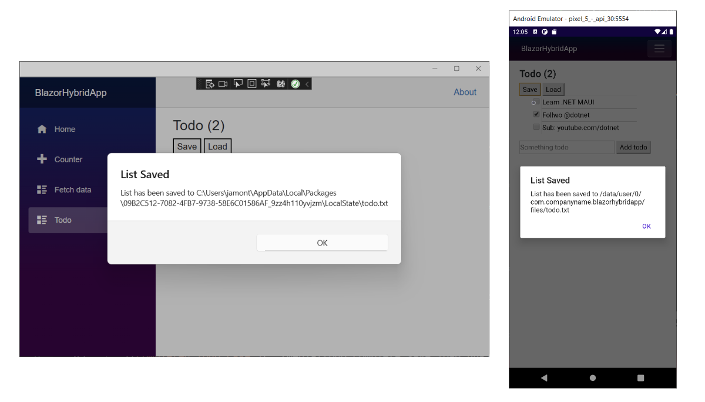

In this exercise, you add the ability to save and load the todo list to the file system.

## Add load and save buttons

1. Let's start by adding two new `<button>` elements for our load and save button under the `<h3>` and  above our list of todo items in the **Todo.razor** file.

    ```razor
    @page "/todo"
    @using BlazorHybridApp.Data

    <h3>Todo (@todos.Count(todo => !todo.IsDone))</h3>

    <button @onclick="Save">Save</button>
    <button @onclick="Load">Load</button>

    <ul class="list-unstyled">
        @foreach (var todo in todos)
        {
            <li>
                <input type="checkbox" @bind="todo.IsDone" />
                <input @bind="todo.Title" />
            </li>
        }
    </ul>
    ```

1. Add two methods in the `@code` block for `Save` and `Load` functionality:

    ```csharp    
    private async Task Save()
    {
    }

    private void Load()
    {
    }
    ```

## Save and load data to disk

.NET includes the `System.IO` namespace that includes the ability to load and save files to disk. .NET MAUI maps this functionality to native APIs for you automatically; all you need to do is specify where to save the file. Each platform has special locations to save user data. The file system helpers in .NET MAUI provide access to get multiple platform directories including the cache and app data directories. It also can load files that are bundled directly into the app. Now, let's implement the `Save` method by using `System.Text.Json`, which is built into .NET.

1. Add the using directives for `Microsoft.Maui.Storage`, `System.Text.Json`, and `System.IO` to the top of the **Todo.razor** file.

    ```razor
    @page "/todo"
    @using BlazorHybridApp.Data
    @using Microsoft.Maui.Storage
    @using System.IO
    @using System.Text.Json
    ```

1. Implement `Save` by serializing the data into a `string`, creating the path for the file, and writing the contents to the file:

    ```csharp
    private async Task Save()
    {
        var contents = JsonSerializer.Serialize(todos);
        var path = Path.Combine(FileSystem.AppDataDirectory, "todo.json");
        File.WriteAllText(path, contents);
        await App.Current.MainPage.DisplayAlert("List Saved", $"List has been saved to {path}", "OK");
    }
    ```

    Note that we can also access platform pop-ups. Here, we're displaying an alert when the file is saved.

1. Implement `Load` by loading the data from disk, deserializing the data, and loading items into the todo list:

    ```csharp
    private void Load()
    {
        var path = Path.Combine(FileSystem.AppDataDirectory, "todo.json");
        if (!File.Exists(path))
            return;
        var contents = File.ReadAllText(path);
        var savedItems = JsonSerializer.Deserialize<List<TodoItem>>(contents);
        todos.Clear();
        todos.AddRange(savedItems);
    }
    ```

1. Save the file. Restart the app if it's not already running.

1. Add items, edit items, and mark items done to test the component. Select the `Save` button to save items to the disk, then close and restart the app or make changes and select `Load` to load the saved data.

   
