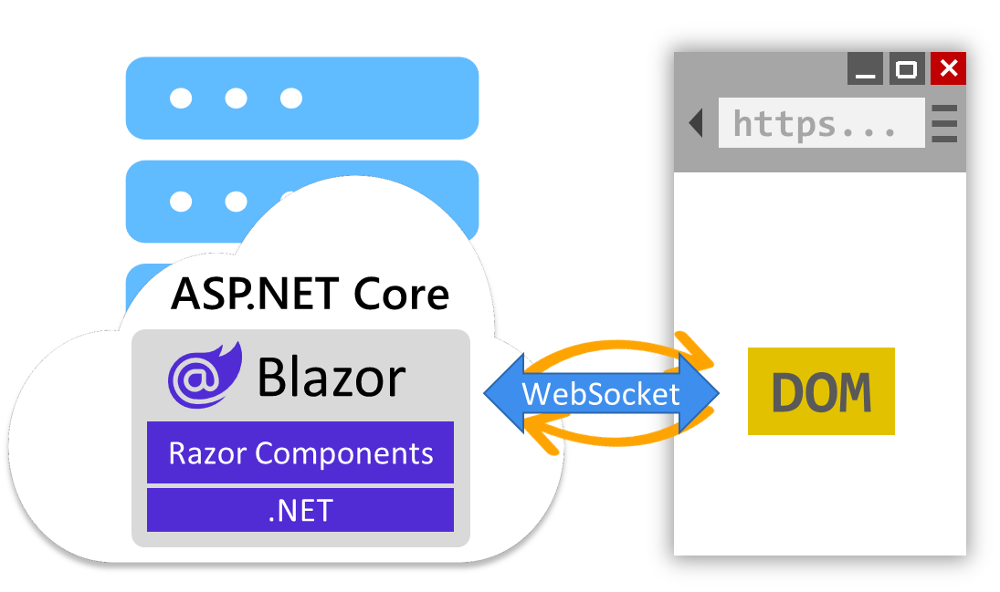
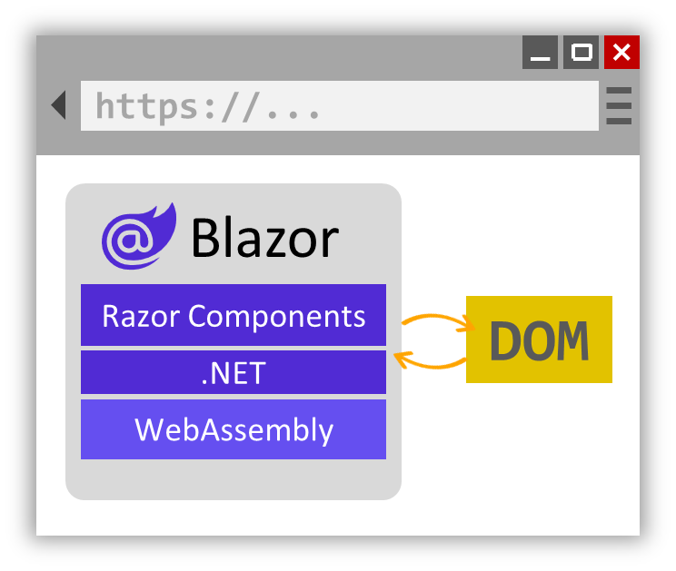

Let's explore how to define component rendering logic and handle UI events.

## Render C# expression values

When you want to render the value of a C# expression in Razor, you use a leading `@` character. For example, a `Counter` component can render the value of its `currentCount` field like this:

```razor
<p role="status">Current count: @currentCount</p>
```

Razor can typically figure out when a C# expression ends and you've transitioned back to writing HTML. But you can also be explicit about the beginning and ending of the expression using parens.

```razor
<p role="status">Current count: @(currentCount)</p>
```

## Add control flow

You can add control flow to your component rendering logic using normal C# statements. For example, you can conditionally render some content using a C# if-statement, like this:

```razor
@if (currentCount > 3)
{
    <p>You win!</p>
}
```

You can also use C# to loop over data and render a list of items:

```razor
<ul>
    @foreach (var item in items)
    {
        <li>@item.Name</li>
    }
</ul>
```

## Handle events

Blazor components often handle UI events. To specify an event callback for an event from a UI element, you use an attribute that starts with `@on` and ends with the event name. For example, you can specify the `IncrementCount` method as a handler for a button click event using the `@onclick` attribute, like this:

```razor
<button class="btn btn-primary" @onclick="IncrementCount">Click me</button>
```

You can specify C# event handlers for other HTML events too, like `@onchange`, `@oninput`, and so on. Event handling methods can be synchronous or asynchronous. You can also define event handlers inline using C# lambda expressions:

```razor
<button class="btn btn-primary" @onclick="() => currentCount++">Click me</button>
```

Event handler methods can optionally take an event argument with information about the event. For example, you can access the value of an input element that has changed like this:

```razor
<input @onchange="InputChanged" />
<p>@message</p>

@code {
    string message = "";

    void InputChanged(ChangeEventArgs e)
    {
        message = (string)e.Value;
    }
}
```

After an event handler runs, Blazor will automatically render the component with its new state, so the message is displayed after the input changes.

## Data binding

Often you want the value of a UI element to be bound to a particular value in code. When the value of the UI element changes, the code value should change, and when the code value changes the UI element should display the new value. Blazor's data binding support makes it easy to set up this sort of two-way data binding.

You bind a UI element to a particular value in code using the `@bind` attribute. For example:

```razor
<input @bind="text" />
<button @onclick="() => text = string.Empty">Clear</button>
<p>@text</p>

@code {
    string text = "";
}
```

When you change the value of the input, the `text` field is updated with the new value. And when you change the value of the `text` field by clicking the Clear button, the value of the input is also cleared.

## Razor directives

Razor directives are reserved keywords in Razor syntax that influence how a Razor file is compiled. Razor directives always begin with the `@` character. Some Razor directives appear at the beginning of a new line, like `@page` and `@code`, while other are attributes that can be applied to elements as attributes, like `@bind`. You can find a full list of the Razor directives in the [Razor syntax reference](/aspnet/core/mvc/views/razor).

## Enable interactivity

To handle UI events from a component and to use data binding, the component must be *interactive*. By default, Blazor components render statically from the server, which means they generate HTML in response to requests and are otherwise unable to handle UI events. You make a component interactive by applying an interactive render mode using the `@rendermode` directive.

You can apply the `@rendermode` directive to a component definition:

```razor
@rendermode InteractiveServer
```

Or to a component instance:

```razor
<Counter @rendermode="InteractiveServer" />
```

The `Counter` component is currently the only interactive component in our app, and it uses interactive server rendering. Interactive server rendering handles UI events from the server over a WebSocket connection with the browser. Blazor sends UI events to the server over this connection so they can be handled by the app's components. Blazor then handles updating the browser DOM with the rendered updates.



Alternatively, Blazor components can use the `InteractiveWebAssembly` render mode to render interactively from the client. In this mode, the component code is downloaded to the browser and run client-side using a WebAssembly-based .NET runtime.



Which interactive render mode you choose to use depends on your app's requirements. Currently our Blazor project is only set up for server-based rendering, so for this module we'll stick with static and interactive server rendering.
