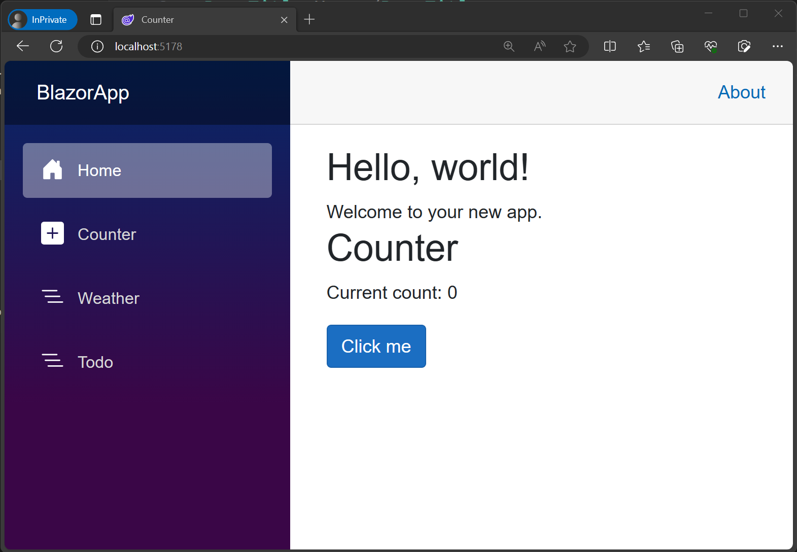

In this exercise, you use everything you learned so far to add a basic to-do list page to your Blazor app.

## Create the to-do list page

1. Create a new Blazor Web App project.

1. Add a *Todo.razor* file to the *Components/Pages* folder

    In Visual Studio and Visual Studio Code you can add the Razor file by right-clicking the *Components/Pages* folder in the **Solution Explorer** and selecting the appropriate option to add a new file.

    You can also create the Razor file using the .NET CLI with this command:

    ```dotnetcli
    dotnet new razorcomponent -n Todo -o Components/Pages
    ```

    The `-n|--name` option in the preceding command specifies the name of the new Razor component. The new component is created in the project's `Components/Pages` folder with the `-o|--output` option.

    > [!IMPORTANT]
    > Razor component file names should have a capitalized first letter so they can easily be distinguished from other HTML elements.

1. Open the `Todo` component and add an `@page` Razor directive to the top of the file with a relative URL of `/todo`, and set the render mode to `InteractiveServer` so the component can handle UI events.

    ```cshtml
    @page "/todo"
    @rendermode InteractiveServer

    <h3>Todo</h3>

    @code {
    
    }
    ```

1. Apply the changes to the app and try browsing to "/todo" to see your new page.

## Add the to-do page to the nav menu

The new to-do list page doesn't yet appear in the nav menu with the other existing pages. The nav menu is defined in the `NavMenu` component, which is part of the app's layout. Let's update the `NavMenu` component to add a link to the to-do list page.

1. Open *Components/Layout/NavMenu.razor*.

1. Find the `nav` element in the `NavMenu` component and add the following `div` element below the existing nav item for the weather page.

    ```razor
    <div class="nav-item px-3">
        <NavLink class="nav-link" href="todo">
            <span class="bi bi-list-nested-nav-menu" aria-hidden="true"></span> Todo
        </NavLink>
    </div>
    ```

    The `NavLink` component is a built-in Blazor component that renders an anchor tag. If the current browser address matches the `href` for the `NavLink`, it also renders an `active` CSS class that you can use for styling the link.

    After applying this change, you should now see the Todo page show up in the nav menu.

    

## Build a list of to-do items

1. Create a new `TodoItem.cs` file at the root of the project (the same level as `Program.cs`) and add the following C# class to it.

    ```csharp
    public class TodoItem
    {
        public string? Title { get; set; }
        public bool IsDone { get; set; } = false;
    }
    ```

1. In *Todo.razor* add a field for the list of to-do items in the `@code` block.

    ```razor
    @code {
        private List<TodoItem> todos = new();
    }
    ```

1. Render an unordered list of all the to-dos using a `foreach` loop.

    ```razor
    <ul>
        @foreach (var todo in todos)
        {
            <li>@todo.Title</li>
        }
    </ul>
    ```

    You don't see anything rendered for the to-do list yet, because the list is empty. You need a way to add some to-do items.

## Add to-do items

Let's add some UI elements for adding to-do items to our list.

1. In *Todo.razor* add an `input` tag and a `button` below the unordered list.

    ```razor
    <input />
    <button>Add todo</button>
    ```

1. Create a `newTodo` string field and bind it to the `input` using the `@bind` directive attribute.

    ```razor
    <input @bind="newTodo" />
    <button>Add todo</button>

    @code {
        private List<TodoItem> todos = new();
        string newTodo = "";
    }
    ```

1. Add a `@onclick` handler to the `button` that adds a new `TodoItem` to the `todos` list based on the value of `newTodo` and then resets the value of `newTodo` to an empty string.

    ```razor
    <input @bind="newTodo" />
    <button @onclick="AddTodo">Add todo</button>

    @code {
        private List<TodoItem> todos = new();
        string newTodo = "";

        void AddTodo()
        {
            if (!string.IsNullOrWhiteSpace(newTodo))
            {
                todos.Add(new TodoItem { Title = newTodo });
                newTodo = string.Empty;
            }
        }
    }
    ```

1. Check that you can now add to-do items and they show up in the list. The `input` value should also reset after adding each to-do item.

## Add checkboxes and count incomplete to-do items

You need a way to mark to-do items as completed, to edit existing to-do items, and to count how many to-do items are yet to be done.

1. Update the contents of the `li` element to render an `input` of type `checkbox` that is bound to `todo.IsDone` and a text `input` that is bound to `todo.Title`.

    ```razor
    <ul>
        @foreach (var todo in todos)
        {
            <li>
                <input type="checkbox" @bind="todo.IsDone" />
                <input @bind="todo.Title" />
            </li>
        }
    </ul>    
    ```

1. Update the `<h3>` header to show a count of the number of todo items that aren't complete (`IsDone` is `false`).

    ```razor
    <h3>Todo (@todos.Count(todo => !todo.IsDone))</h3>
    ```

1. After applying the changes to the app, try adding items, editing items, and marking todo items done to test the component.

   

Your Blazor to-do list is now done ✅.
