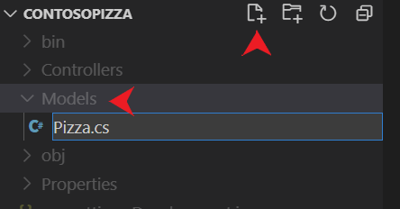
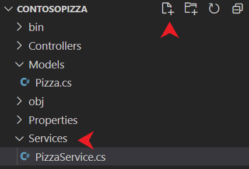

Before you start to implement a web API for pizza, you need to have a data store on which you can perform operations.

You need a `model` class to represent a pizza in inventory. The model contains properties that represent the characteristics of a pizza. The model is used to pass data in the web API and to persist pizza options in the data store.

In this unit, that data store is a simple local in-memory caching service. In a real-world application, you'd consider using a database, such as SQL Server, with Entity Framework Core.

## Create a pizza model

1. Run the following command to create a *Models* folder:

    ```bash
    mkdir Models
    ```

    Select the *Models* folder in Visual Studio Code and add a new file called *Pizza.cs*. 

    

    The project root now contains a *:::no-loc text="Models":::* directory with an empty *:::no-loc text="Pizza.cs":::* file. The directory name *:::no-loc text="Models":::* is a convention. The directory name comes from the *model*-view-controller architecture that the web API uses.

1. Add the following code to *:::no-loc text="Models/Pizza.cs":::* and save your changes. This class defines a pizza.

    ```csharp
    namespace ContosoPizza.Models;

    public class Pizza
    {
        public int Id { get; set; }
        public string? Name { get; set; }
        public bool IsGlutenFree { get; set; }
    }
    ```

## Add a data service

1. Run the following command to create a *Services* folder:

    ```bash
    mkdir Services
    ```

    Select the folder in Visual Studio Code and add a new file called *PizzaService.cs*.

    

1. Add the following code to *:::no-loc text="Services/PizzaService.cs":::* and save your changes. This code creates an in-memory pizza data service.

    ```csharp
    using ContosoPizza.Models;
    
    namespace ContosoPizza.Services;
    
    public static class PizzaService
    {
        static List<Pizza> Pizzas { get; }
        static int nextId = 3;
        static PizzaService()
        {
            Pizzas = new List<Pizza>
            {
                new Pizza { Id = 1, Name = "Classic Italian", IsGlutenFree = false },
                new Pizza { Id = 2, Name = "Veggie", IsGlutenFree = true }
            };
        }

        public static List<Pizza> GetAll() => Pizzas;

        public static Pizza? Get(int id) => Pizzas.FirstOrDefault(p => p.Id == id);

        public static void Add(Pizza pizza)
        {
            pizza.Id = nextId++;
            Pizzas.Add(pizza);
        }

        public static void Delete(int id)
        {
            var pizza = Get(id);
            if(pizza is null)
                return;
            
            Pizzas.Remove(pizza);
        }

        public static void Update(Pizza pizza)
        {
            var index = Pizzas.FindIndex(p => p.Id == pizza.Id);
            if(index == -1)
                return;
            
            Pizzas[index] = pizza;
        }
    }
    ```

    This service provides a simple in-memory data caching service with two pizzas by default. Our web API uses that service for demo purposes. When you stop and start the web API, the in-memory data cache is reset to the two default pizzas from the constructor of `PizzaService`.

## Build the web API project

[!INCLUDE[dotnet build command](../../includes/dotnet-build-command.md)]

In the next unit, you'll create a controller that will use the `Pizza` model and `PizzaService` class.
