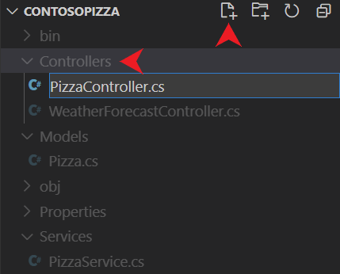

A *controller* is a public class with one or more public methods known as *actions*. By convention, a controller is placed in the project root's *Controllers* directory. The actions are exposed as HTTP endpoints inside the web API controller.

## Create a controller

1. Select the *Controllers* folder in Visual Studio Code and add a new file called *PizzaController.cs*.

    

    An empty class file named *PizzaController.cs* is created in the *Controllers* directory. The *Controllers* directory name  is a convention. The directory name comes from the model-view-*controller* architecture that the web API uses.

    > [!NOTE]
    > By convention, controller class names are suffixed with *Controller*.

1. Add the following code to *Controllers/PizzaController.cs*. Save your changes.

    ```csharp
    using ContosoPizza.Models;
    using ContosoPizza.Services;
    using Microsoft.AspNetCore.Mvc;

    namespace ContosoPizza.Controllers;

    [ApiController]
    [Route("[controller]")]
    public class PizzaController : ControllerBase
    {
        public PizzaController()
        {
        }

        // GET all action

        // GET by Id action

        // POST action

        // PUT action

        // DELETE action
    }
    ```

    As you learned previously, this class derives from `ControllerBase`, the base class for working with HTTP requests in ASP.NET Core. It also includes the two standard attributes you've learned about: `[ApiController]` and `[Route]`. As before, the `[Route]` attribute defines a mapping to the `[controller]` token. Because this controller class is named `PizzaController`, this controller handles requests to `https://localhost:{PORT}/pizza`.

## Get all pizzas

The first REST verb that you need to implement is `GET`, where a client can get all pizzas from the API. You can use the built-in `[HttpGet]` attribute to define a method that returns the pizzas from our service.

Replace the `// GET all action` comment in *Controllers/PizzaController.cs* with the following code:

```csharp
[HttpGet]
public ActionResult<List<Pizza>> GetAll() =>
    PizzaService.GetAll();
```

The preceding action:

* Responds only to the HTTP `GET` verb, as denoted by the `[HttpGet]` attribute.
* Returns an `ActionResult` instance of type `List<Pizza>`. The `ActionResult` type is the base class for all action results in ASP.NET Core.
* Queries the service for all pizza and automatically returns data with a `Content-Type` value of `application/json`.

## Retrieve a single pizza

The client might also want to request information about a specific pizza instead of the entire list. You can implement another `GET` action that requires an `id` parameter. You can use the built-in `[HttpGet("{id}")]` attribute to define a method that returns the pizzas from our service. The routing logic registers `[HttpGet]` (without `id`) and `[HttpGet("{id}")]` (with `id`) as two different routes. You can then write a separate action to retrieve a single item.

Replace the `// GET by Id action` comment in *Controllers/PizzaController.cs* with the following code:

```csharp
[HttpGet("{id}")]
public ActionResult<Pizza> Get(int id)
{
    var pizza = PizzaService.Get(id);

    if(pizza == null)
        return NotFound();

    return pizza;
}
```

The preceding action:

* Responds only to the HTTP `GET` verb, as denoted by the `[HttpGet]` attribute.
* Requires that the `id` parameter's value is included in the URL segment after `pizza/`. Remember, the controller-level `[Route]` attribute defined the `/pizza` pattern.
* Queries the database for a pizza that matches the provided `id` parameter.

Each `ActionResult` instance used in the preceding action is mapped to the corresponding HTTP status code in the following table:

|ASP.NET Core<br>action result|HTTP status code|Description|
|-----------------------------|----------------|-----------|
|`Ok` is implied              |200             |A product that matches the provided `id` parameter exists in the in-memory cache.<br>The product is included in the response body in the media type, as defined in the `accept` HTTP request header (JSON by default).|
|`NotFound`                   |404             |A product that matches the provided `id` parameter doesn't exist in the in-memory cache.|

## Build and test the controller

1. Build and start the web API by running the following command:

    ```dotnetcli
    dotnet run
    ```

1. Open the existing `httprepl` terminal, or open a new integrated terminal from Visual Studio Code by selecting **Terminal** > **New Terminal** from the main menu.

1. Connect to our web API by running the following command:
  
   ```dotnetcli
   httprepl https://localhost:{PORT}
   ```
  
   Alternatively, run the following command at any time while `HttpRepl` is running:

   ```dotnetcli
   connect https://localhost:{PORT}
   ```

1. To see the newly available `Pizza` endpoint, run the following command:

   ```dotnetcli
   ls
   ```

   The preceding command detects all APIs available on the connected endpoint. It should display the following code:

   ```output
    https://localhost:{PORT}/> ls
    .                 []
    Pizza             [GET]
    WeatherForecast   [GET]
   ```

1. Go to the `Pizza` endpoint by running the following command:

   ```dotnetcli
   cd Pizza
   ```

   The preceding command shows an output of available APIs for the `Pizza` endpoint:

   ```output
   https://localhost:{PORT}/> cd Pizza
   /Pizza    [GET]
   ```

1. Make a `GET` request in `HttpRepl` by using the following command:

   ```dotnetcli
   get
   ```

   The preceding command returns a list of all pizzas in JSON:

   ```output
     HTTP/1.1 200 OK
     Content-Type: application/json; charset=utf-8
     Date: Fri, 02 Apr 2021 21:55:53 GMT
     Server: Kestrel
     Transfer-Encoding: chunked

     [
         {
             "id": 1,
             "name": "Classic Italian",
             "isGlutenFree": false
         },
         {
             "id": 2,
             "name": "Veggie",
             "isGlutenFree": true
         }
     ]
   ```

1. To query for a single pizza, you can make another `GET` request, but pass in an `id` parameter by using the following command:

    ```dotnetcli
    get 1
    ```

    The preceding command returns `Classic Italian` with the following output:

    ```output
    HTTP/1.1 200 OK
    Content-Type: application/json; charset=utf-8
    Date: Fri, 02 Apr 2021 21:57:57 GMT
    Server: Kestrel
    Transfer-Encoding: chunked

    {
        "id": 1,
        "name": "Classic Italian",
        "isGlutenFree": false
    }
    ```

1. Our API also handles situations where the item doesn't exist. Call the API again, but pass in an invalid pizza `id` parameter by using the following command:

    ```dotnetcli
    get 5
    ```

    The preceding command returns a `404 Not Found` error with the following output:

    ```output
    HTTP/1.1 404 Not Found
    Content-Type: application/problem+json; charset=utf-8
    Date: Fri, 02 Apr 2021 22:03:06 GMT
    Server: Kestrel
    Transfer-Encoding: chunked

    {
        "type": "https://tools.ietf.org/html/rfc7231#section-6.5.4",
        "title": "Not Found",
        "status": 404,
        "traceId": "00-ec263e401ec554b6a2f3e216a1d1fac5-4b40b8023d56762c-00"
    }
    ```

1. Return to the `dotnet` terminal in the drop-down list in Visual Studio Code and shut down the web API by selecting CTRL+C on your keyboard.

You've now finished implementing the `GET` verbs. In the next unit, you can add more actions to `PizzaController` to support CRUD operations on pizza data.
