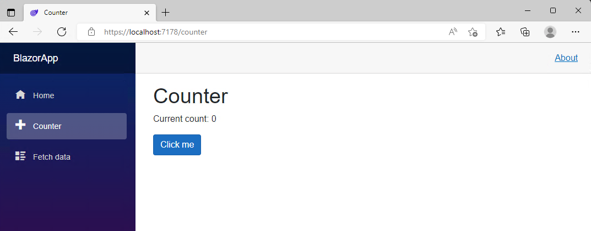

Now that you have your development environment set up, let's explore the structure of a Blazor project and learn how Blazor components work.

## The Home page

The home page for the app is defined by the *Home.razor* file located inside the *Components/Pages* directory. *Home.razor* contains the following code:

```razor
@page "/"

<PageTitle>Home</PageTitle>

<h1>Hello, world!</h1>

Welcome to your new app.
```

The `@page` directive at the top specifies the route for this page, so that the `Home` component is displayed when the user navigates to the root of the app. The `PageTitle` tag is a Blazor component that sets the title for the current page so that it shows up in the browser tab. The rest of the file is normal HTML that defines the content for the page.

## What is Razor?

Razor is a markup syntax based on HTML and C#. A Razor file (.razor) contains plain HTML and then C# to define any rendering logic, like for conditionals, control flow, and expression evaluation. Razor files are then compiled into C# classes that encapsulate the component's rendering logic.

## What are Razor components?

If you explore the files in the Blazor project, you can see that most of the files that make up the project are *.razor* files. In Blazor, a Razor file defines a reusable component that makes up a portion of the app UI. Components define what HTML to render and how to handle user events.

At compile time, each Razor component is built into a C# class. The class can include common UI elements like state, rendering logic, lifecycle methods, and event handlers. Because Blazor components authored in Razor are just C# classes, you can use arbitrary .NET code from your components.

## Using components

To use a component from another component, you add an HTML-style tag with a name that matches the name of the component. For example, if you have a component named *MyButton.razor*, you can add a `MyButton` component to another component by adding a `<MyButton />` tag.

## Component parameters

Components can also have parameters, which allow you to pass data to the component when it's used. Component parameters are defined by adding a public C# property to the component that also has a `[Parameter]` attribute. You can then specify a value for a component parameter using an HTML-style attribute that matches the property name. The value of the parameter can be any C# expression.

## The @code block

The `@code` block in a Razor file is used to add C# class members (fields, properties, and methods) to a component. You can use the `@code` to keep track of component state, add component parameters, implement component lifecycle events, and define event handlers.

## Try the Counter

In the running app, navigate to the Counter page by clicking the Counter tab in the sidebar on the left. The following page should then be displayed:



Select the **Click me** button to increment the count without a page refresh. Incrementing a counter in a webpage normally requires writing JavaScript, but with Blazor, you can use C#.

You can find the implementation of the `Counter` component at *Components/Pages/Counter.razor*.

```razor
@page "/counter"
@rendermode InteractiveServer

<PageTitle>Counter</PageTitle>

<h1>Counter</h1>

<p role="status">Current count: @currentCount</p>

<button class="btn btn-primary" @onclick="IncrementCount">Click me</button>

@code {
    private int currentCount = 0;

    private void IncrementCount()
    {
        currentCount++;
    }
}
```

A request for `/counter` in the browser, as specified by the `@page` directive at the top, causes the `Counter` component to render its content. The `@rendermode` directive enables interactive server rendering for the component, so that it can handle user interface events from the browser.

Each time you select the **Click me** button:

- The `onclick` event is fired.
- The `IncrementCount` method is called.
- The `currentCount` is incremented.
- The component is rendered to show the updated count.
