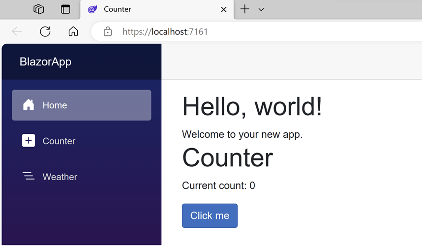

In this exercise, you add a Razor component to the home page of your app.

## Add the Counter component to the Home page

1. Open the *Components/Pages/Home.razor* file.

1. Add a `Counter` component to the page by adding a `<Counter />` element at the end of the `Home.razor` file.

    ```razor
    @page "/"

    <PageTitle>Home</PageTitle>

    <h1>Hello, world!</h1>

    Welcome to your new app.

    <Counter />
    ```

1. Apply the change by restarting the app or using hot reload. The `Counter` component shows up on the home page.

    

## Modify a component

Define a parameter on the `Counter` component to specify how much it increments with every button click.

1. Add a public property for `IncrementAmount` with a `[Parameter]` attribute.

1. Change the `IncrementCount` method to use the `IncrementAmount` value when incrementing the value of `currentCount`.

    The updated code in *Counter.razor* should look like this:

    ```razor
    @page "/counter"
    @rendermode InteractiveServer

    <PageTitle>Counter</PageTitle>

    <h1>Counter</h1>

    <p role="status">Current count: @currentCount</p>

    <button class="btn btn-primary" @onclick="IncrementCount">Click me</button>

    @code {
        private int currentCount = 0;

        [Parameter]
        public int IncrementAmount { get; set; } = 1;

        private void IncrementCount()
        {
            currentCount += IncrementAmount;
        }
    }
    ```

1. In `Home.razor`, update the `<Counter />` element to add an `IncrementAmount` attribute that changes the increment amount to 10, as shown by the last line in the following code:

    ```razor
    @page "/"

    <h1>Hello, world!</h1>

    Welcome to your new app.

    <Counter IncrementAmount="10" />
    ```

1. Apply the changes to the running app.

    The `Home` component now has its own counter that increments by 10 each time the **Click me** button is selected, as shown in the following image.

    

    The `Counter` component at `/counter` continues to increment by one.
