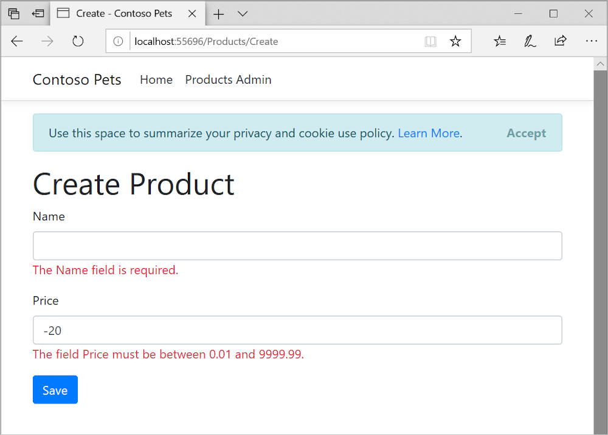

In this unit, you will create a form in the *:::no-loc text="ContosoPets.UI":::* project using Razor Pages to separate the logic of the page from its presentation.

## Use the .NET Core CLI to create a new Razor Page

The *:::no-loc text="ContosoPets.UI":::* project directory should be currently open in the [Azure Cloud Shell editor](https://docs.microsoft.com/azure/cloud-shell/using-cloud-shell-editor). If it's not, repeat the setup steps in the previous *Set up the environment* unit.

1. Run the following command in the command shell:

	```bash
	pushd $srcWorkingDirectory/ContosoPets.Ui/Pages/Products
	```

	The current directory changes to the *:::no-loc text="Products/":::* directory.

1. Run the following .NET Core CLI command in the command shell at the current directory.

	```bash
	dotnet new page --name Create --namespace ContosoPets.Ui.Pages.Products 
	```

	A new Razor page named *:::no-loc text="Create.cshtml":::* and its *:::no-loc text="PageModel":::* class file named *:::no-loc text="Create.cshtml.cs":::* are created in the *:::no-loc text="ContosoPets.Ui/Pages/Products/":::* directory. By convention, the Razor page and its *:::no-loc text="PageModel":::* class file share the same name and location.

## Examine the structure of a basic Razor Page

1. [!INCLUDE[refresh file explorer](../../includes/refresh-file-explorer.md)]

1. Open your new *:::no-loc text="Create.cshtml":::* Razor page, located in the *:::no-loc text="ContosoPets.Ui/Pages/Products/":::* directory, to examine the contents. It looks like the following:

	```cshtml
	@page
	@model ContosoPets.Ui.Pages.CreateModel
	@{
	}

	```

 The preceding default Razor Page contains:

* Reserved Razor keywords:
	* The `@page` directive is what makes this a Razor page. It indicates this page can handle HTTP requests. The `@page` directive must be the first directive on a Razor page.
	* The `@model` directive is Razor syntax specifying the type of the model made available to the Razor page. In this case, the `ContosoPets.UI.Pages.Products.Create` `PageModel`-derived class. `ContosoPets.UI.Pages.Products.CreateModel` was automatically defined in the *:::no-loc text="Create.cshtml.cs":::* class file. *:::no-loc text="Create.cshtml.cs":::* was generated when you made a new Razor page named *:::no-loc text="Create":::*.
* HTML: Such as an `<h1>` tag.
* C# code: The `@` character starts single-statement C# blocks. Multi-statement C# blocks can be created when using `@{}`. For example:

	```cshtml
	@{
    	var pageTitle = "Home page";
    	ViewData["Title"] = pageTitle;
	}
	```


## Render HTML and transition to C#

The following markup from your new Razor Page is an example of an `@` symbol followed by C# code. The C# code is setting the `ViewData` collection's `Title` key value to `Create`. Razor syntax uses the `@` symbol to transition from HTML to C#. If the `@` symbol is followed by a Razor reserved keyword, it transitions into Razor-specific markup; otherwise, it transitions to C#. Razor evaluates the C# expressions and renders them in the HTML output.

```cshtml
@{
    ViewData["Title"] = "Create";
}
```

A Razor Page supports Razor syntax which allows you to combine HTML and C#. The C# code defines the dynamic rendering logic for the page on the server-side. The default Razor language is HTML. Rendering HTML from Razor markup is no different than rendering HTML from an HTML file. HTML markup in *:::no-loc text=".cshtml":::* Razor Page files is rendered by the server unchanged. In Razor Pages, you can use HTML as you are used to while taking advantage of powerful and time saving razor features as you learn to use them.

## Add form markup to the Create Razor page

Open your *:::no-loc text="Create.cshtml":::* Razor page, located in the *:::no-loc text="ContosoPets.Ui/Pages/Products/":::* directory. Replace the contents with the following, and save your changes.

```cshtml
@page
@model ContosoPets.Ui.Pages.Products.CreateModel
@{
    ViewData["Title"] = "Create";
}

<h1>Create Product</h1>

<form method="post">
    <div class="form-group">
        <label asp-for="Product.Name" class="control-label"></label>
        <input asp-for="Product.Name" class="form-control" />
        <span asp-validation-for="Product.Name" class="text-danger"></span>
    </div>
    <div class="form-group">
        <label asp-for="Product.Price" class="control-label"></label>
        <input asp-for="Product.Price" class="form-control" />
        <span asp-validation-for="Product.Price" class="text-danger"></span>
    </div>
    <div class="form-group">
        <input type="submit" value="Save" class="btn btn-primary" />
    </div>
</form>
```

[!INCLUDE[OS-specific keyboard shortcuts](../../includes/keyboard-shortcuts-table.md)]

Your *:::no-loc text="Create":::* Razor Page now contains HTML plus Razor syntax for a basic form. The *:::no-loc text="Create":::* page's purpose is to allow a user to create a new ContosoPets product entry with *:::no-loc text="Name":::* and *:::no-loc text="Price":::* values. Although there is relatively little markup in this file, there are some dynamic features provided through Razor Tag Helpers.

## Razor Tag Helpers

Tag Helpers are components for automating HTML generation in ASP.NET Core web applications. By design, they're reusable, customizable building blocks that save you time. Most built-in Tag Helpers extend standard HTML elements you're familiar with and provide additional server-side attributes for the element, making them more robust. There are three Tag Helpers on this page: Label, Input, and Validation Message. ASP.NET Core extends the standard HTML element by adding attributes.

### The *:::no-loc text="Label Tag Helper":::*

The following markup uses the *:::no-loc text="Label Tag Helper":::* which contains an *:::no-loc text="asp-for":::* attribute, as do many Tag Helpers.

```cshtml
<label asp-for="Product.Name" class="control-label"></label>
```

The *:::no-loc text="Label Tag Helper":::* extends the standard HTML *:::no-loc text="<label>":::* element. As is common for many Razor Tag Helpers, it uses an *:::no-loc text="asp-for":::* attribute which takes a specified *:::no-loc text="PageModel":::* property. The *:::no-loc text="PageModel":::* property is defined in C#. In this case, the value of the *:::no-loc text="PageModel":::* `Name` property will be rendered as the content for an HTML `<label>` element. The `[asp-for]` attribute is scoped to the *:::no-loc text="PageModel":::* for the Razor page, so the `@` symbol isn't used. The label is dynamic as is needed here, but remains compact and easy to add in your markup.

### The *:::no-loc text="Input Tag Helper":::*

The following markup uses the Input Tag Helper. It extends the standard HTML `<input>` element. It also uses an `asp-for` attribute to specify a *:::no-loc text="PageModel":::* property.

```cshtml
<input asp-for="Product.Name" class="form-control" />
```

The *:::no-loc text="Input Tag Helper":::* takes care of a lot for you:

* Like the *:::no-loc text="Label Tag Helper":::* It evaluates the *:::no-loc text="Product.Name":::* property defined in the *:::no-loc text="PageModel":::* in C#, adds an *:::no-loc text="id":::* and *:::no-loc text="name":::* based on that property and sets the input type appropriately. For example if the specified property is a *:::no-loc text="Boolean":::*, then an input type of *:::no-loc text="checkbox":::* would be dynamically generated in the HTML output. In this case the *:::no-loc text="Product.Name":::* property is a *:::no-loc text="String":::*. This is set by the model's data annotation attributes which will be reviewed later in this module.
* It provides client-side validation using JQuery based on the model's data annotation attributes provided through the *:::no-loc text="PageModel":::*. The *:::no-loc text="Input Tag Helper":::* also prompts the Razor engine to provide additional, more robust server-side validation if client-side validation was successful. You will walk through the *:::no-loc text="Create":::* Razor Page's *:::no-loc text="POST":::* event lifecycle, which includes client-side and server-side input validation later in this module. 

The following is the generated HTML output from the *:::no-loc text="Input Tag Helper":::* from the *:::no-loc text="Create":::* page:

```html
<input name="Product.Name" class="form-control" id="Product_Name" type="text" value="" data-val-required="The Name field is required." data-val="true">
```

### The *:::no-loc text="Validation Message Tag Helper":::*

The following markup uses the *:::no-loc text="Validation Message Tag Helper":::*. It displays a validation message for a single property on your model.

```cshtml
<span asp-validation-for="Product.Price" class="text-danger"></span>
The *:::no-loc text="Input Tag Helper":::* adds HTML5 attributes prefixed with `data-` to input elements. The attributes are based on properties in your C# model classes. While responsive client-side validation occurs, validation is also performed on the server which is more secure.

The following is the HTML rendered by the *:::no-loc text="Validation Message Tag Helper":::*:

```html
<input name="Product.Price" class="form-control" id="Product_Price" type="text" value="" data-val-required="The Price field is required." data-val="true" data-val-range-min="0.01" data-val-range-max="9999.99" data-val-range="The field Price must be between 0.01 and 9999.99." data-val-number="The field Price must be a number.">
```

The `type`, `data-val-range-min`, `data-val-range-max` and error response are dynamically set by the model's data annotations for the model's `Product.Price` property.

The following is the completed *:::no-loc text="Create":::* form rendered in the browser displaying its validation messages after the user's input failed to pass data validation.



Now that the *:::no-loc text="Create":::* Razor Page form has been created, let's explore its *:::no-loc text="PageModel":::* class file and modify it to handle the *:::no-loc text="Create":::* page's *:::no-loc text="POST":::* event and data.
