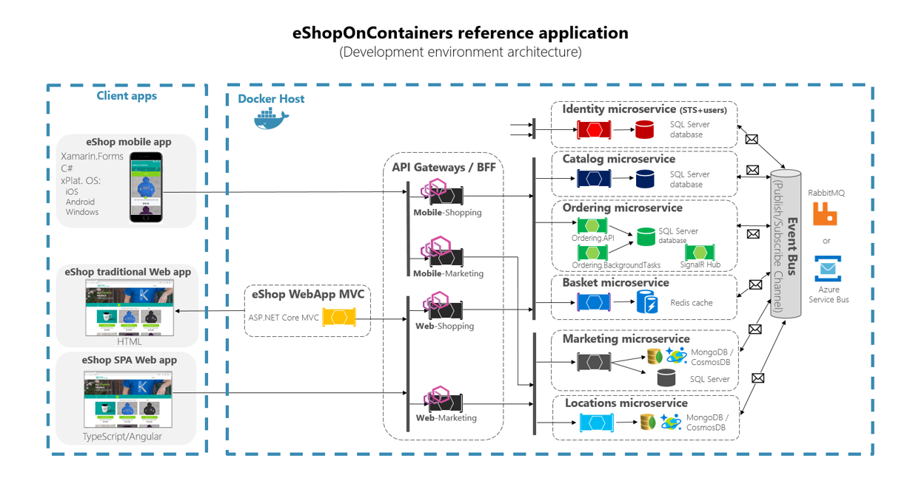

## The need for the API Gateway pattern

In a typical microservices scenario the client applications have to interact with many microservices, so this can create a serious communications problem.

A possible approach is to use a direct client-to-microservice communication architecture. In this approach, a client app can make requests directly to some of the microservices, as shown in the next image.


As you can see in the image above, each client application, either mobile or web, connects to the each of the three microservices.

In this approach, each microservice has a public endpoint, sometimes with a different TCP port for each microservice, but this can make it complicated for the whole system, and it's not just for having to deal with concerns like:

- Need to issue multiple requests for one operation.
- Aggregating data from different microservices.
- Dealing with potentially multiple latencies.
- Handling multiple authorizations.

On the backend side you'd also have to deal with setting up a public IP address and TLS termination for each microservice. You'd probably also have to deal with metering usage for multiple endpoints.

And there's even more, how would you handle the unavoidable API evolution and versioning? All applications would have to be changed in a very coordinated way because of the high coupling.

This is where the API Gateway patterns comes into play, working as shown in the next image:


The above image shows how all client apps, and even a client MVC app, communicate with a single entry point in the API Gateway.

The above configuration has several important advantages, like:

- A single DNS name and HTTPS Termination.
- Frontend and backend completely decoupled.
- A single metering point.

The decoupling aspect also makes it very easy to route different versions to different microservice instances, to simplify progressive deployments and, for example, to implement [A/B testing](https://en.wikipedia.org/wiki/A/B_testing).

### Explore the API Gateway implementation in eShopOnContainers

// TO DO - Need to add/remove content if requires

There are many commercial and open source product available to implement API Gateway. Few of the popular ones are listed as per below :

- [Ocelot](https://github.com/ThreeMammals/Ocelot)
- [Ambassador API Gateway](https://www.getambassador.io/)
- [Kong](https://konghq.com/)

In eShopOnContainers application we implement this pattern with help of a Service Proxy.

#### Service Proxy Vs API Gateway

Though an API Gateway performs similar functionality to a service proxy, it also supports many robust sets of features. Apart from basic routing, monitoring, rate limiting, it can also offer features like advanced security, comprehensive service orchestration, DoS prevention etc. If you are looking for basic proxy related functionalities for your API, then possibly service proxy is a good place to start. But if your API is not self-sufficient and you are planning to have a full-fledged life cycle for your API with advanced features then API Gateway will be the right choice.

#### Choice of Envoy as a service proxy

There are a good number of options available under this segment in [Cloud Native Landscape](https://landscape.cncf.io/category=service-proxy&format=card-mode&grouping=category). But in the `eShopOnContainers` reference application, `Envoy` has been picked up as the right choice because of the following reasons.

- Envoy is a modern, high performance service proxy and imposes a small foot print during deployment.
- It's an open source solution and designed particularly for any cloud-native applications.
- It supports `SSL` for security and has the capability of translating `HTTP/2` to `HTTP/1.1` in both directions of upstream and downstream.
- It's well suited for the large modern service-oriented architectures with functionality like service discovery and load balancing.
- It gets deployed as a sidecar process and that's the reason it's tied to any service implementation.
- Moreover, it's a no-code solution and can easily be deployed with minimal configuration.

A simple `Envoy` configuration with one shopping aggregator (*you will learn below*) as routes for `eShopOnContainers` application looks like as per below :

```yml

admin:
  access_log_path: "/dev/null"
  address:
    socket_address:
      address: 0.0.0.0
      port_value: 8001
static_resources:
  listeners:
  - address:
      socket_address:
        address: 0.0.0.0
        port_value: 80
    filter_chains:
    - filters:
      - name: envoy.http_connection_manager
        config:
          codec_type: auto
          stat_prefix: ingress_http
          route_config:
            name: eshop_backend_route
            virtual_hosts:
            - name: eshop_backend
              domains:
              - "*"
              routes:
              - name: "agg"
                match:
                  prefix: "/"
                route:
                  auto_host_rewrite: true
                  prefix_rewrite: "/"
                  cluster: shoppingagg
          http_filters:
          - name: envoy.router
          access_log:
          - name: envoy.file_access_log
            filter:
              not_health_check_filter: {}
            config:
              json_format:
                time: "%START_TIME%"
                protocol: "%PROTOCOL%"
                duration: "%DURATION%"
                request_method: "%REQ(:METHOD)%"
                request_host: "%REQ(HOST)%"
                path: "%REQ(X-ENVOY-ORIGINAL-PATH?:PATH)%"
                response_flags: "%RESPONSE_FLAGS%"
                route_name: "%ROUTE_NAME%"
                upstream_host: "%UPSTREAM_HOST%"
                upstream_cluster: "%UPSTREAM_CLUSTER%"
                upstream_local_address: "%UPSTREAM_LOCAL_ADDRESS%"
              path: "/tmp/access.log"
  clusters:
  - name: shoppingagg
    connect_timeout: 0.25s
    type: strict_dns
    lb_policy: round_robin
    hosts:
    - socket_address:
        address: webshoppingagg
        port_value: 80  

```

## The BFF pattern

Even though the API Gateway pattern solves many problems, there are still some issues that have to tackled.

Each client application might have a context that imposes some specific constraints, for example, a mobile phone usually has a more restrained internet connection than a desktop computer and, of course, has a much smaller screen size. So it might make sense to have a "basic", "reduced" (low-bandwidth) API for mobile use and an "extended" API for desktop use.

This is where the BFF pattern comes into play, by supplying a per-device-type API, customized for the specific context, as shown in the next image.


In the above image you can see that the mobile applications accesses a mobile-specific API Gateway, while the client SPA and MVC web apps use a desktop-specific API Gateway.

The BFF is much more than an application gateway, as it usually requires custom logic to achieve the required results. This is where the web aggregator comes into play.

## The web aggregator

The web aggregator has the central role in the BFF pattern and you can think of it as a broker. It gets a request from the client, makes further requests to some backend services and then assembles a customized response to send it back to the client app.

### Explore the BFF implementation in eShopOnContainers

The web client BFF in implemented as a Web API application in folder `src\ApiGateways\Aggregators\Web.Shopping.HttpAggregator`.

The `BasketController` is a nice example of what a BFF might look like, and we'll focus specifically in the action that handles the POST request to update the Basket from the SPA.

This action receives the current customer basket and takes care of:

- Getting current basket from DB (Redis) if it exists.
- Aggregating items by product ID.
- Updating prices and other item information from the catalog.
- Saving the basket back to the DB.

You can check some details in the following code fragment.

```csharp
[Route("api/v1/[controller]")]
[Authorize]
[ApiController]
public class BasketController : ControllerBase
{
    .../...
    public BasketController(ICatalogService catalogService, IBasketService basketService, ICouponService couponService)
    {
        .../...
    }

    [HttpPost]
    [HttpPut]
    [ProducesResponseType((int)HttpStatusCode.BadRequest)]
    [ProducesResponseType(typeof(BasketData), (int)HttpStatusCode.OK)]
    public async Task<ActionResult<BasketData>> UpdateAllBasketAsync([FromBody] UpdateBasketRequest data)
    {
        if (data.Items == null || !data.Items.Any())
        {
            return BadRequest("Need to pass at least one basket line");
        }

        // Retrieve the current basket
        var basket = await _basket.GetById(data.BuyerId) ?? new BasketData(data.BuyerId);
        var catalogItems = await _catalog.GetCatalogItemsAsync(data.Items.Select(x => x.ProductId));

        // group by product id to avoid duplicates
        var itemsCalculated = data
                .Items
                .GroupBy(x => x.ProductId, x => x, (k, i) => new { productId = k, items = i })
                .Select(groupedItem =>
                {
                    var item = groupedItem.items.First();
                    item.Quantity = groupedItem.items.Sum(i => i.Quantity);
                    return item;
                });

        foreach (var bitem in itemsCalculated)
        {
            var catalogItem = catalogItems.SingleOrDefault(ci => ci.Id == bitem.ProductId);
            if (catalogItem == null)
            {
                return BadRequest($"Basket refers to a non-existing catalog item ({bitem.ProductId})");
            }

            var itemInBasket = basket.Items.FirstOrDefault(x => x.ProductId == bitem.ProductId);
            if (itemInBasket == null)
            {
                basket.Items.Add(new BasketDataItem()
                {
                    Id = bitem.Id,
                    ProductId = catalogItem.Id,
                    ProductName = catalogItem.Name,
                    PictureUrl = catalogItem.PictureUri,
                    UnitPrice = catalogItem.Price,
                    Quantity = bitem.Quantity
                });
            }
            else
            {
                itemInBasket.Quantity = bitem.Quantity;
            }
        }

        await _basket.UpdateAsync(basket);

        return basket;
    }

    .../...
}

```

This is a clear example of the kind of processing that could be handled by the BFF to make it easier or the client applications.

### Complete architecture of eShopOnContainers - Envoy as API Gateway & BFF pattern



## Route External Traffic using Ingress

You understand that how API Gateway pattern can be helpful for your microservices architecture. But you still need a mechanism for external traffic to talk to the services deployed within the Kubernetes cluster. For that, in the `eShopOnContainers` reference application, we use *NGINX Ingress Controller*. You'll learn more about it in the next unit. There you'll also explore different managed services in Azure by deploying an AKS cluster that uses the *Azure Application Gateway Ingress Controller* instead of the *NGINX Ingress Controller* to route HTTP traffic in the cluster.

## Cloud Managed API Gateway Scalability

In a production scenario, you'll always like to depend on managed services. In Azure, we have the following options available as managed services.

### API Management (APIM)

// TO DO - Add/modify content if requires

API Management (APIM) is a way to create consistent and modern API gateways for existing back-end services. It has the following advantages over an API gateway managed by you.

- Zero maintenance.
- Easy auto scaling based on your increase.
- Has an option to run the API Gateway outside the cluster reducing the load on the cluster.
- Easy analytics option to monitor the load or incoming traffic.

You can always deploy APIM in front of Kubernetes cluster to expose your API internally or externally. There are quite a few options available for you to adopt the right architecture. For more details, refer [Deploy API Management in front of AKS](https://docs.microsoft.com/en-us/azure/api-management/api-management-kubernetes#deploy-api-management-in-front-of-aks)

Though you can always route the traffic from an APIM to an ingress controller to let the traffic flow in from outside to the internal cluster, there is another popular option available for you to explore in Azure. That's **Application Gateway**. You can enable **Application Gateway ingress controller** to easily route the external traffic directly to your service pods. You'll explore those concepts in detail in the next unit.
