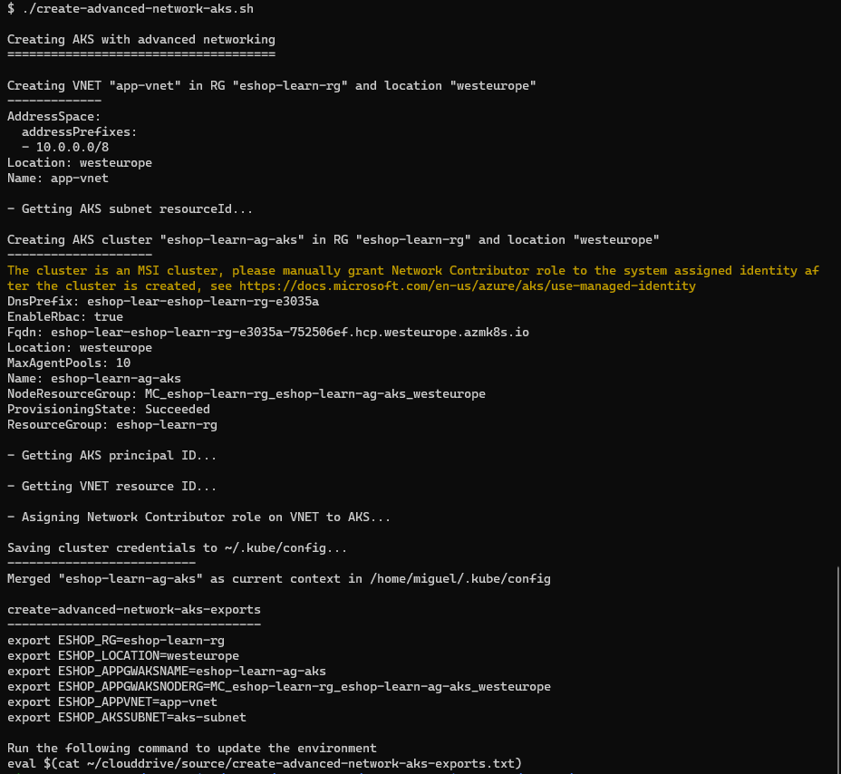
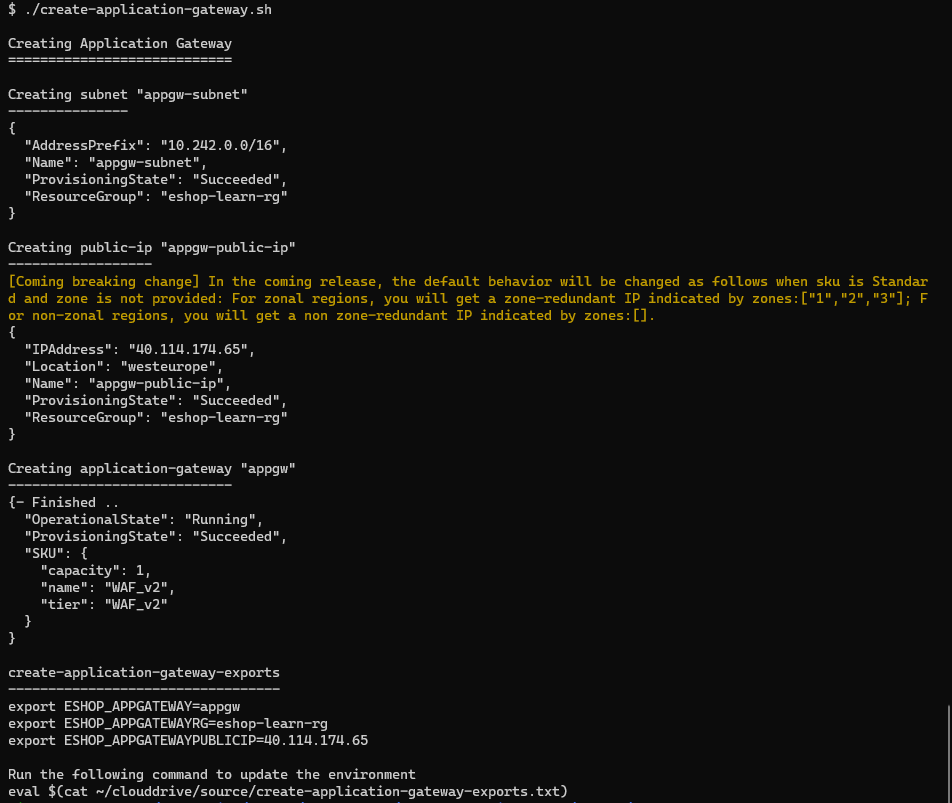
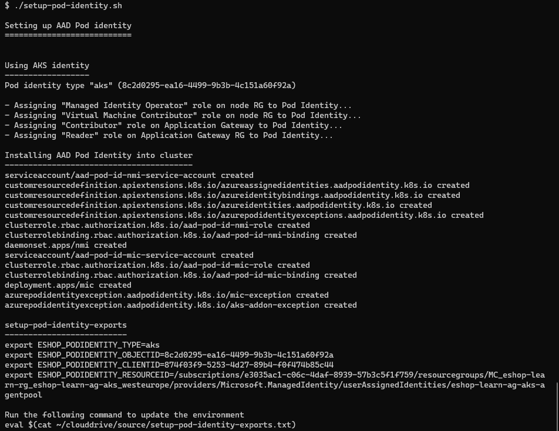
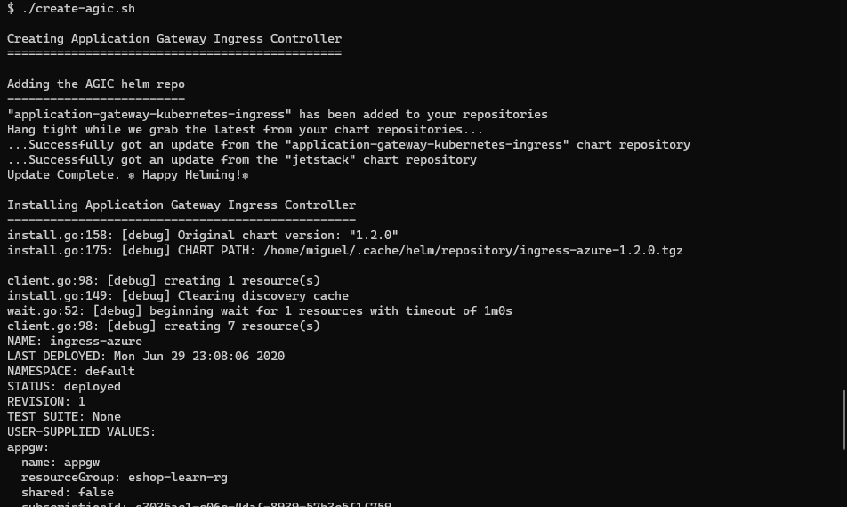
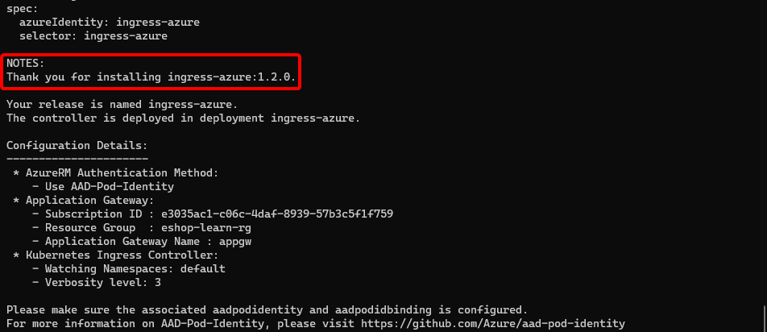
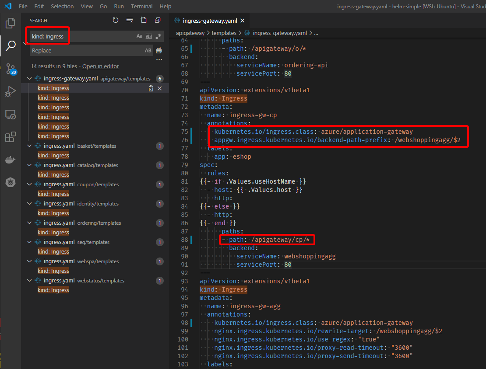
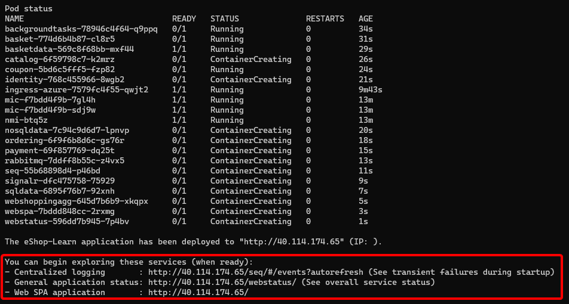

## Overview

In this exercise you'll deploy an instance of Azure Application Gateway with ingress controller to load balance the traffic to different pods directly of `eShopOnContainer` services. Further to that, you'll also enable TLS configuration in Application Gateway to use HTTPS instead of HTTP.

For that, you'll deploy another AKS cluster to the resource group you already created. You can't configure an Application Gateway for the cluster you created in the initial deployment, because it doesn't have the advanced networking option.

In this exercise you will:

- Create an AKS instance with advanced networking.
- Create an Azure Application Gateway instance.
- Set up AAD Pod Identity.
- Deploy the AGIC to the AKS cluster.
- Configure the existing ingresses to use the AGIC.
- Deploy the application with the updated ingresses to AKS.

## Create an AKS instance with advanced networking

Run the script:

```bash
./create-advanced-network-aks.sh
```

The above script performs the following actions:

- Creates a VNET in the resource group your created in the previous exercise.
- Creates the subnet that'll be used for AKS nodes.
- Creates the AKS cluster.
- Assigns the "Network Contributor" role on the VNET to the AKS principal.
- Save the cluster credentials to `~/.kube/config`

You should get something like this:



This script will take a while, so in the meantime you can begin to take a look to the [Configure ingresses](#configure-the-existing-ingresses) step.

## Create an Azure Application Gateway instance

Run the script:

```bash
./create-application-gateway.sh
```

The script will perform the following tasks:

- Create a subnet for the Application Gateway in the VNET created in the previous step.
- Create a public IP.
- Create the Application Gateway.

You should get something like this:



This script will also take a while, so in the meantime you can continue checking out the [ingresses configuration](#configure-the-existing-ingresses).

## Set up AAD Pod Identity

This a key step for the whole setup to work properly. Since the AGIC needs to update the Application Gateway configuration constantly, to respond to ingress resource changes in the cluster, it needs permissions to create listeners, routes, and backend pools in the Application Gateway. This means the AGIC needs an identity it can "impersonate" that has the needed permissions.

In this case the identity used is the [Managed System Identity](https://docs.microsoft.com/azure/active-directory/managed-identities-azure-resources/overview) from the AKS cluster.

To set up the AAD pod identity, run the script:

```bash
./setup-pod-identity.sh
```

The above script performs the following tasks:

- Assigns necessary roles to the AKS principal
  - Managed Identity Operator
  - Virtual Machine Contributor
  - Contributor
  - Reader
- Installs the AAD Pod Identity object in the AKS cluster

You should get something like this:



## Create the AGIC in the AKS cluster

Run the script:

```bash
./create-agic.sh
```

The script installs the AGIC helm chart from its repo. This where the configured identity mentioned before is assigned to the AGIC.

You should get a long output that begins like this:



And ends like this:



## Configure the existing ingresses

There are a couple of changes that have to be made on the ingresses for the AGIC to use them:

- Change the annotations
- Change the path definitions

Regarding annotations there are also a couple of changes.

- First, all ingresses must include the `kubernetes.io/ingress.class: azure/application-gateway` annotation for the AGIC to watch for changes in them.
- Then, if the ingress needs to change the url before routing to the backend, you have to include the `appgw.ingress.kubernetes.io/backend-path-prefix` annotation to implement the url rewriting.

You can see the change details in the next sample:

- NGINX configuration <br><br>

    ```yml
    apiVersion: extensions/v1beta1
    kind: Ingress
    metadata:
    name: seq
    labels:
      app: eshop
      service: seq
    annotations:
      kubernetes.io/ingress.class: "nginx"
      nginx.ingress.kubernetes.io/use-regex: "true"
      nginx.ingress.kubernetes.io/rewrite-target: /$2
    spec:
    rules:
    {{- if .Values.useHostName }}
    - host: {{ .Values.host }}
      http:
    {{- else }}
    - http:
    {{- end }}
        paths:
        - path: /seq(/|$)(.*)
          backend:
            serviceName: seq
            servicePort: 80
    ```

- Application Gateway Ingress Controller configuration<br><br>

    ```yml
    apiVersion: extensions/v1beta1
    kind: Ingress
    metadata:
    name: seq
    labels:
      app: eshop
      service: seq
    annotations:
      kubernetes.io/ingress.class: azure/application-gateway
      appgw.ingress.kubernetes.io/backend-path-prefix: /
    spec:
    rules:
    {{- if .Values.useHostName }}
    - host: {{ .Values.host }}
      http:
    {{- else }}
    - http:
    {{- end }}
        paths:
        - path: /seq/*
          backend:
            serviceName: seq
            servicePort: 80
    ```

The ingress configuration for the AGIC is usually simpler than for NGINX.

The next table summarizes the changes that have to be made to all ingresses:

| chart | file | ingress-name | path-value | backend-path-prefix |
|--|--|--|--|--|
| apigateway | ingress-gateway | ingress-gw-c | /apigateway/c/* | /catalog-api/ |
| apigateway | ingress-gateway | ingress-gw-b | /apigateway/b/* | /basket-api/ |
| apigateway | ingress-gateway | ingress-gw-o | /apigateway/o/* | /ordering-api/ |
| apigateway | ingress-gateway | ingress-gw-cp | /apigateway/cp/* | /webshoppingagg/ |
| apigateway | ingress-gateway | ingress-gw-signalr | /apigateway/hub/notificationhub* | /hub/notificationhub |
| basket | ingress | basket | /basket-api/* |  |
| catalog | ingress | catalog | /catalog-api/* |  |
| coupon | ingress | coupon | /coupon-api/* |  |
| identity | ingress | identity | /identity/* |  |
| ordering | ingress | ordering | /ordering-api/* |  |
| seq | ingress | seq | /seq/* | / |
| webspa | ingress | webspa | /* |  |
| webstatus | ingress | webstatus | /webstatus/* |  |

> **NOTE**
>
> The `ingress-gw-signalr` configurations end with `...notificationhub*` and `...notificationhub`, without a `/`, it's not a typo.

The table above can be read like:

- In the `deploy/k8s/helm-simple/{chart}/templates/{file}` file
- Change the `path` property to `{path-value}` for the ingress named `{ingress-name}`
- Add the `appgw.ingress.kubernetes.io/backend-path-prefix:{backend-path-prefix}` annotation (if it has value).

Note: Keep in mind that all ingresses must contain the `kubernetes.io/ingress.class: azure/application-gateway` annotation.

You can use VS Code's search feature to make it easier to update the ingresses, as shown in the next image:



In the preceding image you can see the searching for `kind: ingress` in VS Code makes it easy to identify all files that have to be updated.

If you don't feel like doing this task in the editor (which we recommend to reinforce learning 😉), you can also copy all files from the `helm-ingress` folder that already contains the updated ingresses, running this command from the `deploy/k8s` folder:

```bash
cp -r ./helm-ingress/* ./helm-simple
```

## Deploy the application with the updated ingresses

Just run the following script, replacing the `{appgw-public-ip}` with the value of the variable `ESHOP_APPGATEWAYPUBLICIP` you got when creating the Application Gateway:

```bash
./deploy-application.sh --registry eshopdev --hostip {appgw-public-ip}
```

You should get an output just like the one from the initial deployment, only the IP will be different:



You can now explore the application deploy onto the new AKS, although, other than the IP, you shouldn't see any difference.

## Configure TLS terminiation

// TO DO
