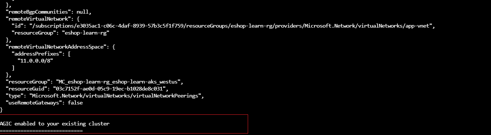
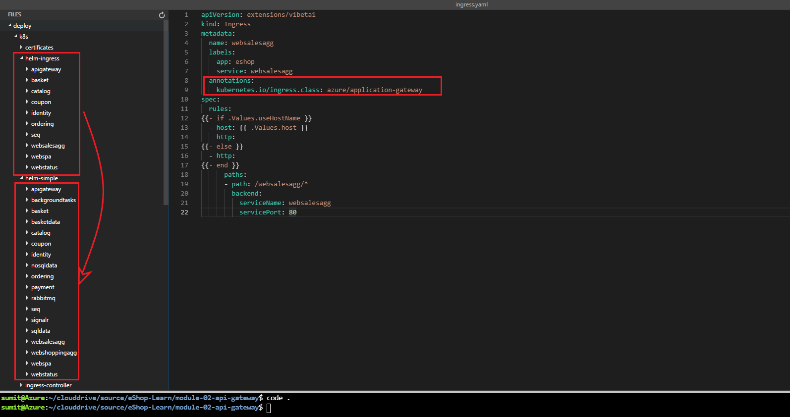
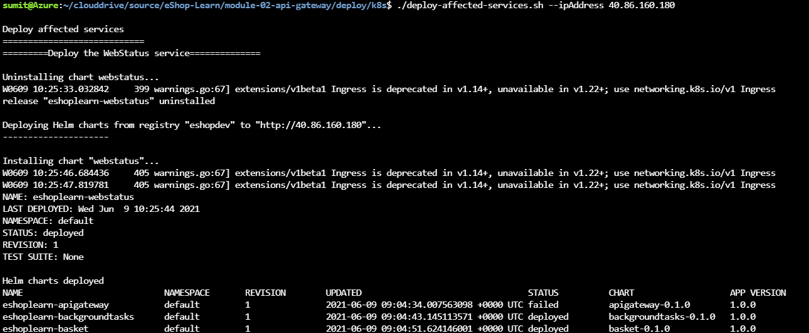
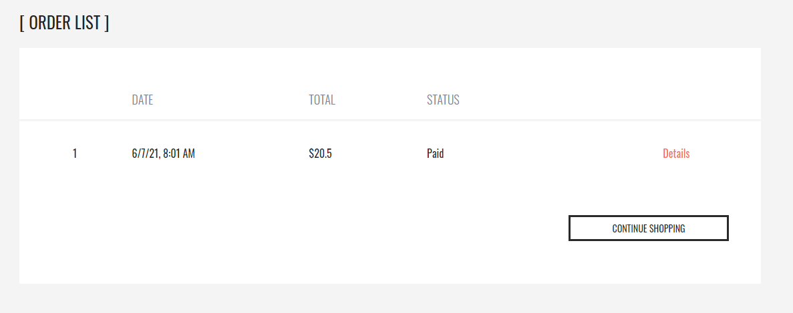
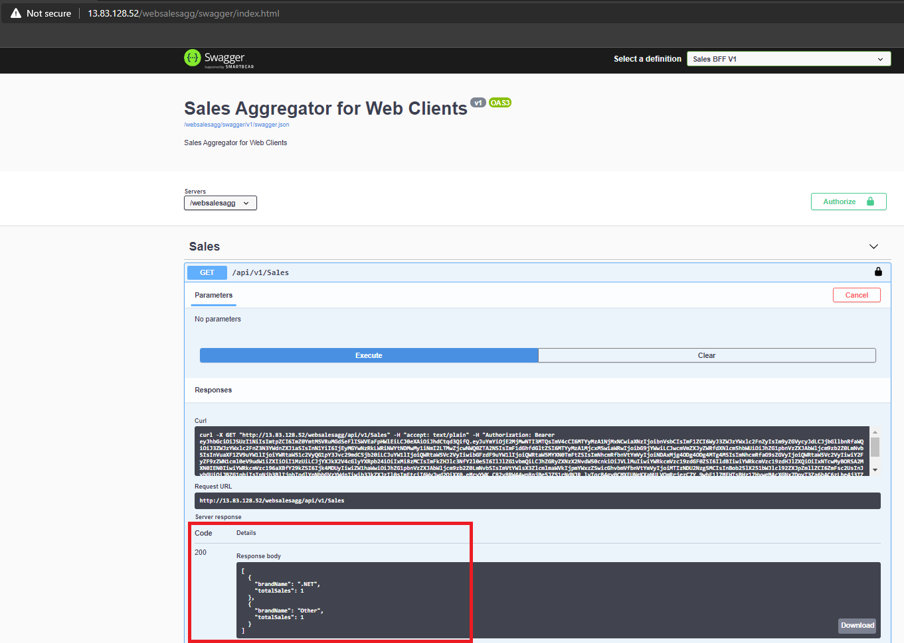

In this exercise you'll deploy an instance of Azure Application Gateway with ingress controller to load balance the traffic to different pods directly of `eShopOnContainer` services.

In this exercise you will:

- Create an Azure Application Gateway instance.
- Enable the AGIC in the AKS cluster.
- Configure the existing ingresses to use the AGIC.
- Deploy the application with the updated ingresses.
- Clean up old ingress objects.
- Redeploy the affected apps to the cluster.
- Add the `websalesagg` client redirect uris in the `IdentityDb`.
- Test `websalesagg` using Swagger UI.

## Create an Azure Application Gateway instance

To create a new instance of Azure Application Gateway, run the below command.

```bash
./create-application-gateway.sh
```

The script will perform the following tasks:

- Create a VNET for the Application Gateway.
- Create a subnet in the VNET created in the previous step.
- Create a public IP.
- Create the Application Gateway.

You should get something like this:


This script will also take a while, so in the meantime, you can continue checking out the [ingresses configuration](#configure-the-existing-ingresses). Take a note of the Application Gateway public IP that is exported as `ESHOP_APPGATEWAYPUBLICIP`. You'll need that later in this unit.

## Enable the AGIC in the AKS cluster

Run the script:

```bash
./enable-agic-adon.sh
```

As there is already an existing cluster running, you'll not create a new cluster and configure the application gateway with advanced networking. Instead, you'll follow a brownfield approach and enable the AGIC on the existing AKS instance.

The script will perform the following tasks:

- Enable the AGIC as an add-on feature in the existing Kubernetes cluster.
- Enable the bi-directional peering between the existing VNET network of the AKS cluster and the newly created VNET of the Application Gateway cluster.


And ends like this:



## Configure the ingresses to use the AGIC

You need to include the `kubernetes.io/ingress.class: azure/application-gateway` annotation in your ingress Yaml manifest files for the AGIC to use them. In some scenarios, if the ingress needs to change the URL before routing to the backend, you have to include the `appgw.ingress.kubernetes.io/backend-path-prefix` annotation to implement the URL rewriting.

Both the implementation together can be seen for the ingress Yaml of the `Seq` app. It's available under `/deploy/k8s/helm-ingress/seq/templates` directory.

For now, you'll look into the ingress manifest file of `websalesagg` which looks like below:

  ```yml
  apiVersion: extensions/v1beta1
  kind: Ingress
  metadata:
    name: websalesagg
    labels:
      app: eshop
      service: websalesagg
    annotations:
      kubernetes.io/ingress.class: azure/application-gateway
  spec:
    rules:
  {{- if .Values.useHostName }}
    - host: {{ .Values.host }}
      http:
  {{- else }}
    - http:
  {{- end }}
        paths:
        - path: /websalesagg/*
          backend:
            serviceName: websalesagg
            servicePort: 80
  ```

You'll also need to update the Nginx configuration annotated as `kubernetes.io/ingress.class: "nginx"` of each service to make it available for the AGIC. You can update that one at a time by going to the `helm-simple` directory. But for simplicity, you can just copy all files from the `helm-ingress` folder that already contains the updated ingresses, running this command from the `deploy/k8s` folder to put the updated ingress manifest put it in the right place.

```bash
cp -r ./helm-ingress/* ./helm-simple
```

You can view this step with the below image.



> [!NOTE]
> In the above step, a new ingress file will be created for the `websalesagg` app because it was newly created, but for others, it will replace the existing ones.

## Clean up old ingress objects

You'll need to clean up the old ingress objects before deploying the newly annotated `azure/application-gateway` ingress object and populate those with the public IP of the Application Gateway. So you'll need to run the below script.

```bash
kubectl delete ingress --all
```

## Deploy the application with the updated ingresses

In this step, you'll need the public ip of the application gateway that you have noted earlier. In case if you don't have the value of variable `ESHOP_APPGATEWAYPUBLICIP` with you then run the below command to fetch that or else skip this step.

```bash
cat ~/clouddrive/source/create-application-gateway-exports.txt
```

And then, replace the `{appgw-public-ip}` with the value of the variable `ESHOP_APPGATEWAYPUBLICIP` and run the below command.

```bash
./deploy-application.sh --registry eshopdev --hostip {appgw-public-ip}
```

The above command will deploy the existing services from the `eshopdev` container registry because you'll still need the old services to create an order to test out your newly created Salas API.

You should get an output just like the one from the initial deployment, only the IP will be different:


You can now explore the application deploy onto the new AKS, although, other than the IP, you shouldn't see any difference.

> [!NOTE]
> In this step, you'll see an error related to the `websalesagg` pod. That's quite obvious because the `eshopdev` container registry doesn't contain a docker image of the Web Sales Aggregator. You'll deploy that in the next step. In the actual production scenario, this extra deployment step can be avoided by deploying all the docker images from the same container registry.

## Redeploy the affected apps to the cluster

You'll also need to redeploy the local changes to the cluster with the public IP address of the Application Gateway. For that, similar to the above step, replace `{appgw-public-ip}` with the public IP address the value of variable `ESHOP_APPGATEWAYPUBLICIP` and then run the below command.

```bash
./deploy-affected-services.sh --ipAddress {appgw-public-ip}
```

The above script will deploy the following services :

- `WebStatus`
- `Identity.API`
- `WebSalesAgg`



## Add the `websalesagg` client redirect uris in the `IdentityDb`

Before testing out the changes, you need to do one more additional step. The existing `[Microsoft.eShopOnContainers.Service.IdentityDb]` database of the `sqldata-*` pod will not have the necessary configuration for the `websalesagg` authorize. So, you'll need to repopulate the data in the `IdentityDb`. You can do that by using the below steps.

- Delete the SQL related pod by using the below command.

    ```bash
    kubectl delete pods --selector service=sqldata
    ```

- Wait until the SQL Server pod is ready to accept connections and then restart all other pods. Then run the command mentioned below to restart the other instances of the app to populate all the necessary data in the respective databases.

    ```bash
    kubectl delete pods --selector service!=sqldata
    ```

- Check the `webstatus` app using `http://{appgw-public-ip}/webstatus/hc-ui#/healthchecks` and make sure `websalesagg` is up and running.
- Then, you can access the `websalesagg` swagger ui by using `http://{appgw-public-ip}/websalesagg/` url.

## Test `websalesagg` using Swagger UI

### Create an order

- It's important that you login to the `WebSPA` app using `http://{appgw-public-ip}/` and create an order. Otherwise, you'll not be able to see any data in the Sales API.



### Fetch the sales data

- Authorize the request with the `adminuser@microsoft.com` user.
- And click on the `Sales API` to fetch the API data.
- You'll see the below output, where aggregated sales unit per brand has been shown for those orders which have been created today.


