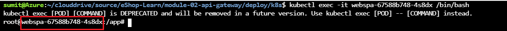

In this exercise you'll deploy the newly created Web Sales BFF to the existing Kubernetes cluster.

In this exercise you will:

- Enable the Web Sales Aggregator BFF.
- Review the necessary configuration.
- Create an instance of Azure Container Registry(ACR).
- Build the local images and push the changes in the container registry.
- Deploy the affected apps to the cluster.
- Verify the deployed sales aggregator.

## Enable the Web Sales Aggregator BFF

### Web.Sales.HttpAggregator - project related changes

You can find an ASP.NET Core project for the `Web.Sales` BFF in the *src/ApiGateways/Aggregators/Web.Sales.HttpAggregator* directory. Locate that directory in the Cloud Shell editor. Apply the following changes to the service:

1. In *Controllers/SalesController*, uncomment the following code snippet of the *GetSalesOfTodayByBrand()* method.

    ```csharp
    
    // [HttpGet]
    // [ProducesResponseType(typeof(SalesDto), (int)HttpStatusCode.OK)]
    // public async Task<ActionResult<List<SalesDto>>> GetSalesOfTodayByBrand()
    // {
    //     _logger.LogInformation("----- SalesController --> GetTotalSalesAsync()");

    //     try
    //     {
    //         // All catalog items
    //         var catalogItems = await _catalog.GetCatalogItemAsync();

    //         // All catalog brands
    //         var catalogBrands = await _catalog.GetCatalogBrandAsync();

    //         // All orders
    //         var orderItems = await _ordering.GetOrdersAsync();

    //         // Fetch processed sales data
    //         var salesData = await this.GetSalesData(catalogItems, catalogBrands, orderItems);

    //         return salesData;
    //     }
    //     catch (System.Exception ex)
    //     {
    //         throw ex;
    //     }
    // }

    ```

    In the preceding asynchronous action method:

    - Fetches and stores all the catalog items in `catalogItems` variable.
    - Similarly, it also fetches and stores the catalog brand and order information in `catalogBrands` and `orderItems` respectively.
    - After that, it calls the *GetSalesData()* method with those variables to process and generate aggregated sales data.
    - Finally, it returns the Sales data as `SalesDto` object along with the HTTP 200 status code.
    - You can review the implementation of `CatalogService` and `OrderingService` under the *Service* directory.

1. In *Controllers/SalesController*, *GetSalesData()* method is used to process and aggregate the Sales data. You don't need to make any changes in this method. This will work as is.

    ```csharp
    
    private async Task<List<SalesDto>> GetSalesData(List<CatalogItem> catalogItems, List<CatalogBrand> catalogBrands, List<Order> listOfOrders)
    {
        _logger.LogInformation("----- Processing sales data <-- GetSalesData() ");

        var salesDataItem = new List<SalesData>();

        // Step 1 : Filter all the orders based on the present day and which are processed
        var allOrdersOfPresentDay = listOfOrders.Where(o => o.date.Day == DateTime.Today.Day && o.status == "Paid");

        _logger.LogInformation($"----- allOrdersOfPresentDay : {JsonConvert.SerializeObject(allOrdersOfPresentDay)}");

        foreach (var eachOrder in allOrdersOfPresentDay)
        {
            // Step 2: Fetch each order details based on order number
            var specificOrderItem = await _ordering.GetOrderDetailsAsync(eachOrder.ordernumber);

            if (specificOrderItem != null &&
                specificOrderItem.OrderItems != null && specificOrderItem.OrderItems.Count() > 0)
            {
                // Step 3: Calculate each product unit of sale
                foreach (var eachProduct in specificOrderItem.OrderItems)
                {
                    // Step 4: Filter catalog item
                    var catalogItemObj = catalogItems.Find(catalogItem => catalogItem.name == eachProduct.ProductName);

                    // Step 5: Populate sales data
                    salesDataItem.Add(new SalesData()   
                    {
                        CatalogBrandId = catalogItemObj.catalogBrandId,
                        CatalogBrandName = catalogBrands.Find(catalogBrand => catalogBrand.Id == catalogItemObj.catalogBrandId).Brand, // Fetch the brand name based on it's id
                        TotalUnitOfSoldItems = eachProduct.Units
                    });
                }
            }

        }
        
        // Step 6: Aggregate the unit of sales based on the Brand name
        var groupedSalesData = salesDataItem.GroupBy(catalogBrand => catalogBrand.CatalogBrandName)
                                            .Select(
                                                catalogBrand => new SalesDto() {      
                                                    BrandName = catalogBrand.Key,                                                                                                
                                                    TotalSales = catalogBrand.Sum(unit => unit.TotalUnitOfSoldItems),
                                                }).ToList();

        _logger.LogInformation($"----- groupedSalesData : {JsonConvert.SerializeObject(groupedSalesData)}");

        return groupedSalesData;
    }
    
    ```

    In the preceding asynchronous action method:

    - **Step 1:** Filter all the orders from the `listOfOrders` variable using today's date and the status as `Paid`. Because you'll only want to see the data of today's sale and those orders which are actually paid/completed.
    - **Step 2:** For each order, you'll fetch the specific order details and try to calculate the unit of sales of each product based on **Step 3**.
    - **Step 4 & 4:** You'll also need to have the catalog item and brand information to populate the sales data. You'll do that in these steps.
    - **Step 5:** Finally, in this step, you'll group the sales data based on the individual brand name.

    > [!NOTE]
    > The above code snippet could be little complex to implement. It's not very efficient in terms of time complexity when you are dealing with a large list of orders and catalog items. That's because you are trying to process an transaction data and generate aggregated information from a OLTP type of datastore. You usually don't that in a real production scenario. You might want to copy the data to a different analytical (for e.g : OLAP) database to keep sales data.

1. Add real-time HTTP health checking to the web sales aggregator by applying the following changes in *Startup.cs*:

    ```csharp
    ....
    var healthCheckBuilder = services.AddHealthChecks()
                .AddCheck("self", () => HealthCheckResult.Healthy())
                .AddUrlGroup(new Uri(Configuration["CatalogUrlHC"]), name: "catalogapi-check", tags: new string[] { "catalogapi" })
                .AddUrlGroup(new Uri(Configuration["OrderingUrlHC"]), name: "orderingapi-check", tags: new string[] { "orderingapi" })
                .AddUrlGroup(new Uri(Configuration["IdentityUrlHC"]), name: "identityapi-check", tags: new string[] { "identityapi" });
    ....
    ```

    With the preceding change:

    - ASP.NET Core's health check service is registered in the web sales aggregator dependency injection container.
    - As the functionality of web sales aggregator also depends Ordering and Catalog API, it's important to add those necessary configuration in the *AddUrlGroup()* method.

1. In the *Startup.cs* file, you'll also see that the JWT authentication is already added using the following code.

    ```csharp

    ....
    services.AddAuthentication(options =>
        {
            options.DefaultAuthenticateScheme = JwtBearerDefaults.AuthenticationScheme;
            options.DefaultChallengeScheme = JwtBearerDefaults.AuthenticationScheme;

        })
        .AddJwtBearer(options =>
        {
            options.Authority = identityUrl;
            options.RequireHttpsMetadata = false;
            options.Audience = "websalesagg";                
        });
    ....        

    ```

1. To enable the Swagger UI for the respective API, the following code snippet has been added as well in the *Startup.cs*.

    ```csharp
        ....
        app.UseSwagger().UseSwaggerUI(c =>
        {
            c.SwaggerEndpoint($"{ (!string.IsNullOrEmpty(pathBase) ? pathBase : string.Empty) }/swagger/v1/swagger.json", "Sales BFF V1");

            c.OAuthClientId("websalesaggswaggerui");
            c.OAuthClientSecret(string.Empty);
            c.OAuthRealm(string.Empty);
            c.OAuthAppName("web sales bff Swagger UI");
        });
        ...
    ```

    In the next section, you'll also enable `websalesaggswaggerui` client in the `Identity.API` project.

### Identity.API - project related changes

1. As mentioned above, the web sales aggregator project has been configured as `websalesaggswaggerui` client in the *Config.cs* file of the `Identity.API` project.

    ```csharp
    .....
    new Client
    {
        ClientId = "websalesaggswaggerui",
        ClientName = "Web Sales Aggregator Swagger UI",
        AllowedGrantTypes = GrantTypes.Implicit,
        AllowAccessTokensViaBrowser = true,

        RedirectUris = { $"{clientsUrl["WebSalesAgg"]}/swagger/oauth2-redirect.html" },
        PostLogoutRedirectUris = { $"{clientsUrl["WebSalesAgg"]}/swagger/" },

        ....
    },
    ....
    ```

1. You'll also need a user with `Admin` role to access the `Sales API` exposed by WebSales Aggregators controller. So for that, the following user has been added. Because you'll not be able to access it using default `demouser@microsoft.com` user. You can take a note of that for later use.

    ```text

    EmailId : `adminuser@microsoft.com` 
    Password : `Pass@word1`

    ```

## Review the necessary configuration

### WebStatus project related configuration

1. In the previous step, you have added the necessary health check step in the *Startup.cs* file of web sales aggregator project. You'll also need to enable the necessary configuration for the Web Status project to look for the newly created app. So uncomment the following health check uri configuration in the `configmap.yaml` file of `webstatus` app.

    ```text
    HealthChecksUI__HealthChecks__10__Name: Web Sales Aggregator GW HTTP Check
    HealthChecksUI__HealthChecks__10__Uri: http://websalesagg/hc
    ```

The above configuration will include the health check for the `websalesagg` in the `WebStatus` app.

### Identity.API project related configuration

1. Uncomment the following `WebSalesAggClient` configuration in the `configmap.yaml` file of the `identity` app.

    ```text
    WebSalesAggClient: {{ .Values.protocol }}://{{ .Values.host }}/websalesagg
    ```

The above configuration will include the url for the `websalesagg` client in the `Identity.API`.

## Create an instance of Azure Container Registry(ACR)

1. You'll need a container registry to host the docker images. So, run the below command to create one.

    ```bash
    ./create-acr.sh  --resource-group eshop-learn-rg --location westus
    ```

    The script will create an instance of ACR. You should see something like this:

    

## Build the local images and push the changes in the container registry

1. You need to build the image of the `identity-api` app with the latest changes.

    ```bash
    ./build-to-acr.sh --services identity-api
    ```

1. You need to build the image of the `websalesagg` app with the latest changes.

    ```bash
    ./build-to-acr.sh --services websalesagg
    ```

1. The above steps will be pushed the latest changes in the container registry

## Deploy the affected apps to the cluster

1. Before deploying, you'll also need to fetch the external IP address of the existing nginx ingress load balancer. You can do that by using the below command :

    ```bash
    kubectl get svc -n ingress-nginx 
    ```

    For more details, you can refer below image as well.

    

    > [!NOTE]
    > In the next unit, you'll learn more about the Kubernetes ingress controller and it's purpose.

1. Replace `{nginx-ingress-ip-address}` with the external IP address of the nginx ingress controller and then run the below command to deploy the affected services to the cluster.

    ```bash
    ./deploy-affected-services.sh --ipAddress {nginx-ingress-ip-address}
    ```

    The above script will deploy the following services :

    - `WebStatus`
    - `Identity.API`
    - `WebSalesAgg`

## Verify the deployed sales aggregator

Wait till the `websalesagg` pod is up and running. Then you'll be able to access the `websalesagg` API. But at this point, `websalesagg` is only available for the internal resources to consume and you'll not be able to access the `websalesagg` outside the Kubernetes cluster yet. For that, you'll have to configure the ingress object for that and you'll explore those concepts in the next unit. As of now, to access the `websalesagg` API, you can use the cluster IP. You can follow the below steps :

1. Run the below command to fetch the pod name of the `WebSPA` app. Take a note of that.

    ```bash
    kubectl get svc --selector service=webspa
    ```

    

1. And also take a note of the cluster ip of the `websalesagg` pod by using the below command. Make a note of that IP address.

    ```bash
    kubectl get svc --selector service=websalesagg
    ```

    

1. Then run the below command to get into the pod. Make sure you replace `{webspa-pod-name}` with the pod name which you have noted in the previous step.

    ```bash
    kubectl exec -it {webspa-pod-name} /bin/bash
    ```

    

1. Within the pod, you run the below CURL command to see if it's accessible.

    ```bash
    curl http://<clusterip-of-websalesagg-pod>/websalesagg/swagger/index.html
    ```

    

In the next unit, you'll configure the ingress object to access the API outside of the Kubernetes cluster.