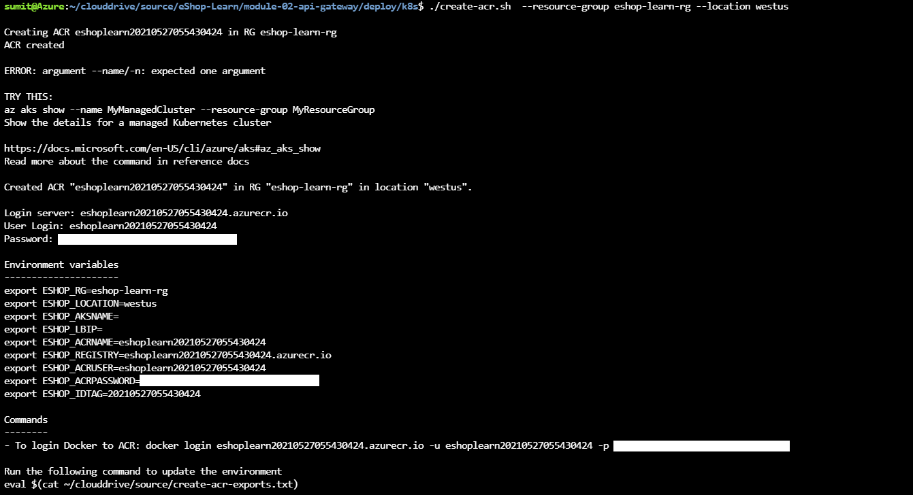
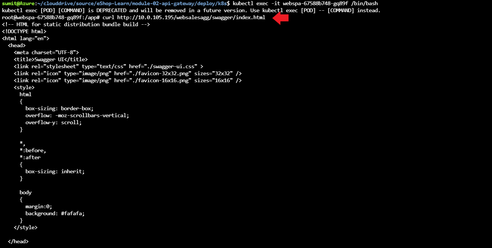

# Exercise - Implement a new Backend for Frontend

## Overview

In this exercise you'll deploy the newly created Web Sales BFF to the existing Kubernetes cluster.

In this exercise you will:

- Create an instance of Azure Container Registry(ACR).
- Enable the `websalesagg` BFF.
- Review the related configuration.
- Build the local images and push the changes in the container registry.
- Deploy the affected apps to the cluster.
- Verify the deployed web sales aggregator pod
- Add the `websalesagg` client redirect uris in the `IdentityDb`
- Test `websalesagg` using Swagger UI.

## Create an instance of Azure Container Registry(ACR)

- You'll need a container registry to host the docker images. Run the below command to create one.

    ```bash
    ./create-acr.sh  --resource-group eshop-learn-rg --location westus
    ```

    The script will create an instance of ACR. You should get something like this:

    

- Make sure you run the following command to login to the ACR instance because that will be required to push the docker images.

    ```bash
    docker login <CONTAINER_REGISTRY>.azurecr.io -u <USER_NAME> -p <PASSWORD>
    ```

## Enable the `websalesagg` BFF

### Web.Sales.HttpAggregator - project related changes

- In the `SalesController` of the `websalesagg` aggregator, the data from both `Catalog.API` and `Ordering.API` has been fetched to process and prepare the sales data. You have already reviewed the code in the previous unit but in this step make sure you have uncommented and enabled it.

    ```csharp
    
    [HttpGet]
    [ProducesResponseType(typeof(SalesDto), (int)HttpStatusCode.OK)]
    public async Task<ActionResult<List<SalesDto>>> GetSalesOfTodayByBrand()
    {
        _logger.LogInformation("----- SalesController --> GetTotalSalesAsync()");
    
        try
        {
            // All catalog items
            var catalogItems = await _catalog.GetCatalogItemAsync();
    
            // All catalog brands
            var catalogBrands = await _catalog.GetCatalogBrandAsync();
    
            // All orders
            var orderItems = await _ordering.GetOrdersAsync();
    
            // Fetch processed sales data
            var salesData = await this.GetSalesData(catalogItems, catalogBrands, orderItems);
    
            return salesData;
        }
        catch (System.Exception ex)
        {
            throw ex;
        }
    }
    ```

- Then the following *GetSalesData()* method is used to aggregate the Sales data. You don't need to change the following code snippet.

### Identity.API - project related changes

- In the `Identity.API` project `websalesagg` client is already added in the configuration. Refer the following code in the `Config.cs` file of `Identity.API` project.

    ```csharp
        .....
        new Client
        {
            ClientId = "websalesaggswaggerui",
            ClientName = "Web Sales Aggregator Swagger UI",
            AllowedGrantTypes = GrantTypes.Implicit,
            AllowAccessTokensViaBrowser = true,
    
            RedirectUris = { $"{clientsUrl["WebSalesAgg"]}/swagger/oauth2-redirect.html" },
            PostLogoutRedirectUris = { $"{clientsUrl["WebSalesAgg"]}/swagger/" },
    
            ....
        },
        ....
    ```

- It also enables an `Admin` user with the following credential.

    ```text

        EmailId : `adminuser@microsoft.com` 
        Password : `Pass@word1`

    ```

The above user will be used to access the `Sales API` exposed by WebSales Aggregators controller, as it has `Admin` role attached in the form of `Claims`. You'll not able to access it using default `demouser@microsoft.com`.

## Review the related configuration

It also requires the following configuration :

- Uncomment the following health check uri configuration in the `configmap.yaml` of `webstatus` app.

    ```text
      HealthChecksUI__HealthChecks__10__Name: Web Sales Aggregator GW HTTP Check
      HealthChecksUI__HealthChecks__10__Uri: http://websalesagg/hc
    ```

The above configuration will include the health check for the `websalesagg` in the `WebStatus` app.

- `websalesagg` client is also added in the `Config.cs` and `ConfigurationDbContextSeed.cs` files of the `Identity.API` app.

- Uncomment the following `WebSalesAggClient` configuration in the `configmap.yaml` file of the `identity` app.

    ```text
    WebSalesAggClient: {{ .Values.protocol }}://{{ .Values.host }}/websalesagg
    ```

## Build the local images and push the changes in the container registry

- You need to build the image of the `identity-api` app with the latest changes.

    ```bash
    ./build-to-acr.sh --services identity-api
    ```

- You need to build the image of the `websalesagg` app with the latest changes.

    ```bash
    ./build-to-acr.sh --services websalesagg
    ```

- The above steps will be pushed the latest changes in the container registry

## Deploy the affected apps to the cluster

- Fetch the external ip address of the nginx ingress load balancer

    

- Replace `{nginx-ingress-ip-address}` with the ip address of the external ip address of the nginx ingress controller and then run the below command to deploy the affected services to the cluster.

    ```bash
    ./deploy-affected-services.sh --ipAddress {nginx-ingress-ip-address}
    ```

The above script will deploy the following services :

- `WebStatus`
- `Identity.API`
- `WebSalesAgg`

## Verify the deployed sales aggregator

// TO DO - Explain more

- Wait till the `websalesagg` pod is up and running. Then you'll be able to access the websalesagg only through clusterIP

    

At this point, `websalesagg` is only available for the internal resources to consume. You'll not able to access the `websalesagg` outside the Kubernetes cluster.
You'll need to configure the ingress object for that. You'll explore those concepts in the next unit.

| [TOC](../README.md) | [NEXT >](review-load-balancer-concepts.md) |