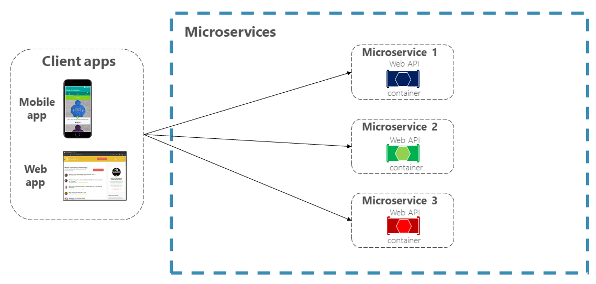
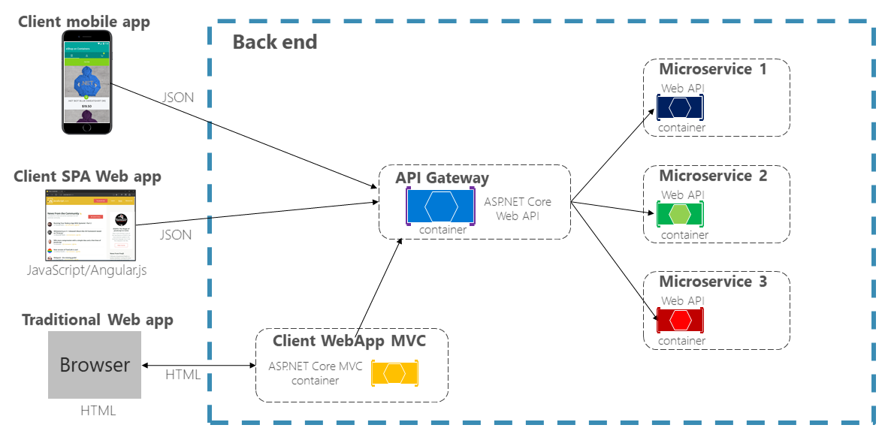
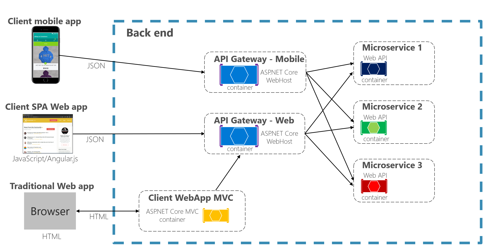
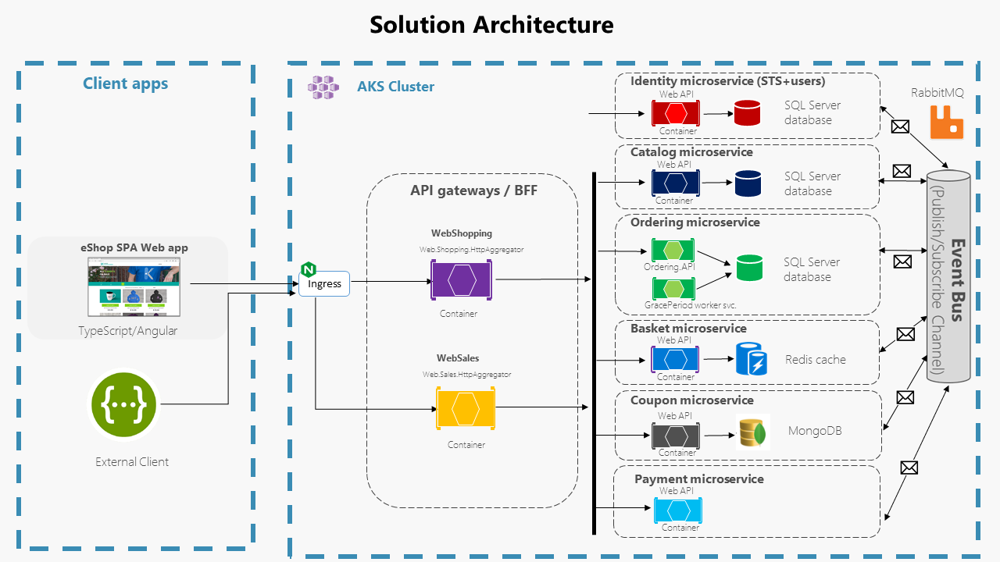

## The need for the API Gateway pattern

In a typical microservices scenario the client applications have to interact with many microservices, so this can create a serious communications problem.

A possible approach is to use a direct client-to-microservice communication architecture. In this approach, a client app can make requests directly to some of the microservices, as shown in the next image.



As you can see in the image above, each client application, either mobile or web, connects to the each of the three microservices.

In this approach, each microservice has a public endpoint, sometimes with a different TCP port for each microservice, but this can make it complicated for the whole system, and it's not just for having to deal with concerns like:

- Need to issue multiple requests for one operation.
- Aggregating data from different microservices.
- Dealing with potentially multiple latencies.
- Handling multiple authorizations.

On the backend side you'd also have to deal with setting up a public IP address for each microservice. You'd probably also have to deal with metering usage for multiple endpoints.

And there's even more, how would you handle the unavoidable API evolution and versioning? All applications would have to be changed in a very coordinated way because of the high coupling.

This is where the API Gateway patterns comes into play, working as shown in the next image:



The above image shows how all client apps, and even a client MVC app, communicate with a single entry point in the API Gateway.

The above configuration has several important advantages, like:

- A single DNS name.
- Frontend and backend completely decoupled.
- A single metering point.

The decoupling aspect also makes it very easy to route different versions to different microservice instances, to simplify progressive deployments and, for example, to implement [A/B testing](https://en.wikipedia.org/wiki/A/B_testing).

## The BFF pattern

Even though the API Gateway pattern solves many problems, there are still some issues that have to tackled.

Each client application might have a context that imposes some specific constraints, for example, a mobile phone usually has a more restrained internet connection than a desktop computer and, of course, has a much smaller screen size. So it might make sense to have a "basic", "reduced" (low-bandwidth) API for mobile use and an "extended" API for desktop use.

This is where the BFF pattern comes into play, by supplying a per-device-type API, customized for the specific context, as shown in the next image.



In the above image you can see that the mobile applications accesses a mobile-specific API Gateway, while the client SPA and MVC web apps use a desktop-specific API Gateway.

The BFF is much more than an application gateway, as it usually requires custom logic to achieve the required results. This is where the web aggregator comes into play.

## The web aggregator

The web aggregator has the central role in the BFF pattern and you can think of it as a broker. It gets a request from the client, makes further requests to some backend services and then assembles a customized response to send it back to the client app.

### Explore *Web.Shopping* aggregator implementation in eShopOnContainers

The web client BFF in implemented as a Web API application in folder `src\ApiGateways\Aggregators\Web.Shopping.HttpAggregator`.

The `BasketController` is a nice example of what a BFF might look like, and we'll focus specifically in the action that handles the POST request to update the Basket from the SPA.

### Implement *Web.Sales* aggregator in eShopOnContainers

Similar to `Web.Shopping.HttpAggregator`, you'll implement a new BFF to fetch the Sales data for the Web Client. It can be used to see the aggregated unit sales data per each catalog brand. In the *SalesController*, you'll define the following :

- A method *GetSalesOfTodayByBrand()* where you'll fetch Catalog Brand information from the `Catalog.API` and Sales data from the `Ordering.API`.
- A method *GetSalesData()* to process and aggregate the sales based on the brand names.

You can check some details in the following code fragment.

```csharp
    
  [HttpGet]
  [ProducesResponseType(typeof(SalesDto), (int)HttpStatusCode.OK)]
  public async Task<ActionResult<List<SalesDto>>> GetSalesOfTodayByBrand()
  {
      _logger.LogInformation("----- SalesController --> GetTotalSalesAsync()");
  
      try
      {
          // All catalog items
          var catalogItems = await _catalog.GetCatalogItemAsync();
  
          // All catalog brands
          var catalogBrands = await _catalog.GetCatalogBrandAsync();
  
          // All orders
          var orderItems = await _ordering.GetOrdersAsync();
  
          // Fetch processed sales data
          var salesData = await this.GetSalesData(catalogItems, catalogBrands, orderItems);
  
          return salesData;
      }
      catch (System.Exception ex)
      {
          throw ex;
      }
  }

  private async Task<List<SalesDto>> GetSalesData(List<CatalogItem> catalogItems, List<CatalogBrand> catalogBrands, List<Order> listOfOrders)
  {
      _logger.LogInformation("----- Processing sales data <-- GetSalesData() ");

      var salesDataItem = new List<SalesData>();

      // Filter all the orders based on the present day and which are processed
      var allOrdersOfPresentDay = listOfOrders.Where(o => o.date.Day == DateTime.Today.Day && o.status == "Paid");

      _logger.LogInformation($"----- allOrdersOfPresentDay : {JsonConvert.SerializeObject(allOrdersOfPresentDay)}");

      foreach (var eachOrder in allOrdersOfPresentDay)
      {
          // Fetch each order details based on order number
          var specificOrderItem = await _ordering.GetOrderDetailsAsync(eachOrder.ordernumber);

          if (specificOrderItem != null &&
              specificOrderItem.OrderItems != null && specificOrderItem.OrderItems.Count() > 0)
          {
              // Calculate each product unit of sale
              foreach (var eachProduct in specificOrderItem.OrderItems)
              {
                  // Filter catalog item
                  var catalogItemObj = catalogItems.Find(catalogItem => catalogItem.name == eachProduct.ProductName);

                  // Populate sales data
                  salesDataItem.Add(new SalesData()   
                  {
                      CatalogBrandId = catalogItemObj.catalogBrandId,
                      CatalogBrandName = catalogBrands.Find(catalogBrand => catalogBrand.Id == catalogItemObj.catalogBrandId).Brand, // Fetch the brand name based on it's id
                      TotalUnitOfSoldItems = eachProduct.Units
                  });
              }
          }

      }
      
      // Aggregate the unit of sales based on the Brand name
      var groupedSalesData = salesDataItem.GroupBy(catalogBrand => catalogBrand.CatalogBrandName)
                                          .Select(
                                              catalogBrand => new SalesDto() {      
                                                  BrandName = catalogBrand.Key,                                                                                                
                                                  TotalSales = catalogBrand.Sum(unit => unit.TotalUnitOfSoldItems),
                                              }).ToList();

      _logger.LogInformation($"----- groupedSalesData : {JsonConvert.SerializeObject(groupedSalesData)}");

      return groupedSalesData;
  }

```

> [!NOTE]
> In the real production scenario, you usually don't generate the aggregated sales data from the OLTP database. You might want to copy the data to a different analytical (for e.g : OLAP) database to keep sales data.

### WebSalesAggregator Architecture - Envoy as API Gateway & BFF pattern



> [!NOTE]
> In this implementation, you'll not implement any UI to consume the WebSales aggregator but will use the Swagger UI as an external client to test out the functionality.

In the next unit, you'll review the different configuration and deploy these newly created `Web.Sales.HttpAggregator` to the existing Kubernetes cluster.