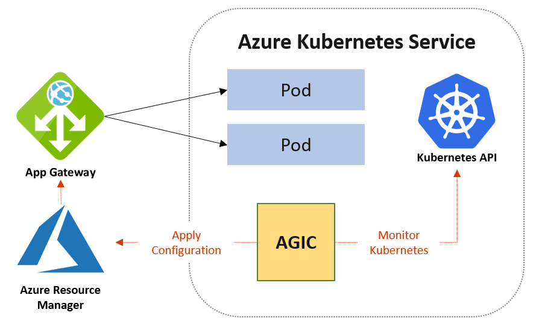
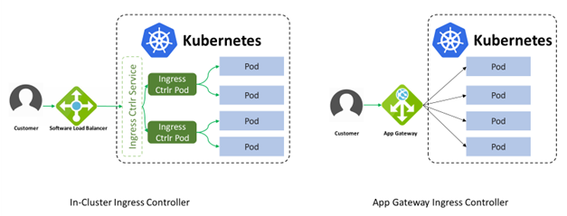
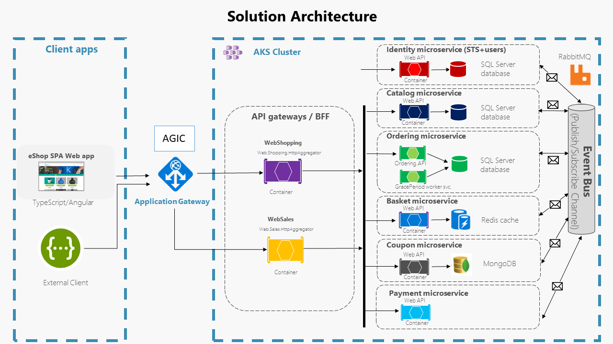

In the previous unit, you developed and deployed a newly created BFF to the kubernetes cluster. In this exercise, you'll learn the different ways to make the Sales BFF available outside the cluster for the client to consume.

## Route External Traffic using Ingress

Until now, you understood that how the API Gateway pattern can be helpful for your microservices architecture. But you still need a mechanism for external traffic to talk to the services deployed within the Kubernetes cluster. For that, in the `eShopOnContainers` reference application, you'll use *NGINX Ingress Controller*. You'll also explore the *Azure Application Gateway Ingress Controller* instead of the *NGINX Ingress Controller* to route HTTP traffic in the cluster.

## Kubernetes Ingress Controller

The Kubernetes ingress is basically an HTTP traffic router, that's usually used to expose HTTP and HTTPS endpoints outside of a Kubernetes cluster through a single base url, typically with the help of a Load Balancer. It helps to route the traffic from outside to inside the Kubernetes cluster.

To implement an ingress in a Kubernetes cluster you need:

- Al least one **ingress controller**.
- Usually, several **ingress resources**, typically one per exposed service.

The ingress controller has the responsibility to do the routing, and the ingress resources are just the configuration for the controller.

In a typical Kubernetes cluster the pods and services are not accessible outside the cluster.

The [NGINX Ingress Controller](https://kubernetes.github.io/ingress-nginx/) is probably the most widely used open-source ingress controller, and the one currently used in initial eShopOnContainers deployment.

### Routes configuration

Since the API Gateway has a single entry point, each microservice has to be differentiated by adding a path element.

In the sample app, you'll find that the routes are configured like this:

| External path                         | Destination                          |
|---------------------------------------|--------------------------------------|
| `https://<host-name>/identity/*`      | `http://identity/identity/*`         |
| `https://<host-name>/apigateway/c/*`  | `http://catalog-api/catalog-api/*`   |
| `https://<host-name>/apigateway/cp/*` | `http://coupon-api/coupon-api/*`     |
| `https://<host-name>/apigateway/o/*`  | `http://ordering-api/ordering-api/*` |

The configuration table above shows we have two main entry routes to the cluster, `/identity` and `/apigateway`.

The `/identity` route is handled internally by the `identity` microservice, using a simple `http` termination and using the internal service name.

The `/apigateway` route needs another path segment (`c`, `cp`, and `o`) so it can route the requests to the receiving microservice.

The ingress for the `identity` service is kept in the `deploy/k8s/helm-simple/identity/templates/ingress.yaml` file, as part of the **identity** Helm chart.

You can see the routes configuration for the API Gateway in the `deploy/k8s/helm-simple/apigateway/templates/ingress-gateway.yaml` file. In this case the file contains several ingresses that look like this:

```yaml
apiVersion: extensions/v1beta1
kind: Ingress
metadata:
  name: ingress-gw-c
  annotations:
    kubernetes.io/ingress.class: nginx
    nginx.ingress.kubernetes.io/rewrite-target: /catalog-api/$2
    nginx.ingress.kubernetes.io/use-regex: "true"
    nginx.ingress.kubernetes.io/proxy-read-timeout: "3600"
    nginx.ingress.kubernetes.io/proxy-send-timeout: "3600"
  labels:
    app: eshop
spec:
  rules:
{{- if .Values.useHostName }}
  - host: {{ .Values.host }}
    http:
{{- else }}
  - http:
{{- end }}
      paths:
      - backend:
          serviceName: catalog-api
          servicePort: 80
        path: /apigateway/c(/|$)(.*)
---
apiVersion: extensions/v1beta1
kind: Ingress
metadata:
  name: ingress-gw-b
...
```

The section delimited between `{{- if .Values.useHostName }}` and `{{- end }}` handles the option to deploy to an IP address, because an IP address is not valid as a host name for Kubernetes. If you want to know more about different component of the above manifest yaml, then refer [Kubernetes Ingress](https://kubernetes.io/docs/concepts/services-networking/ingress/)

## Cloud managed load balancer

### Azure Application Gateway

The API Gateway used in eShopOnContainers is fine as a learning resource and many real-world scenarios, but for large-scale scenarios you need a more robust solution that takes care of common, general requirements, so you can focus on the value-adding features of your application.

Azure Application Gateway is a managed solution that allows you to handle any-size scenarios that can scale to world-wide level if necessary. Azure Application Gateway has several [key features](/azure/application-gateway/features) that help you tackle real-world scenarios, like the following:

- Secure Sockets Layer (SSL/TLS) termination.
- Auto-scaling.
- Web Application Firewall.
- HTTP headers rewriting, to name just a few.

#### Azure Application Gateway Ingress Controller (AGIC)

The Application Gateway Ingress Controller (AGIC) makes it easy to integrate the Application Gateway with your Kubernetes cluster. The next image shows the general architecture of the solution.



In the image above, you can see that the AGIC lives inside the AKS cluster as an Ingress Controller, although it isn't really routing any traffic. The AGIC monitors the cluster state using the Kubernetes API and applies the required configuration to the Application Gateway, so it can route traffic directly to the pods.

Since the Azure Application Gateway is a managed service outside the AKS cluster, that can't usually access the pods directly, the AKS has to be created with the "advanced networking option". This advanced networking option makes the pods connect through a subnet that's accesible by the Application Gateway.

For further information, see the [Application Gateway Ingress Controller overview page](/azure/application-gateway/ingress-controller-overview)

#### Difference between In-Cluster Ingress Controller and AGIC

AGIC ingress controller has many advantages over in-cluster ingress controller.

- AGIC doesn't take any resource of the Kubernetes cluster as it runs outside of the cluster.
- External traffics doesn't go through the extra hop of the ingress controller pod, which eventually reduces latency.



Now, you can review the modified solution architecture of the eShop app that you'll deploy in the next unit.

