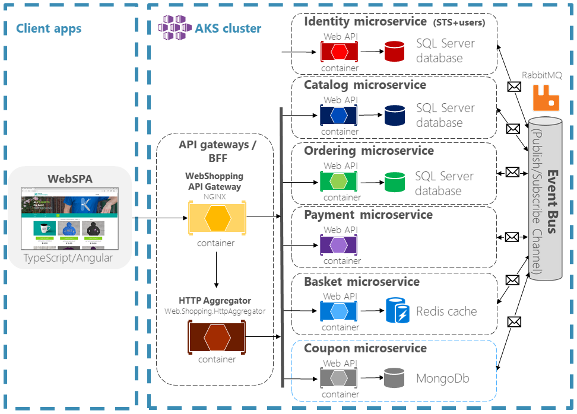
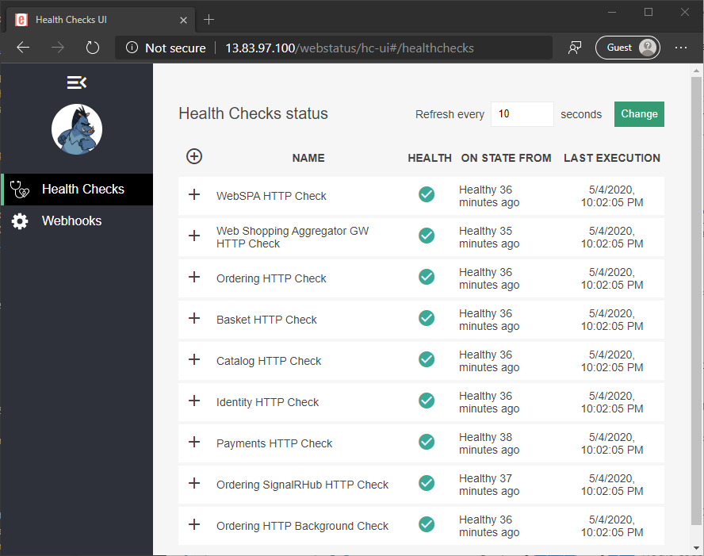

In this unit, you'll deploy the eShop app to AKS. You'll also gain an understanding of the microservices architecture used.

## Set up development environment

Run the following command in the command shell. Be patient, as setup can take a few minutes to complete.

```bash
. <(wget -q -O - https://aka.ms/microservices-aspnet-core-setup)
```

[!INCLUDE[OS-specific keyboard shortcuts](../../../includes/azure-cloudshell-copy-paste-tip.md)]

The preceding command retrieves and runs a setup script from a GitHub repository. The script completes the following steps:

* Clones the eShop project from a GitHub repository.
* Provisions an AKS and Azure Container Registry (ACR) resource.
* Launches the Cloud Shell Editor to view the code.
* Deploys the containers to AKS.
* Displays connection information upon completion

> [!NOTE]
> Non-blocking warnings are expected in the deployment process.

## Review code and architecture

Soon after launching the script, a code editor window will appear. You may investigate the code while the script continues to deploy the containers to AKS.

The following directories in *src/* contain .NET Core projects, each of which is containerized and deployed to AKS:

| Project directory | Description |
|-------------------|-------------|
| *Aggregators/* | Services to aggregate across multiple microservices for certain cross-service operations. This is implemented by the *ApiGateways/Aggregators/Web.Shopping.HttpAggregator* project. |
| *BuildingBlocks/* | Services that provide cross-cutting functionality, such as the app's event bus used for inter-service events. |
| *Services/* | These projects implement the business logic of the app. Each microservice is autonomous with its own data store. They showcase different software patterns, including **C**reate-**R**ead-**U**pdate-**D**elete (CRUD), **D**omain-**D**riven **D**esign (DDD), and **C**ommand and **Q**uery **R**esponsibility **S**egregation (CQRS). |
| *Web/* | ASP.NET Core apps that implement user interfaces:<br>*WebSPA* is a storefront UI built with Angular. *WebStatus* is the health checks dashboard for monitoring the operational status of each service. |



As depicted in the preceding diagram, the event bus is used for integrating events across microservices. The implementation that has been deployed in AKS uses RabbitMQ in a container, but a service such as Azure Service Bus would also be appropriate.

## Test deployment

Once the app has deployed to AKS, you'll see a variation of the following message in the Azure Cloud Shell:

```
The eShop-Learn application has been deployed.

You can begin exploring these services (when available):
- Centralized logging       : http://13.83.97.100/seq/#/events?autorefresh (See transient failures during startup)
- General application status: http://13.83.97.100/webstatus/ (See overall service status)
- Web SPA application       : http://13.83.97.100/
```

1. Select the **General application status** link. The resulting health check page displays the status of each microservice in the deployment.

    

    > [!NOTE]
    > While the app is warming up, you may receive an HTTP 50x response from the server. You may retry after a few seconds. The Seq logs viewable at the **Centralized logging** URL will be available before the other endpoints. 

1. Once all the services are healthy, select the **Web SPA application** link to test the eShop on Containers web app.

    

1. Log in to the app (the credentials are provided on the login page) and then browse the shop. Add some items to the cart, and then complete the purchase.

## Add the coupon service

An ASP.NET Core project for the coupon service has been provided in *src/Services/Coupon*.

1. Open *src/Services/Coupon/Coupon.API/Controllers/CouponController.cs*.
1. Replace the comment `/* Add the GetCouponByCodeAsync method */` with the following code:

    ```csharp
    [HttpGet("{code}")]
    [ProducesResponseType(StatusCodes.Status200OK)]
    [ProducesResponseType(StatusCodes.Status400BadRequest)]
    [ProducesResponseType(StatusCodes.Status404NotFound)]
    public async Task<ActionResult<CouponDto>> GetCouponByCodeAsync(string code)
    {
        var coupon = await _couponRepository.FindCouponByCodeAsync(code);

        if (coupon is null || coupon.Consumed)
        {
            return NotFound();
        }

        var couponDto = _mapper.Translate(coupon);

        return couponDto;
    }
    ```

    In the preceding asynchronous action method:

    * The `CouponRepository` class' `FindCouponByCodeAsync` method retrieves the coupon corresponding to the provided `code` parameter value. The coupon is retrieved from a MongoDB database.
    * If the coupon returned is `null` or has already been used, an HTTP 404 status code is returned.
    * If the coupon returned isn't `null` and hasn't already been used, the `Coupon` object is converted to a `CouponDto` **D**ata **T**ransfer **O**bject (DTO). Finally, an HTTP 200 status code is returned along with the DTO.

1. Make the following changes to the ConfigureServices method in *src/Services/Coupon/Coupon.API/Startup.cs*

    [!code-csharp[](../code/src/services/coupon/coupon.api/temp-startup.cs?name=snippet_configureServices&highlight=13)]

    The preceding change adds the custom health check service to the app.

1. Also in *Startup.cs*, make following changes to the Configure method:

    [!code-csharp[](../code/src/services/coupon/coupon.api/temp-startup.cs?name=snippet_configure&highlight=30-38)]

    The preceding change adds the readiness `/hc` and liveness `/liveness` endpoints for the custom health check service.

1. Run the following script in the command shell to make additional configuration changes for the coupon service:

    ```bash
    ./deploy/k8s/implementation-script.sh
    ```

    The preceding script:

    * Uncomments HTML markup in the WebSPA checkout and order details views to support accepting coupon codes and displaying discount amounts, respectively.
    * Creates a Helm chart for the coupon service in *deploy/k8s/helm-simple/*. 
    * Adds the coupon service endpoints to the aggregator Helm chart in *deploy/k8s/helm-simple/webshoppingagg/templates/configmap.yaml*
    * Adds the coupon health check to the WebStatus Helm chart in *deploy/k8s/helm-simple/webstatus/templates/configmap.yaml*.

    The Helm chart for the coupon service is comprised of five files in *deploy/k8s/helm-simple/coupon/*:

    | File | Description |
    |------|-------------|
    | *Chart.yaml* | %TODO% - Nish |
    | *templates/deployment.yaml* | %TODO% - Nish |
    | *templates/service.yaml* | %TODO% - Nish |
    | *templates/configmap.yaml* | %TODO% - Nish |
    | *templates/ingress.yaml* | %TODO% - Nish |

1. Open *deploy/k8s/build-to-acr.sh*

    %TODO% explain that we're building the project to ACR in this script
    
1. Run the following script in the command shell:

    ```bash
    ./deploy/k8s/build-to-acr.sh
    ```

    The containers are published to ACR.

1. Open *deploy/k8s/update-to-aks.sh*

    %TODO% explain that this is installing Helm charts
1. Run the following script in the command shell:

    ```bash
    ./deploy/k8s/update-to-aks.sh
    ```
1. Observe the services stopping and redeploying on the web status.
1. After the app deploys, refresh the page.
1. Add items to the cart.
1. Navigate to the cart and select **Check out**.
1. Add the coupon code *DISC-15*.

## Clean up Azure resources

To de-provision... 

```azurecli
az group delete --name eshop-learn-rg --yes
```

Also explain how to remove the service principal. Can that be done easily from a script?

