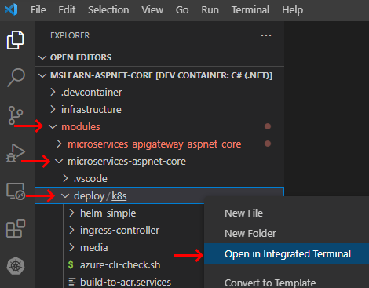

In this unit, you use a script to deploy the existing :::no-loc text="eShopOnContainers"::: app to Azure Kubernetes Service (AKS). Using a script keeps the focus on the learning objectives. The script outputs colored text to the terminal to show the commands being executed. You can inspect the script and the output to better understand the commands.

## Install the app

The quickstart script completes the following steps to deploy a modified version of the [:::no-loc text="eShopOnContainers":::](https://github.com/dotnet-architecture/eshoponcontainers) reference app:

1. Provisions AKS and Azure Container Registry resources.
1. Deploys the app containers to the fully managed AKS service.
1. Displays connection information upon completion.

To run the quickstart script:

1. In your dev environment, expand the *deploy/k8s* directory in the Visual Studio Code **Explorer** pane. This directory contains the scripts to use in this module.

   > [!NOTE]
   > By default, Visual Studio Code displays *k8s* on the same line as *deploy* because *deploy*  contains only the *k8s* subdirectory.

1. Right-click the *k8s* directory and select **Open in Integrated Terminal**.

   

1. In the new terminal pane, sign in to the Azure CLI. If you use GitHub Codespaces, include the `--use-device-code` flag. If you use local Visual Studio Code, the flag is optional.

   ```azurecli
   az login --use-device-code
   ```

1. View the selected Azure subscription.

   ```azurecli
   az account show -o table
   ```

   If the wrong subscription is selected, use the [az account set](/cli/azure/account#az-account-set) command to select the correct one.

1. Run the quickstart script:

   ```bash
   ./quickstart.sh
   ```

   [!INCLUDE[Quickstart note](../../includes/microservices/quickstart.md)]

While the script deploys the Docker containers to AKS, review the other code directories in the dev environment.

## Review the code

Review the other directories in the **Explorer** pane. All directory paths in this module are relative to the *modules/microservices-aspnet-core* directory.

Each of the following subdirectories in *src* contains a containerized .NET project that's deployed to AKS.

| Project directory | Description |
|-------------------|-------------|
| *:::no-loc text="Aggregators/":::* | Services to aggregate across multiple microservices for certain cross-service operations. An HTTP aggregator is implemented in the *:::no-loc text="ApiGateways/Aggregators/Web.Shopping.HttpAggregator":::* project. |
| *:::no-loc text="BuildingBlocks/":::* | Services that provide cross-cutting functionality, such as the event bus for interservice events. |
| *:::no-loc text="Services/":::* | Projects that implement the app's business logic. Each microservice is autonomous, with its own data store. The microservices showcase different software patterns, including Create-Read-Update-Delete (CRUD), Domain-Driven Design (DDD), and Command and Query Responsibility Segregation (CQRS). The new *:::no-loc text="Coupon.API":::* project is present, but incomplete. |
| *:::no-loc text="Web/":::* | ASP.NET Core apps that implement user interfaces. *:::no-loc text="WebSPA":::* is the storefront UI built with Angular. *:::no-loc text="WebStatus":::* is the health check dashboard for monitoring the operational status of each service. |

In the next unit, you verify that the app installed and works correctly.
