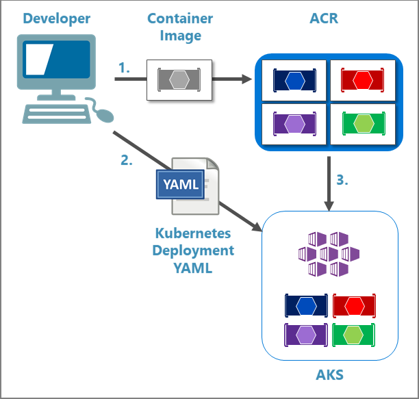

In this unit, you complete the *Coupon.API* project. You will then run a script to generate changes to the *WebSPA* HTML, as well as generate and modify Helm charts to define the kubernetes deployment.

## Add the coupon service

An ASP.NET Core project for the coupon service has been provided in the *src/Services/Coupon/Coupon.API* directory. Locate that directory in the Cloud Shell editor, and apply the following changes to the service:

1. In *Controllers/CouponController.cs*, replace the comment `/* Add the GetCouponByCodeAsync method */` with the following code:

    ```csharp
    [HttpGet("{code}")]
    [ProducesResponseType(StatusCodes.Status200OK)]
    [ProducesResponseType(StatusCodes.Status400BadRequest)]
    [ProducesResponseType(StatusCodes.Status404NotFound)]
    public async Task<ActionResult<CouponDto>> GetCouponByCodeAsync(string code)
    {
        var coupon = await _couponRepository.FindCouponByCodeAsync(code);

        if (coupon is null || coupon.Consumed)
        {
            return NotFound();
        }

        var couponDto = _mapper.Translate(coupon);

        return couponDto;
    }
    ```

    In the preceding asynchronous action method:

    * The `CouponRepository` class' `FindCouponByCodeAsync` method retrieves the coupon corresponding to the provided `code` parameter value. The coupon is retrieved from a MongoDB database.
    * If the coupon returned is `null` or has already been used, an HTTP 404 status code is returned.
    * If the coupon returned isn't `null` and hasn't already been used, the `Coupon` object is converted to a `CouponDto` **D**ata **T**ransfer **O**bject (DTO). Finally, an HTTP 200 status code is returned along with the DTO.

1. Add real-time HTTP health checking to the coupon service by applying the following changes in *Startup.cs*:
    1. In the `ConfigureServices` method, invoke the custom `AddCustomHealthCheck` extension method immediately after the `AddSwagger` method call:

        [!code-csharp[](../code/src/services/coupon/coupon.api/temp-startup.cs?name=snippet_configureServices&highlight=13)]

        With the preceding change:

        * ASP.NET Core's health check service is registered in the coupon service's dependency injection container. ASP.NET Core provides health checks middleware that executes when a health check endpoint is requested.
        * The `AddCustomHealthCheck` extension method (implemented in *Extensions/IServiceCollectionExtensions.cs*), tests external service dependencies to confirm availability and normal operation. Examples of such external dependencies include MongoDB and RabbitMQ.

            ```csharp
            var hcBuilder = services.AddHealthChecks();
            hcBuilder.AddCheck("self", () => HealthCheckResult.Healthy())
                .AddMongoDb(
                    configuration["ConnectionString"],
                    name: "CouponCollection-check",
                    tags: new string[] { "couponcollection" });
            ```

        The preceding code adds:

        * A health check named `self`, which returns an HTTP success status code for each request to the coupon microservice health endpoint.
        * A check for its MongoDB dependency using the `AddMongoDb` extension method. The `AddMongoDb` method is implemented in the [AspNetCore.HealthChecks.MongoDb](https://www.nuget.org/packages/AspNetCore.HealthChecks.MongoDb/) NuGet package.

        > [!TIP]
        > The open-source project [AspNetCore.Diagnostics.HealthChecks](https://github.com/Xabaril/AspNetCore.Diagnostics.HealthChecks) provides various custom health check implementations for ASP.NET Core projects. The MongoDB implementation used in this step is just one example.

    1. In the `Configure` method, register the health checks endpoints with the ASP.NET Core routing system:

        [!code-csharp[](../code/src/services/coupon/coupon.api/temp-startup.cs?name=snippet_configure&highlight=30-38)]

        The preceding change registers two HTTP health check endpoints with the ASP.NET Core routing system:

        * `/liveness` &ndash; A "liveness" endpoint that Kubernetes queries periodically to check for failures. Kubernetes provides liveness probes to detect applications that are failing and restarts them when they do not return success codes. When the coupon microservice starts up for the first time, there could be time-consuming tasks like setting up seed data in the database or awaiting RabbitMQ to boot up. To avoid restarts during this time, the liveness check filters the checks with the `self` tag, which returns HTTP status code 200 for every request.
        * `/hc` &ndash; A "readiness" endpoint that Kubernetes queries to know when a service is ready to start accepting traffic. It returns HTTP status code 200 when all registered checks are successful. The same endpoint is also queried by an external health monitoring system like the `WebStatus` app. `WebStatus` provides a dashboard to visualize configured health checks and the status of each. The [AspNetCore.HealthChecks.UI.Client](https://www.nuget.org/packages/AspNetCore.HealthChecks.UI) NuGet package is used to generate the dashboard.

        In the following Kubernetes deployment configuration file, the "liveness" and "readiness" probes use HTTP GET requests to the above mentioned health endpoints to determine their status codes. Any HTTP status code greater than or equal to 200 and less than 400 indicates success. Any other code indicates failure.

        [!code-yaml[](../code/src/services/coupon/coupon.api/deployment.yml?highlight=28,34)]

1. Set your current location to the coupon service project directory using the following command:

    ```bash
    pushd src/Services/Coupon/Coupon.API/
    ```

    Your current location is *~/clouddrive/aspnet-learn/src/src/Services/Coupon/Coupon.API*.

1. [!INCLUDE[dotnet build command](../../includes/dotnet-build-command.md)]

1. Return to your previous location using the following command:

    ```bash
    popd
    ```

1. Open *src/Services/Coupon/Coupon.API/Dockerfile* in the Cloud Shell Editor. Notice the following things in this *Dockerfile*:

    * The ASP.NET Core runtime image is used as the base image of the multistage build.
    * The .NET Core SDK image is acquired to support the running of the following .NET Core CLI commands against the *Coupon.API* project:
        * `dotnet restore`&ndash;Restores the project's NuGet packages.
        * `dotnet build`&ndash;Builds the project in release mode. The build artifacts are written to the *app/build/* directory of an intermediate image.
        * `dotnet publish`&ndash;Publishes the project in release mode. The published bundle is written to the *app/publish/* directory of the final image.
    * The final image contains the ASP.NET Core runtime and the published coupon service artifacts.
    * When a container is started from the final image, the coupon service is started by running `dotnet Coupon.API.dll`.

1. Run the following script in the command shell to make additional configuration changes for the coupon service:

    ```bash
    ./deploy/k8s/implementation-script.sh
    ```

    > [!TIP]
    > This unit uses scripts to keep focus on the learning objectives. You may inspect the scripts in the Cloud Shell editor to better understand the commands used.

    The preceding script:

    * Uncomments HTML markup in the *WebSPA* checkout and order details Angular components to support accepting coupon codes and displaying discount amounts, respectively. The following HTML markup in the *Web/WebSPA/Client/src/modules/orders* directory is uncommented:

        *orders-detail/orders-detail.component.html*:

        [!code-html[](../code/src/Web/WebSPA/Client/src/modules/orders/orders-detail/orders-detail.component.html)]

        *orders-new/orders-new.component.html*:

        [!code-html[](../code/src/Web/WebSPA/Client/src/modules/orders/orders-new/orders-new.component.html)]

    * Creates a Helm chart for the coupon service in *deploy/k8s/helm-simple/coupon*.
    * Adds the coupon service endpoints to the aggregator Helm chart in *deploy/k8s/helm-simple/webshoppingagg/templates/configmap.yaml*
    * Adds the coupon health check to the *WebStatus* Helm chart in *deploy/k8s/helm-simple/webstatus/templates/configmap.yaml*.

    When you create an object in a Kubernetes (or AKS) cluster, you must provide the object specification in a YAML file. You'll use the template functionality in the open-source tool Helm to generate and send the YAML files to the AKS cluster.

    The Helm chart for the coupon service is comprised of the following files in the *deploy/k8s/helm-simple/coupon* directory:

    * *Chart.yaml*
    * *templates/configmap.yaml*
    * *templates/deployment.yaml*
    * *templates/ingress.yaml*
    * *templates/service.yaml*

    The *Chart.yaml* file contains a description of the chart. The *templates* directory contains template files. When Helm evaluates the chart with the `helm install` command, it sends all of the files in the *templates* directory to the template rendering engine. It then collects the rendered YAML created by those templates and sends it to AKS.

## Build the coupon service in ACR

Container images are hosted in container registries. For many scenarios, a public container registry like Docker Hub might be appropriate. Private container registries, such as ACR, are often more appropriate for enterprise scenarios. Only your team and services have access to a private registry. All of the container images used when the solution was initially deployed to AKS were from one of Microsoft's ACR endpoints.

The following diagram depicts the relationships between Docker container images, container registries such as ACR, and Kubernetes/AKS deployments.



In the preceding diagram:

1. The developer sends the container image to ACR.
2. The developer sends Kubernetes YAML configuration files to AKS. The configuration specifies which container images are required.
3. AKS retrieves the images from ACR and uses the images to build and run the containers.

The coupon service uses a new container image you're creating. The image needs to be hosted in a container registry, and for that you'll use your own ACR instance. The coupon service isn't the only container image that needs to be hosted on your ACR. The *implementation-script.sh* script modified the *WebSPA* app on your behalf. The modified *WebSPA* app isn't available as a container image on Microsoft's ACR. Accordingly, you must host both the new coupon service container image and the modified *WebSPA* app container image on your private ACR.

> [!NOTE]
> The `helm install` command used later in the module specifies which container registry to use when the charts are installed to Kubernetes/AKS.

Run the following script in the command shell to build the coupon service and *WebSPA* app container images and host them in ACR:

```bash
./deploy/k8s/build-to-acr.sh
```

The preceding script builds the container images in ACR using the `az acr build` command with the provided *Dockerfile* files for the *Coupon.API* and *WebSPA* projects. 

Note the solution isn't being built in your Cloud Shell instance. The build occurs in the cloud when the container image is sent to ACR. Build output is displayed in the console. The `az acr build` commands used by the script are displayed in the console with the correct parameters. The command resembles this:

```azurecli
az acr build --registry eshoplearn \
     --image eshoplearn.azurecr.io/coupon.api:linux-latest \
     --file src/Services/Coupon/Coupon.API/Dockerfile \
     .
```

In the preceding example:

* The `--registry` parameter specifies the name of the container registry to use.
* The `--image` parameter specifies the name and tag of the image in the format `<repo url>/<name>:<tag>`.
* The `--file` parameter specifies the relative path of the Dockerfile.
* The final parameter, which is positional and not indicated by a command-line flag, specifies the location of the local source code directory. In this case, the script uses the directory in which it's currently running, indicated by `.`.

In the next unit, you'll update the AKS deployment with your modifications.
