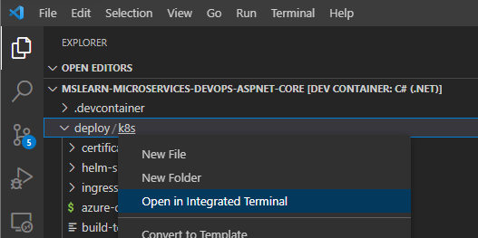

In this unit, you use a script to deploy the existing *:::no-loc text="eShopOnContainers":::* app to Azure Kubernetes Service (AKS). This unit uses a script to keep focus on the learning objectives. The script outputs colored text to indicate the commands being executed. You can inspect the script and the output to better understand the commands used.

The following diagram shows the app's solution architecture. This module focuses on adding CI/CD for the coupon service shown at the bottom of the following diagram.

:::image type="content" source="../../media/microservices/eshop-architecture.png" alt-text="Diagram that shows the eShopOnContainers solution architecture." lightbox="../../media/microservices/eshop-architecture.png":::

The quickstart script completes the following steps to deploy a modified version of the [*:::no-loc text="eShopOnContainers":::*](https://github.com/dotnet-architecture/eshoponcontainers) app.

- Provisions AKS and Azure Container Registry resources.
- Deploys the containers to the fully managed AKS service.
- Displays connection information upon completion.

## Create the Azure resources in the dev environment

1. In a new browser window, fork the [MicrosoftDocs/mslearn-microservices-devops-aspnet-core](https://github.com/MicrosoftDocs/mslearn-microservices-devops-aspnet-core) repository to your own GitHub account. For instructions, see [Fork a repo](https://docs.github.com/get-started/quickstart/fork-a-repo).

   - To use GitHub Codespaces, create a new codespace using the `main` branch of your forked repository.

   - To use Visual Studio Code:
     1. Make sure Docker is running. In a new window, press **Ctrl**+**Shift**+**P** to open the command palette.
     1. Search for and select **Dev Containers: Clone Repository in Container Volume**, and select **Got it** if prompted.
     1. Select your forked repository and branch. Visual Studio Code creates your development container.

1. After the project loads in the container, expand the *deploy/k8s* directory in the Visual Studio Code **Explorer** pane. This directory contains the scripts to use in this module.

   > [!NOTE]
   > By default, Visual Studio Code displays *k8s* on the same line as *deploy* because *deploy*  contains only the *k8s* subdirectory.
   
1. Right-click the *k8s* directory and select **Open in Integrated Terminal**.

   

1. In the new terminal pane, sign in to the Azure CLI. If you use GitHub Codespaces, include the `--use-device-code` flag. If you use Visual Studio Code, the flag is optional.

   ```azurecli
   az login --use-device-code
   ```

1. View the selected Azure subscription.

   ```azurecli
   az account show -o table
   ```

   If the wrong subscription is selected, use the [az account set](/cli/azure/account#az-account-set) command to select the correct one.

1. Run the quickstart script:

   ```bash
   ./quickstart.sh
   ```

   [!INCLUDE[Quickstart note](../../includes/microservices/quickstart.md)]

