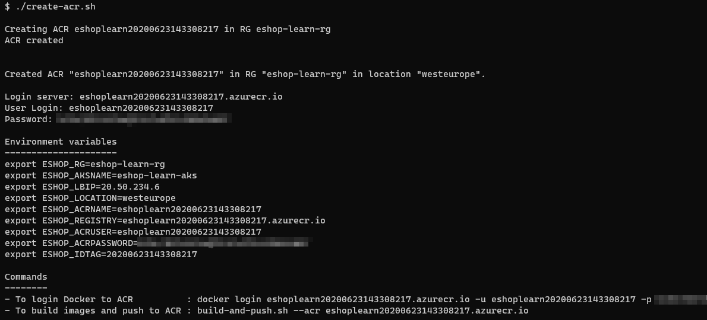
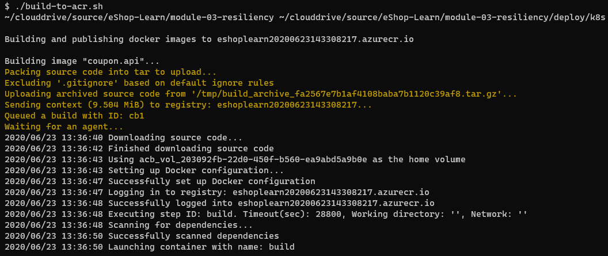
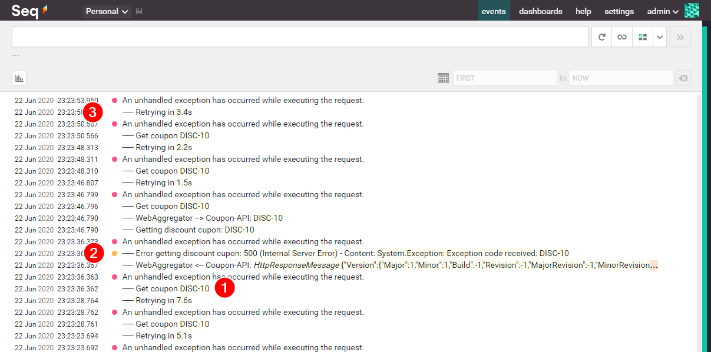

In this exercise, you'll implement a resiliency handler with Polly. The initial eShop-Learn deployment includes a failure simulation feature when validating a coupon from the checkout basket. This feature allows you to configure how many times a request for a specific discount coupon code should fail.

In this exercise you will:

- Explore the app's response when resiliency isn't implemented.
- Update the app's code to implement failure handling using Polly.
- Create an ACR instance and deploy the updated application to AKS.
- Explore the system response under failure after implementing resiliency.

## Explore the response of a non-resilient app

### 1. Buy some stuff

You need to have at least one item in the basket to configure a simulated failure so:

1. Log in to *eShopOnContainers*.
2. Click on the **.NET FOUNDATION PIN**.
3. Click on the basket icon at the top right of the page.
4. Click checkout.

### 2. Configure simulated failure

1. Go to the **HAVE A DISCOUNT CODE?** input at the bottom of the page.
2. Enter the code **FAIL 2 DISC-10** to have the coupon service raise an exception twice, when validating the **DISC-10** discount code.
3. Click **APPLY**.
4. You should receive a confirmation message with number of failures configured for the code: "**CONFIG: 2 failure(s) configured for code "DISC-10"!**" as shown in the next image.


This configuration will make the next two requests for the **DISC-10** code to throw an exception.

### 3. Apply the failing discount coupon

1. Enter the coupon code **DISC-10**.
2. Click **APPLY**.
3. You should receive the message "**ERROR: 500 - Internal Server Error!**"
4. If you click **APPLY** again, you should receive the same message once more.
5. On the third try, the code validation should succeed and the discount should be applied to the order.

Notice that you receive the error message immediately.

If you check the log traces, you should see something like this:


In the preceding image, you can see that:

- The first two requests (#1, #2) fail when getting the values.
- The third request (#3) succeeds and,
- Returns the expected value (#4).

## Add failure handling code using Polly

The basic idea is to have the app automatically handle retrying the operation until it succeeds, or give up because it looks like a severe failure.

When validating a discount coupon, the request goes to the web shopping aggregator, as the implementation of the BFF ([Backends For Frontends pattern](https://samnewman.io/patterns/architectural/bff/)). The BFF makes another REST API request to the coupon service to get the required information. So we'll use the BFF to handle resiliency using [IHttpClientFactory](/aspnet/core/fundamentals/http-requests) and [Polly](http://www.thepollyproject.org/).

In this case, you'll implement two policies to handle failure: the Retry and Circuit Breaker policies from the previous unit.

Using Polly together with `IHttpClientFactory` to add resiliency to web apps is probably one of the archetypical solutions to handle failures. To implement the failure handling, you'll:

- Add Polly to your project.
- Configure the `HttpClient` to apply Polly policies.

### 1. Add Polly to your project

From the folder *src\ApiGateways\Aggregators\Web.Shopping.HttpAggregator*, execute the following command:

```dotnetcli
dotnet add . package Microsoft.Extensions.Http.Polly
```

You can also do it from Visual Studio using the **Manage NuGet packages** option from the project's context menu in **Solution Explorer**.

In this case, the actual Polly package is installed as a dependency of `Microsoft.Extensions.Http.Polly`.

### 2. Add Polly policies to `HttpClient`

To implement this, you'll use the `AddHttpClient` extension method to register a specific configuration for the `HttpClient` that will be injected into `CouponService`.

Edit the *src\ApiGateways\Aggregators\Web.Shopping.HttpAggregator\Startup.cs* file and make the following changes:

- Add `Polly`, `Polly.Extensions.Http`, and `Serilog` to the `using` section.
- Include the `AddPolicyHandler(GetRetryPolicy())` and `AddPolicyHandler(GetCircuitBreakerPolicy())` to the `AddHttpClient` method for the `CouponService` dependency injection registration.
- Add the `GetRetryPolicy()` and `GetCircuitBreakerPolicy()` methods.

Check the code below for details:

```csharp
using System
...
using Polly;
using Polly.Extensions.Http;
using Serilog;
...

public class Startup
{
    ...
}

public static class ServiceCollectionExtensions
{
    ...
    public static IServiceCollection AddApplicationServices(this IServiceCollection services)
    {
        ...
        services.AddHttpClient<ICouponService, CouponService>()
            .AddHttpMessageHandler<HttpClientAuthorizationDelegatingHandler>()
            .AddPolicyHandler(GetRetryPolicy())
            .AddPolicyHandler(GetCircuitBreakerPolicy());

        return services;
    }

    static IAsyncPolicy<HttpResponseMessage> GetRetryPolicy()
    {
        return HttpPolicyExtensions
            .HandleTransientHttpError()
            .WaitAndRetryAsync(5, retryAttempt => TimeSpan.FromMilliseconds(Math.Pow(1.5, retryAttempt) * 1000), (_, waitingTime) =>
            {
                Log.Logger.Information("----- Retrying in {WaitingTime}s", $"{ waitingTime.TotalSeconds:n1}");
            });
    }

    static IAsyncPolicy<HttpResponseMessage> GetCircuitBreakerPolicy()
    {
        return HttpPolicyExtensions
            .HandleTransientHttpError()
            .CircuitBreakerAsync(15, TimeSpan.FromSeconds(15));
    }
}
```

The preceding code configures a retry policy with an exponential back-off that increases the retry time as a power of 1.5 seconds. This value is typically a power of 2 seconds in most samples. To decrease wait times for this exercise, 1.5 seconds is used instead.

You can also see that the Circuit Breaker policy "opens the breaker" for 15 seconds, after 15 continuous failures. This policy configuration gives the server some time to recover.

## Deploy the updated microservice

To deploy the changes that you've implemented:

- Create an ACR instance.
- Build and publish the updated image to ACR.
- Deploy the updated image from the ACR to AKS.

### 1. Create an ACR instance

We'll use a private ACR instance to publish the updated `webshoppingagg` image so AKS will pull it from there to deploy the changes.

To create the ACR instance, run the following script from the *deploy/k8s* folder:

```bash
./create-acr.sh
```

The preceding script creates and ACR instance and gives the AKS cluster permission to pull images from the ACR. You should get something like this:



### 2. Publish the updated image to ACR

To update the deployment, run the following script:

```bash
./build-to-acr.sh --charts webshoppingagg
```

The preceding script uses an [ACR quick task](/azure/container-registry/container-registry-tasks-overview#quick-task) to build the `webshoppingagg` image and push it to the ACR in a command. You should get an output similar to the following:



And this when finished:


### 3. Deploy the updated image to AKS

Run the script:

```bash
./deploy-application.sh --charts webshoppingagg
```

The preceding script uninstalls the old `webshoppingagg` Helm chart and installs it again, so the AKS uses the new image from the ACR. You should get a result like this:


## Explore the system response when implementing resiliency

### 1. Simple retries

We're going to repeat now what we did on the initial exploration, only we've already deployed the resilient BFF.

Consider the situation in which you configure the same two coupon failures with the code "**FAIL 3 DISC-10**". When you enter the **DISC-10** code, it will take a few seconds to get the response back. Fortunately, you won't have to deal with the retrying.

If you check the log traces, you should see something like this:


In the preceding image, you can see:

- The logs traces when configuring the simulated failures (#1) and
- Three retries until the aggregator could finally get the value (#2).

### 2. Circuit breaker

For this case, you'll configure the code for 20 failures, using **FAIL 20 DISC-10**, as shown next:


Now enter the code **DISC-10** again and click **APPLY**. You'll have to wait about 20 seconds to get the error 500 message. When you do, click again on **APPLY**. After the second failure, click **APPLY** again for the third time.

On the third try, notice that the error 500 message came in much faster. That's because the circuit breaker was activated. If you click **APPLY** once again, you'll get the error message immediately.

You'll see this clearly in the log traces, as show next:



In the image above, you see that:

- After waiting for 7.6 seconds (#1), you get the error 500 message with the retry policy (#2) but
- The next time you try, you validate the code, you get the error 500 message after waiting only 3.4 seconds (#3) and you don't see the "Get coupon..." trace, meaning it failed without going to the server.
- If you check the details on this last trace, you should something like this:

    

Where you can see that the last trace has the "The circuit is now open..." message.

Let's move on to the deployment of Linkerd in the next exercise.
