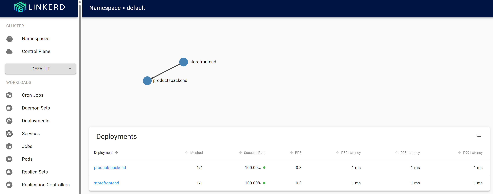

In the previous unit, you implemented resiliency by adding failure-handling code using .NET native resilience extension. However, this change only applies to the service that you changed. Updating a large app with many services would be nontrivial.

Instead of using *code-based* resiliency, this unit uses an approach called *infrastructure-based* resiliency that spans the entire app. You will:

* Redeploy the app without any resiliency into Kubernetes.
* Deploy Linkerd in your Kubernetes cluster.
* Configure the app to use Linkerd for resiliency.
* Explore the app behavior with Linkerd.

## Redeploy the app

Before applying Linkerd, revert the app to a state before code-based resiliency was added. To revert, follow these steps:

1. In the bottom panel, select to the **TERMINAL** tab and run the following git commands to undo your changes:

    ```bash
    cd Store
    git checkout Program.cs
    git checkout Store.csproj
    cd ..
    docker-compose build
    ```

### Install Kubernetes 

In your codespace you'll now install Kubernetes and k3d. k3d is a tool that runs a single-node Kubernetes cluster inside a VM on your local machine. It's useful for testing Kubernetes deployments locally and runs well inside a codespace.

Run these commands to install Kubernetes and MiniKube:

```bash

curl -fsSL https://pkgs.k8s.io/core:/stable:/v1.28/deb/Release.key | sudo gpg --dearmor -o /etc/apt/kubernetes-apt-keyring.gpg

echo 'deb [signed-by=/etc/apt/kubernetes-apt-keyring.gpg] https://pkgs.k8s.io/core:/stable:/v1.28/deb/ /' | sudo tee /etc/apt/sources.list.d/kubernetes.list

sudo apt-get update
sudo apt-get install -y kubectl

curl -s https://raw.githubusercontent.com/k3d-io/k3d/main/install.sh | bash
k3d cluster create devcluster --config k3d.yml
```

### Deploy the eShop services to Docker Hub

The local images of your services that you've built need to be hosted in a container registry to be deployable into Kubernetes. In this unit, you'll use Docker Hub as your container registry.

Run these commands to push your images to Docker Hub:

```bash
sudo docker login

sudo docker tag productservice [your username]/productservice
sudo docker tag storeimage [your username]/storeimage

sudo docker push [your username]/productservice
sudo docker push [your username]/storeimage
```

### Convert your docker-compose file to Kubernetes manifests

At the moment you've defined how your app runs in docker. Kubernetes uses a different format for defining how your app runs. You'll use a tool called Kompose to convert your docker-compose file to Kubernetes manifests.

1. You need to edit these files to use the images you've pushed to Docker Hub. 
1. In the codespace, open the file **backend-deploy.yml**.
1. Change this line:

    ```yaml
      containers:
        - image: [YOUR DOCKER USER NAME]/productservice:latest
    ```

    Replace the placeholder [YOUR DOCKER USER NAME] with your actual Docker username.
    
1. Repeat these steps for the **frontend-deploy.yml** file.
1. Change this line:

    ```yaml
      containers:
      - name: storefrontend
        image: [YOUR DOCKER USER NAME]/storeimage:latest  
    ```

    Replace the placeholder [YOUR DOCKER USER NAME] with your actual Docker username.
    
1. Switch to the **PORTS** tab, point at the **Forwarded Address** for the **Back End (32001)** port, and then click the **Copy Local Address** icon.

1. Paste this URL into the `ImagePrefix` environment variable in the **frontend-deploy.yml** file, replacing the text `http://localhost`. Make sure that `/images` appears at the end of the line: 

    ```yaml
    env:
        - name: ASPNETCORE_URLS
          value: http://*:80
        - name: ProductEndpoint
          value: http://productsbackend
        - name: ImagePrefix
          value: https://studious-fortnight-4g4rx9g47wg249w-32001.app.github.dev/images
	```

    Your codespace will have a different URL for *studious-fortnight-4g4rx9g47wg249w-32001*.

1. Deploy the eShop app into Kubernetes:

    ```bash
    kubectl apply -f backend-deploy.yml,frontend-deploy.yml  
    ```

    You should see output similar to this:

    ```bash
    deployment.apps/productsbackend created
    service/productsbackend created
    deployment.apps/storefrontend created
    service/storefrontend created
    ```
    
1. Check that all the services are running:

    ```bash
    kubectl get pods
    ```

    You should see output similar to this:

    ```bash
    NAME                        READY   STATUS    RESTARTS   AGE
    backend-66f5657758-5gnkw    1/1     Running   0          20s
    frontend-5c9d8dbf5f-tp456   1/1     Running   0          20s
    ```

1. Switch to the **PORTS** tab, to view the eShop running on Kubernetes select the globe icon next to **Front End (32000)** port.

### Install linkerd

The dev container needs Linkerd CLI to be installed. Run the following command to confirm that Linkerd prerequisites have been satisfied:

```bash
curl -sL run.linkerd.io/install | sh
export PATH=$PATH:/home/vscode/.linkerd2/bin
linkerd check --pre
```

A variation of the following output appears:

```console
kubernetes-api
--------------
√ can initialize the client
√ can query the Kubernetes API

kubernetes-version
------------------
√ is running the minimum Kubernetes API version
√ is running the minimum kubectl version

pre-kubernetes-setup
--------------------
√ control plane namespace does not already exist
√ can create non-namespaced resources
√ can create ServiceAccounts
√ can create Services
√ can create Deployments
√ can create CronJobs
√ can create ConfigMaps
√ can create Secrets
√ can read Secrets
√ can read extension-apiserver-authentication configmap
√ no clock skew detected

pre-kubernetes-capability
-------------------------
√ has NET_ADMIN capability
√ has NET_RAW capability

linkerd-version
---------------
√ can determine the latest version
√ cli is up-to-date

Status check results are √
```

### Deploy Linkerd to Kubernetes

First, run the following command to install the CRDs:

```bash
linkerd install --crds | kubectl apply -f -
```

Then, run the following command:

```bash
linkerd install --set proxyInit.runAsRoot=true | kubectl apply -f -
```

In the preceding command:

* `linkerd install` generates a Kubernetes manifest with the necessary control plane resources.
* The generated manifest is piped to `kubectl apply`, which installs those control plane resources in the Kubernetes cluster.

The first line of the output shows that the control plane was installed in its own `linkerd` namespace. The remaining output represents the objects being created.

```console
namespace/linkerd created
clusterrole.rbac.authorization.k8s.io/linkerd-linkerd-identity created
clusterrolebinding.rbac.authorization.k8s.io/linkerd-linkerd-identity created
serviceaccount/linkerd-identity created
clusterrole.rbac.authorization.k8s.io/linkerd-linkerd-controller created
```

### Validate the Linkerd deployment

Run the following command:

```bash
linkerd check
```

The preceding command analyzes the configurations of the Linkerd CLI and control plane. If Linkerd is configured correctly, the following output is displayed:

```console
kubernetes-api
--------------
√ can initialize the client
√ can query the Kubernetes API

kubernetes-version
------------------
√ is running the minimum Kubernetes API version
√ is running the minimum kubectl version

linkerd-existence
-----------------
√ 'linkerd-config' config map exists
√ heartbeat ServiceAccount exist
√ control plane replica sets are ready
√ no unschedulable pods
√ controller pod is running
√ can initialize the client
√ can query the control plane API

linkerd-config
--------------
√ control plane Namespace exists
√ control plane ClusterRoles exist
√ control plane ClusterRoleBindings exist
√ control plane ServiceAccounts exist
√ control plane CustomResourceDefinitions exist
√ control plane MutatingWebhookConfigurations exist
√ control plane ValidatingWebhookConfigurations exist
√ control plane PodSecurityPolicies exist

linkerd-identity
----------------
√ certificate config is valid
√ trust anchors are using supported crypto algorithm
√ trust anchors are within their validity period
√ trust anchors are valid for at least 60 days
√ issuer cert is using supported crypto algorithm
√ issuer cert is within its validity period
√ issuer cert is valid for at least 60 days
√ issuer cert is issued by the trust anchor

linkerd-api
-----------
√ control plane pods are ready
√ control plane self-check
√ [kubernetes] control plane can talk to Kubernetes
√ [prometheus] control plane can talk to Prometheus
√ tap api service is running

linkerd-version
---------------
√ can determine the latest version
√ CLI is up to date

control-plane-version
---------------------
√ control plane is up to date
√ control plane and CLI versions match

linkerd-addons
--------------
√ 'linkerd-config-addons' config map exists

linkerd-grafana
---------------
√ grafana add-on service account exists
√ grafana add-on config map exists
√ grafana pod is running

Status check results are √
```

> [!TIP]
> To see a list of Linkerd components that were installed, run this command: `kubectl -n linkerd get deploy`

## Configure the app to use Linkerd

Linkerd has been deployed, but it hasn't been configured. The app's behavior is unchanged.

Linkerd is unaware of service internals and can't determine whether it's appropriate to retry a failed request. For example, it would be a bad idea to retry a failed HTTP POST for a payment. A *service profile* is necessary for this reason. A service profile is a custom Kubernetes resource that defines routes for the service. It also enables per-route features, such as retries and timeouts. Linkerd only retries routes configured in the service profile manifest.

For brevity, implement Linkerd only on the aggregator and coupon services. To implement Linkerd for those two services, you will:

* Modify the eShop deployments so Linkerd creates its proxy container in the pods.
* Add a service profile object to the cluster to configure retries on the coupon service's route.

### Modify the eShop deployments

The coupon and aggregator services must be configured to use Linkerd proxy containers.

1. Add the `linkerd.io/inject: enabled` annotation to the **backend-deploy.yml** file under the kompose annotations.

    ```yaml
      template:
        metadata:
          annotations:
            linkerd.io/inject: enabled 
    ```

1. Add the `linkerd.io/inject: enabled` annotation to the **fromkend-deploy.yml** file in the same place.

1. Update the deployments in the Kubernetes cluster:

    ```bash
    kubectl apply -f backend-deployment.yaml,frontend-deployment.yaml
    ```

### Apply the Linkerd service profile for the product service

The service profile manifest for the product service is:

```yaml
apiVersion: linkerd.io/v1alpha2
kind: ServiceProfile
metadata:
  name: backend
  namespace: default
spec:
  routes:
  - condition:
      method: GET
      pathRegex: /api/Product
    name: GET /v1/products
    isRetryable: true
  retryBudget:
    retryRatio: 0.2
    minRetriesPerSecond: 10
    ttl: 120s
```

The preceding manifest is configured such that:

* Any idempotent HTTP GET route matching the pattern `/api/Product` can be retried.
* Retries can add no more than an extra 20 percent to the request load, plus an another 10 "free" retries per second.

Run the following command to use the service profile in the Kubernetes cluster:

```bash
kubectl apply -f - <<EOF
apiVersion: linkerd.io/v1alpha2
kind: ServiceProfile
metadata:
  name: backend
  namespace: default
spec:
  routes:
  - condition:
      method: GET
      pathRegex: /api/Product
    name: GET /v1/products 
    isRetryable: true
  retryBudget:
    retryRatio: 0.2
    minRetriesPerSecond: 10
    ttl: 120s  
EOF
```

The following output appears:

```bash
serviceprofile.linkerd.io/backend created
```
### Install monitoring on the service mesh

Linkerd has extensions to give you additional features. You'll install the viz extension and view the status of the app in Linkerd's dashboard.

1. In the terminal, run this command to install the extension:

    ```bash
    linkerd viz install | kubectl apply -f -
    ```
1. View the dashboard with this command:

   ```bash
   linkerd dashboard
   ```

   Visual Studio Code will show a popup that allows you to open the dashboard in a new tab. Select **Open in Browser**.
1. In the Linkerd dashboard, select **Namespaces**.
1. Under HTTP Metrics, select **default**.

   

### Test Linkerd resiliency

After the redeployed containers are healthy, use the following steps to test the app's behavior with Linkerd:

1. Check the status of the running pods with this command:

    ```bash
    kubectl get pods --all-namespaces
    ```
1. Stop all the product service pods:

    ```bash
    kubectl scale deployment productsbackend --replicas=0
    ```

1. Go to the eShop web app and try to view the products. There will be a delay until the error message, "There is a problem loading our products. Please try again later."

1. Restart the product service pods:

    ```bash
    kubectl scale deployment backend --replicas=1
    ```
1. The app should now display the products.

Linkerd follows a different approach to resiliency than what you saw with code-based resilience. Linkerd transparently retried the operation multiple times in quick succession. The app didn't need to be changed to support this behavior.

## Additional information

For more information about Linkerd configuration, see the following resources:

* [Configuring retries - Linkerd documentation](https://linkerd.io/2/tasks/configuring-retries)
* [Configuring timeouts - Linkerd documentation](https://linkerd.io/2/tasks/configuring-timeouts)
* [How we designed retries in Linkerd 2.2 - Linkerd blog](https://linkerd.io/2019/02/22/how-we-designed-retries-in-linkerd-2-2)
