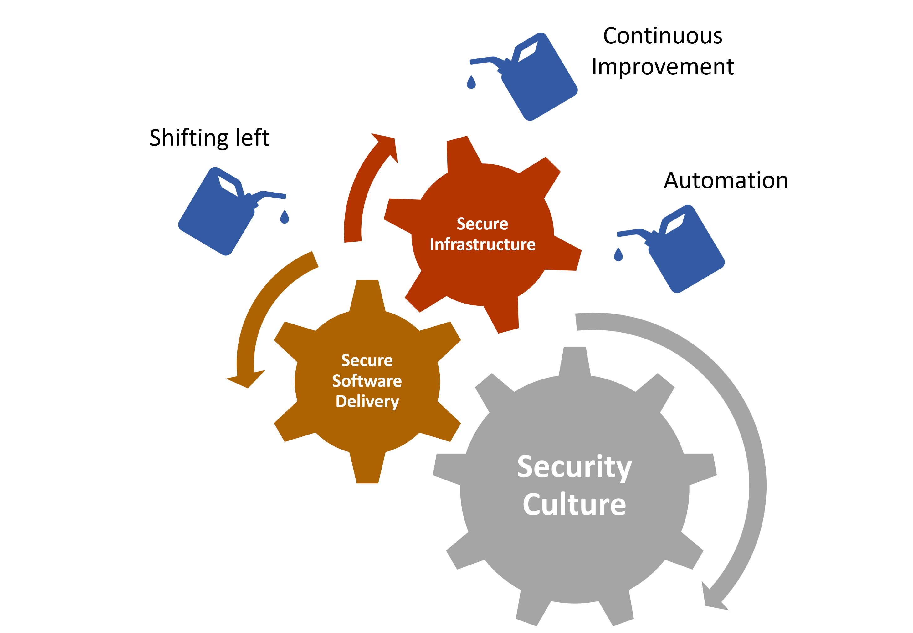

Implementing secured and high quality software  be challenging. In this module, we'll learn about  about application security from the perspective of a (.NET) developer. We’ll go through the recently updated version of OWASP TOP Ten to discover, by looking at examples, that are the most common security weaknesses and how we, app developers, can minimalize the risk of security bug infecting our systems. We’ll also introduce techniques, tools and best practices that can improve our product’s security posture.

<!--  -->
# Threat landscape

No developer, whether your an independent or enterprise, sets out to write bad or insecure code, yet year after year we’re still seeing the same vulnerabilities - the same types of vulnerabilities, pop up in applications. Developers write code to the best of their ability – but what you don’t know what you don’t know, which means the foundation of any AppSec programme has to be education.

Malware, exploits and many other cyber threats are on the rise. Attacks happen by exploiting vulnerabilities in an application. A vulnerability is just an unintended flaw or weakness in that application. The way data is processed or validated, how information is stored or protected, a simple misconfiguration of a external service that forms part of the application are a few examples of where vulnerability could be introduced.

We, as authors of ever more complex systems, are responsible for success of our products and part of that success is providing our customers with a secure and reliable solution. Education element of the secured development lifecycle is fundamental, understanding the risk associated and discussed in OWASP Top Ten is a great start.

Not a week goes by without a news story about a company being hacked, ransomware or data being stolen and posted on dark web. According to the 2021 Identity Theft Resource Center (ITRC) Annual Data Breach Report the cost of a data breach increased by nearly 10% between 2020 and 2021. Data breaches are increasing and getting more costly.

> [!IMPORTANT]
> [Software Vulnerability Definition NIST](https://csrc.nist.gov/glossary/term/Software_Vulnerability):
> A security flaw, glitch, or weakness found in software code that could be exploited by an attacker (threat source).

## The World of Application Security

Application Security, often refereed to as AppSec, is the process of finding, fixing, and preventing security vulnerabilities at the application level.

As the application complexity becomes more increases, so does the effort of making it secure. Modern applications, in contrast with single-project monolith legacy application, depend on external libraries, services for hosting, building and releasing to name a few.
None of these services are simple plug and play affairs, developers need to understand them, and know how to configure and implement the flows and processes – the interactions - securely in their own code.

[Image source](https://www.informationisbeautiful.net/visualizations/worlds-biggest-data-breaches-hacks/)

It’s important to understand there isn’t any single silver bullet or check box to enable AppSec. All the things we’re going to talk about join together to build your suit of AppSec armour.

### Application security in a wider security context​

AppSec logically it falls under the wider context of **Information Security (InfoSec)**, term covering protection of information and systems from unauthorized access, use, disruption, or destruction etc. InfoSec also covers areas like as network security, intrusion detection, digital forensics, and governance, risk, and compliance for example.

**The Security Development Lifecycle (SDL)** consists of a set of practices that support security assurance and compliance requirements. The SDL helps developers build more secure software by reducing the number and severity of vulnerabilities in software.

**DevSecOps** is an evolution in the way development organizations approach security by introducing a security-first mindset culture, and automating security into every phase of the software development lifecycle from design to delivery.​
