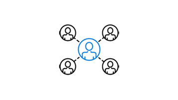

Let's start our education journey by establishing the current state of play in secure software development.

## Education

:::row:::
   :::column span="2":::
     Security is everyone’s job. Developers, service engineers, and program and product managers must understand security basics and know how to build security into software and services to make products more secure while still addressing business needs and delivering user value.
   :::column-end:::
   :::column span="":::
     
   :::column-end:::
:::row-end:::

Training and education stage is the essential step in application development lifecycle (or SDL). For developers, OWASP Top 10 is a great start.

To quote first pillar of Microsoft's SDL practices *effective training will complement and re-enforce security policies, SDL practices, standards, and requirements of software security, and be guided by insights derived through data or newly available technical capabilities.
Although security is everyone’s job, it’s important to remember that not everyone needs to be a security expert nor strive to become a proficient penetration tester. However, ensuring everyone understands the attacker’s perspective, their goals, and the art of the possible will help capture the attention of everyone and raise the collective knowledge bar.*

## What is OWASP?

The [Open Web Application Security Project (OWASP)](https://owasp.org/) is a global charitable organization focused on improving software security.
This is the recently updated list for 2021, and you can see how each category covers different areas of application security. Their mission is to make software security visible so that individuals and organizations can make informed decisions.

## OWASP Top 10

The OWASP Top 10 is a standard awareness document for developers and web application security. It represents a broad consensus about the most critical security risks to web applications.

Globally recognized by developers as the first step towards more secure coding, ordered by severity of reported, vulnerabilities, industry suggested guidelines and probability of attracts

* A01:2021 - Broken Access Control​
* A02:2021 - Cryptographic Failures​
* A03:2021 - Injection​
* A04:2021 - Insecure Design​
* A05:2021 - Security Misconfiguration​
* A06:2021 - Vulnerable and Outdated Components​
* A07:2021 - Identification and Authentication Failures​
* A08:2021 - Software and Data Integrity Failures​
* A09:2021 - Security Logging and Monitoring Failures​
* A10:2021 - Server-Side Request Forgery​

Top of the 2021 list is broken access control, which covers a range of issues that fail to stop users accessing or changing data, or performing functions they shouldn’t be able to. Things like failing to properly validate authorization roles or scopes; or maybe elevation of privilege such as being able to perform admin tasks when you’re not an admin; the ability to enumerate information such as users or orders. It’s what happens when you don’t get authentication and authorization right.
