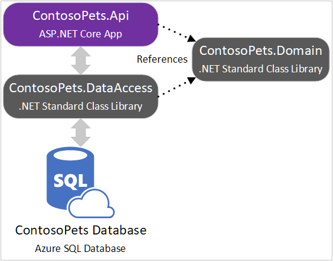

In this unit, you'll set up the development environment for the module. You'll also gain an understanding of the resulting project.

[!include[](../../../includes/azure-sandbox-activate.md)]

## Set up development environment

Run the following command in the command shell. Be patient, as setup can take a few minutes to complete.

```bash
. <(wget -q -O - https://aka.ms/persist-data-ef-core-setup)
```

[!INCLUDE[OS-specific keyboard shortcuts](../../../includes/azure-cloudshell-copy-paste-tip.md)]

The preceding command retrieves and runs a setup script from a GitHub repository. The script completes the following steps:

* Clones the ASP.NET Core starter code from a GitHub repository.
* Builds the ASP.NET Core starter code.
* Provisions an Azure SQL database and Azure Monitor Application Insights resource.
* Sets environment variables that are required for this module.
* Displays connection information for the Azure resources.
* Launches the Cloud Shell Editor to view the starter code.

## Review starter code

The app consists of the following projects.

|Project                 |Description|
|------------------------|-----------|
|*:::no-loc text="ContosoPets.Api":::*|Contains a web API controller, named `OrdersController`. The controller is a facade for accessing data from the *:::no-loc text="ContosoPets.DataAccess":::* project.|
|*:::no-loc text="ContosoPets.DataAccess":::*|Contains a class named `ContosoPetsContext` that derives from `DbContext`. The `OrderService` class will contain queries and use `ContosoPetsContext` to execute the queries.|
|*:::no-loc text="ContosoPets.Domain":::*|Contains Data Transfer Object (DTO) classes. The DTOs are used for representing formatted query result sets.|

The starter code provides a framework for building a data access project. The app won't yet run successfully. The `OrdersController` class has intentionally been excluded from compilation in *:::no-loc text="ContosoPets.Api.csproj":::*. The controller class will be included in compilation in a future unit.

Your team is responsible for multiple client apps. The Solution Architect approved the following N-tier architecture for an ASP.NET Core web API consumed by all client apps:



Your team makes the following technical decisions:

* Other teams at Contoso Pets intend to take *:::no-loc text="ContosoPets.Domain":::* and *:::no-loc text="ContosoPets.DataAccess":::* as dependencies for their apps. To ensure the greatest compatibility, the target framework for the *:::no-loc text="ContosoPets.DataAccess":::* and *:::no-loc text="ContosoPets.Domain":::* projects is .NET Standard.
* Your team decides to keep the web API controllers as minimal as possible. Business logic should be implemented in the *:::no-loc text="ContosoPets.DataAccess":::* project for testability.
* The Operations Manager has requested integration with an Application Performance Monitoring (APM) solution to ease triage of production issues. Application Insights, an APM solution, is already configured in *:::no-loc text="ContosoPets.Api":::*.

## Review EF Core architecture


Classes deriving from `DbContext`:

* Represent an active session with the database.
* Save and query instances of entities.
* Include properties of type `DbSet<T>` representing tables in the database. If a table doesn't already exist in the database, it will be created.

The EF Core Provider translates object graph changes to SQL.

The Database Provider:

* Is a plug-in library designed for a specific database engine, such as SQL Server, Azure Cosmos DB, or PostgreSQL.
* Accepts SQL from the EF Core Provider and executes it in the database.
* Extends EF Core to enable functionality that's unique to the database engine.

## Verify database connectivity

Run the following command:

```bash
db -Q "SELECT TABLE_NAME FROM INFORMATION_SCHEMA.TABLES WHERE TABLE_SCHEMA='dbo' ORDER BY TABLE_NAME" -Y 25
```

The script created a `db` alias. The alias corresponds to `sqlcmd` with `-U` (username), `-P` (password), `-S` (server hostname), and `-d` (database name) options. [sqlcmd](https://docs.microsoft.com/sql/tools/sqlcmd-utility) is a cross-platform command-line tool for administering and querying SQL Server databases. The preceding command retrieves a list of tables from the Azure SQL Database that was created earlier.

As expected, the list is empty because there are no tables in the database's `dbo` schema.

```console
TABLE_NAME
-------------------------

(0 rows affected)
```
