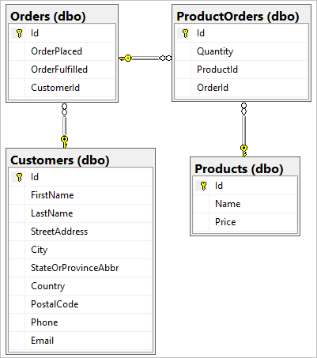

In this unit, you'll create C# entity classes that will map to tables in the *ContosoPets* Azure SQL database. EF migrations will produce tables from those entities. Migrations provide a way to incrementally update the database schema.

As is true with ASP.NET Core MVC, EF Core adopts a *convention over configuration* philosophy. EF Core conventions shorten development time by inferring the developer's intent. For example, a property named `Id` or `<entity name>Id` is inferred to be the generated table's primary key. If you choose not to adopt the naming convention, the property must be annotated with the `[Key]` attribute.

1. Run the following command to create new files to store entity model classes:

    ```bash
    pushd $srcWorkingDirectory/ContosoPets.Domain/Models && \
        touch Product.cs ProductOrder.cs Order.cs Customer.cs && \
        popd
    ```

    The preceding command:

    * Navigates to the *:::no-loc text="Models":::* directory of the *:::no-loc text="ContosoPets.Domain":::* project.
    * Creates files named *:::no-loc text="Product.cs":::*, *:::no-loc text="ProductOrder.cs":::*, *:::no-loc text="Order.cs":::*, and *:::no-loc text="Customer.cs":::* in the *:::no-loc text="Models":::* directory.
    * Navigates back to the root of the *:::no-loc text="ContosoPets.Api":::* project.

    The newly created files will ultimately support generation of the following database structure:

    

    The following one-to-many relationships will exist:

    * A customer may have one or more orders.
    * An order may have one or many products.
    * A product may belong to one or many orders.

    The following table depicts the foreign key relationships that will be created.

    |Dependent entity|Principal entity|Foreign key property|
    |----------------|----------------|--------------------|
    |`Orders`        |`Customers`     |`CustomerId`        |
    |`ProductOrders` |`Orders`        |`OrderId`           |
    |`ProductOrders` |`Products`      |`ProductId`         |

1. [!INCLUDE[refresh file explorer](../../includes/refresh-file-explorer.md)]

    The *:::no-loc text="Product.cs":::*, *:::no-loc text="ProductOrder.cs":::*, *:::no-loc text="Order.cs":::*, and *:::no-loc text="Customer.cs":::* files appear in the *:::no-loc text="ContosoPets.Domain/Models":::* directory.

1. Add the following code to *:::no-loc text="Models/Product.cs":::*. Save your changes.

    ```csharp
    using System.Collections.Generic;
    using System.ComponentModel.DataAnnotations;
    using System.ComponentModel.DataAnnotations.Schema;

    namespace ContosoPets.Domain.Models
    {
        public partial class Product
        {
            public int Id { get; set; }
            [Required]
            public string Name { get; set; }
            [Column(TypeName = "decimal(18, 2)")]
            public decimal Price { get; set; }

            public ICollection<ProductOrder> ProductOrders { get; set; }
        }
    }
    ```

    In the preceding code:

    * A `Product` entity is defined to represent a table for storing product data. By convention, the `Id` property is used as the primary key column name.
    * The `[Required]` attribute is applied to the `Name` property. As a result, the associated column in the generated `Products` table is assigned a `not null` constraint.
    * The `[Column]` attribute is applied to the `Price` property. As a result, the associated column in the generated `Products` table is assigned a `decimal(18,2)` SQL Server column data type. Defining the specific data type prevents loss of precision.
    * A *navigation property*, named `ProductOrders`, is defined on the principal entity `Product`. A navigation property contains a reference to a related entity and enables loading of related entities without explicitly joining them in a query.
    * A one-to-many relationship is established between the `Product` entity and the `ProductOrder` entity.

1. Add the following code to *:::no-loc text="Models/ProductOrder.cs":::*. Save your changes.

    ```csharp
    namespace ContosoPets.Domain.Models
    {
        public partial class ProductOrder
        {
            public int Id { get; set; }
            public int Quantity { get; set; }
            public int ProductId { get; set; }
            public int OrderId { get; set; }

            public Order Order { get; set; }
            public Product Product { get; set; }
        }
    }
    ```

    In the preceding code:

    * A `ProductOrder` entity is defined to represent an *intersection table*. An intersection table models a many-to-many relationship between two tables. Every order is associated with one or more products. Each product can belong to multiple orders.
    * The `Order` and `Product` navigation properties represent foreign key relationships to be created in the database. The generated `ProductOrders` table will contain foreign key columns named `OrderId` and `ProductId` to establish this relationship.
    * As a best practice, the `OrderId` and `ProductId` properties are included. If the properties aren't included, EF Core infers their inclusion in the entity as *shadow properties*. Shadow properties aren't defined in the entity but are defined in the generated EF Core model.

1. Add the following code to *:::no-loc text="Models/Customer.cs":::*. Save your changes.

    ```csharp
    using System.Collections.Generic;
    using System.ComponentModel.DataAnnotations;

    namespace ContosoPets.Domain.Models
    {
        public partial class Customer
        {
            public int Id { get; set; }
            [Required]
            public string FirstName { get; set; }
            [Required]
            public string LastName { get; set; }
            public string StreetAddress { get; set; }
            public string City { get; set; }
            public string StateOrProvinceAbbr { get; set; }
            public string Country { get; set; }
            public string PostalCode { get; set; }
            public string Phone { get; set; }
            public string Email { get; set; }

            public ICollection<Order> Orders { get; set; }
        }
    }
    ```

    In the preceding code:

    * A `Customer` entity is defined to represent a table for storing customer data.
    * The `[Required]` attribute is applied to the `FirstName` and `LastName` properties. As a result, the associated columns in the generated `Customers` table are each assigned a `not null` constraint.
    * A navigation property named `Orders` is defined on the principal entity `Customer`.
    * A one-to-many relationship is established between the `Customer` entity and the `Order` entity.

1. Add the following code to *:::no-loc text="Models/Order.cs":::*. Save your changes.

    ```csharp
    using System;
    using System.Collections.Generic;

    namespace ContosoPets.Domain.Models
    {
        public partial class Order
        {
            public int Id { get; set; }
            public DateTime OrderPlaced { get; set; }
            public DateTime? OrderFulfilled { get; set; }
            public int CustomerId { get; set; }

            public Customer Customer { get; set; }
            public ICollection<ProductOrder> ProductOrders { get; set; }
        }
    }
    ```

    In the preceding code:

    * An `Order` entity is defined to represent a table for storing order data.
    * The `OrderFulfilled` property is declared as a nullable `DateTime` type. As a result, the associated column in the generated `Orders` table is assigned a `null` constraint and uses the `datetime2(7)` SQL Server data type.
    * Navigation properties, named `Customer` and `ProductOrders`, are defined on the principal entity `Order`.
    * A one-to-many relationship is established between the `Customer` entity and the `Order` entity.
    * A one-to-many relationship is established between the `Order` entity and the `ProductOrder` entity.

1. In *:::no-loc text="ContosoPets.DataAccess/Data/ContosoPetsContext.cs":::*, replace the `// Add the DbSet<T> properties` comment with the following code. Save your changes.

    ```csharp
    public DbSet<Customer> Customers { get; set; }
    public DbSet<Order> Orders { get; set; }
    public DbSet<Product> Products { get; set; }
    public DbSet<ProductOrder> ProductOrders { get; set; }
    ```

    The `DbSet<T>` properties correspond to tables to be created in the database. The table names will match the `DbSet<T>` property names in the `ContosoPetsContext` class.

1. In *:::no-loc text="ContosoPetsContext.cs":::*, replace the `// Add the ContosoPets.Domain.Models using statement` comment with the following code. Save your changes.

    ```csharp
    using ContosoPets.Domain.Models;
    ```

    Inclusion of the preceding namespace resolves the `DbSet<T>` references in the previous step.

1. [!INCLUDE[dotnet build command](../../includes/dotnet-build-no-restore-command.md)]

1. Run the following command to generate a migration for creating the database tables:

    ```dotnetcli
    dotnet ef migrations add InitialCreate \
        --project ../ContosoPets.DataAccess/ContosoPets.DataAccess.csproj \
        --context ContosoPetsContext
    ```

    In the preceding command:

    * The migration is given a name of *:::no-loc text="InitialCreate":::*.
    * The `--project` option provides the location of the project to be used for creating the migration.
    * The `--context` option specifies the name of the class in the *:::no-loc text="ContosoPets.DataAccess":::* project, which derives from `DbContext`.

1. Refresh file explorer.

    A new *:::no-loc text="Migrations":::* directory appears in the *:::no-loc text="ContosoPets.DataAccess":::* project root. The directory contains a *:::no-loc text="&lt;timestamp&gt;_InitialCreate.cs":::* file describing database changes to be translated to a Data Definition Language (DDL) change script.

1. Run the following command to apply the *:::no-loc text="InitialCreate":::* migration:

    ```dotnetcli
    dotnet ef database update \
        --project ../ContosoPets.DataAccess/ContosoPets.DataAccess.csproj \
        --context ContosoPetsContext
    ```

    Execution of the preceding command results in DDL changes within the Azure SQL database.

    > [!TIP]
    > The `dotnet ef` tool is supported on all platforms. In Visual Studio on Windows, it's preferable to use the `Add-Migration` and `Update-Database` PowerShell cmdlets in the **Package Manager Console** window.

1. Run the following command to list the tables in the Azure SQL database:

    ```bash
    db -Q "SELECT TABLE_NAME AS 'Table' FROM INFORMATION_SCHEMA.TABLES WHERE TABLE_SCHEMA='dbo' ORDER BY TABLE_NAME" -Y 25
    ```

    The following output appears, which confirms the *:::no-loc text="InitialCreate":::* migration successfully created the tables.

    ```console
    Table
    -------------------------
    __EFMigrationsHistory
    Customers
    Orders
    ProductOrders
    Products

    (5 rows affected)
    ```

1. Run the following command to list the primary key and foreign key constraints on tables in the Azure SQL database:

    ```bash
    db -i $setupWorkingDirectory/listkeys.sql -Y 35
    ```

    The *:::no-loc text="listkeys.sql":::* script referenced in the preceding command uses the `sp_pkeys` and `sp_fkeys` system stored procedures in the database. The following result set appears:

    ```console
    Table          Column  Primary key
    -------------- ------- -----------------
    Orders         Id      PK_Orders
    Products       Id      PK_Products
    ProductOrders  Id      PK_ProductOrders
    Customers      Id      PK_Customers
  
    Table          Column      Foreign key
    -------------- ----------- -----------------------------------
    ProductOrders  OrderId     FK_ProductOrders_Orders_OrderId
    ProductOrders  ProductId   FK_ProductOrders_Products_ProductId
    Orders         CustomerId  FK_Orders_Customers_CustomerId
    ```

    EF Core's primary key and foreign key constraint naming conventions are `PK_<Primary key property>` and `FK_<Dependent entity>_<Principal entity>_<Foreign key property>`, respectively. The `<Dependent entity>` and `<Principal entity>` placeholders correspond to the entity class names.
