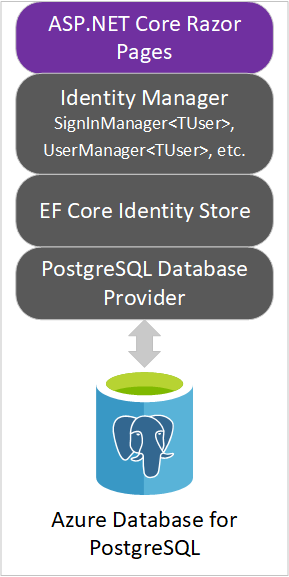

ASP.NET Core Identity is a membership system that adds user registration and login capabilities to an ASP.NET Core web UI. The membership system handles both authentication and authorization concerns. As an alternative to local account creation, Identity supports external login providers such as Facebook and Twitter. User sessions are preserved using cookie-based authentication. By default, a cookie is created upon log in and destroyed upon log out.

Membership data is persisted using a data store and persistence mechanism of your choosing. The default persistence mechanism is an Object-Relational Mapper (O/RM) called Entity Framework (EF) Core. The default data store is SQL Server.

The intricacies of interacting with the underlying database are abstracted away by EF Core. Therefore, EF Core generally makes it possible to use any of its database providers with Identity. Example database providers include, but aren't limited to, PostgreSQL and SQLite. PostgreSQL, however, is a third-party provider and is therefore not eligible for support from Microsoft. Identity also provides the flexibility to use a persistence mechanism of your choosing. Dapper is one popular alternative.

The following diagram depicts the Identity architecture used in this module:

::: zone pivot="pg"



::: zone-end

::: zone pivot="sql"


::: zone-end

In the preceding diagram:

* The *ASP.NET Core Razor Pages* app represents the web UI to which Identity support will be added in this module.
* The *Identity Manager* layer contains classes used from the `Microsoft.AspNetCore.Identity` namespace. Examples of such classes used explicitly in this module are `SignInManager<TUser>` and `UserManager<TUser>`.
* The *EF Core Identity Store* layer contains classes from the `Microsoft.AspNetCore.Identity.EntityFrameworkCore` namespace. An example of such a class used implicitly in this module is `UserStore<TUser>`.

In this unit, you'll set up the development environment for the module. You'll also gain an understanding of the resulting project. This module focuses on just two of the possible EF Core data stores. Use the toggle above to select your preference.

[!include[](../../../includes/azure-sandbox-activate.md)]

## Set up development environment

Run the following command in the command shell. The command reflects your data store choice in the toggle above. Be patient, as setup can take a few minutes to complete.

::: zone pivot="pg"

```bash
. <(wget -q -O - https://aka.ms/secure-aspnet-core-identity-setup) "pg"
```

::: zone-end

::: zone pivot="sql"

```bash
. <(wget -q -O - https://aka.ms/secure-aspnet-core-identity-setup) "sql"
```

::: zone-end

[!INCLUDE[OS-specific keyboard shortcuts](../../../includes/azure-cloudshell-copy-paste-tip.md)]

The preceding command retrieves and runs a setup script from a GitHub repository. The script completes the following steps:

* Clones the ASP.NET Core starter code from a GitHub repository.
* Builds and deploys an ASP.NET Core web API to supply the web app with data.
* Provisions a database to store Identity framework entities.
* Sets environment variables that are required for this module.
* Displays connection information for the Azure resources.
* Launches the Cloud Shell Editor to view the starter code.

## Review project requirements

Your stakeholders have defined the following business requirements:

* There are two types of authenticated users for the system: employees and administrators.
* Anonymous users aren't allowed to view the product catalog.
* Employees can only view the product catalog.
* Administrators can modify products.
* Upon successful login, the user's first and last name should appear in the app's header.

Your development team makes the following technical decisions:

* Identity data should be isolated in its own database.
* The database tables supporting Identity should belong to the default schema.
* Administrators will self-enroll using a single-use token.
* The app must support logging in with multi-factor authentication using a TOTP authenticator app.
* The database credentials should be stored in Azure Key Vault.

## Review starter code

The app consists of a single ASP.NET Core Razor Pages project named *ContosoPets.Ui*. The project contains the user interface for viewing and managing product data. The product data is obtained via an external ASP.NET Core web API.

Of particular interest are the following files and directories in *ContosoPets.Ui*:

|Name              |Description                                                    |
|------------------|---------------------------------------------------------------|
|*:::no-loc text="Controllers/AdminTokenController.cs":::* |Exposes `AdminRegistrationTokenService` as an HTTP endpoint. Unused until Unit 6.|
|*:::no-loc text="Pages/Products/":::*            |Contains web UI for CRUD operations.|
|*:::no-loc text="Services/AdminRegistrationTokenService.cs":::* |Generates tokens allowing administrators to self-register. Unused until Unit 6.|
|*:::no-loc text="Services/ProductService.cs":::*          |Manages all interactions with the external ASP.NET Core web API.|
|*:::no-loc text="Services/QRCodeService.cs":::*          |Manages the creation of QR codes for supporting multi-factor authentication. Unused until Unit 5.|
|*:::no-loc text="wwwroot/js/product.js":::*          |Enables deletion of a product from *:::no-loc text="Pages/Products/Index.cshtml":::* without a server-side postback.|
|*:::no-loc text="Program.cs":::*            |Serves as the app's main entry point and registers the Azure Key Vault configuration provider.|
|*:::no-loc text="Startup.cs":::*            |Configures services and the app's HTTP request pipeline.|

> [!NOTE]
> Azure Key Vault is used to securely store and retrieve sensitive data. The starter code implements it to demonstrate one possible way to secure database credentials. It's unrelated to Identity and therefore out of scope for this module. [Learn more about Azure Key Vault](https://docs.microsoft.com/learn/modules/manage-secrets-with-azure-key-vault/).

## Verify database connectivity

Run the following command:

::: zone pivot="pg"

```bash
db -c "SELECT tablename FROM pg_catalog.pg_tables WHERE schemaname != 'pg_catalog' AND schemaname != 'information_schema'"
```

The script created a `db` alias. The alias corresponds to `psql` with `--host` (server hostname), `--port` (port number), `--username`, and `--dbname` (database name) options. psql obtains the password from an environment variable named `PGPASSWORD`. [psql](http://postgresguide.com/utilities/psql.html) is a cross-platform command-line tool for administering and querying PostgreSQL databases. The preceding command retrieves a list of non-system tables from the PostgreSQL database that was created earlier.

As expected, the list is empty because the database only contains system tables.

```console
 tablename 
-----------
(0 rows)
```

::: zone-end

::: zone pivot="sql"

```bash
db -Q "SELECT TABLE_NAME FROM INFORMATION_SCHEMA.TABLES WHERE TABLE_SCHEMA='dbo' ORDER BY TABLE_NAME" -Y 25
```

The script created a `db` alias. The alias corresponds to `sqlcmd` with `-U` (username), `-P` (password), `-S` (server hostname), and `-d` (database name) options. [sqlcmd](https://docs.microsoft.com/sql/tools/sqlcmd-utility) is a cross-platform command-line tool for administering and querying SQL Server databases. The preceding command retrieves a list of non-system tables from the Azure SQL Database that was created earlier.

As expected, the list is empty because there are no tables in the database's `dbo` schema.

```console
TABLE_NAME
-------------------------

(0 rows affected)
```

::: zone-end
