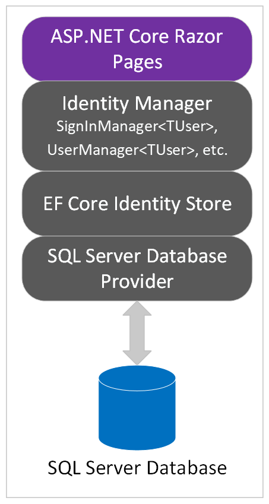

In this unit, you'll gain an understanding of Identity architecture.

## ASP.NET Core Identity architecture

ASP.NET Core Identity is a membership system that adds user registration and login capabilities to an ASP.NET Core web UI. The membership system handles both authentication and authorization concerns. Authentication is concerned with who you are. Authorization is concerned with what you're allowed to do. Authentication is therefore a prerequisite for authorization.

As an alternative to local account creation, Identity supports external login providers such as Facebook and Twitter. User sessions are preserved using cookie-based authentication. By default, a cookie is created upon log in and destroyed upon log out.

Membership data is persisted using a data store and data access technology of your choosing. The default data access technology is an Object-Relational Mapper (O/RM) called Entity Framework (EF) Core. The default data store is SQL Server.

The intricacies of interacting with the underlying database are abstracted away by EF Core. Therefore, EF Core generally makes it possible to use any of its database providers with Identity. Database providers are available for SQL Server, SQLite, and several other data stores. Identity also provides the flexibility to use a data access technology of your choosing. Dapper is one popular alternative.

The following diagram depicts the Identity architecture used in this module:

In the preceding diagram:

* The *ASP.NET Core Razor Pages* app represents the web UI to which Identity support will be added in this module.
* The *Identity Manager* layer contains classes used from the `Microsoft.AspNetCore.Identity` namespace. Examples of such classes used explicitly in this module are `SignInManager<TUser>` and `UserManager<TUser>`.
* The *EF Core Identity Store* layer contains classes from the `Microsoft.AspNetCore.Identity.EntityFrameworkCore` namespace. An example of such a class used implicitly in this module is `UserStore<TUser>`.
* The *Database Provider* is a database-specific library that accepts SQL from the *EF Core Provider* (not pictured) and executes it.

After applying the initial EF Core migration, the supporting database tables are created. The following diagram depicts the schemas of the supporting tables:

:::image type="content" source="../media/identity-tables.png" alt-text="Identity database schema" lightbox="../media/identity-tables.png":::

> [!NOTE]
> The above image shows the key(s) and relationships in the database. The key is a one, and the infinity (sideways 8) is a many. A database can have one-to-one, one-to-many, and many-to-many relationship types. Keys are unique. The diagram shows how these joins are created, and the relationships.

## Summary

In this unit, you learned about ASP.NET Core Identity architecture. In the next unit, you'll add the default ASP.NET Core Identity implementation to an existing app.
