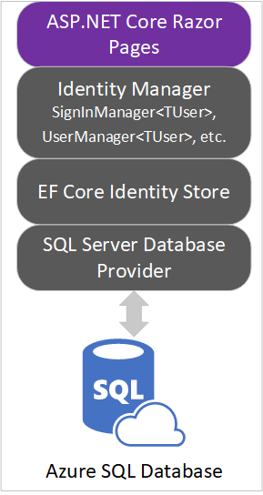

In this unit, you'll gain an understanding of Identity architecture.

## Review ASP.NET Core Identity architecture

ASP.NET Core Identity is a membership system that adds user registration and login capabilities to an ASP.NET Core web UI. The membership system handles both authentication and authorization concerns. Authentication is concerned with who you are. Authorization is concerned with what you're allowed to do. Authentication is therefore a prerequisite for authorization.

As an alternative to local account creation, Identity supports external login providers such as Facebook and Twitter. User sessions are preserved using cookie-based authentication. By default, a cookie is created upon log in and destroyed upon log out.

Membership data is persisted using a data store and data access technology of your choosing. The default data access technology is an Object-Relational Mapper (O/RM) called Entity Framework (EF) Core. The default data store is SQL Server.

The intricacies of interacting with the underlying database are abstracted away by EF Core. Therefore, EF Core generally makes it possible to use any of its database providers with Identity. Database providers are available for PostgreSQL, SQLite, and several other data stores. PostgreSQL, however, is a third-party provider and is therefore not eligible for support from Microsoft. Identity also provides the flexibility to use a data access technology of your choosing. Dapper is one popular alternative.

The following diagram depicts the Identity architecture used in this module:



In the preceding diagram:

* The *ASP.NET Core Razor Pages* app represents the web UI to which Identity support will be added in this module.
* The *Identity Manager* layer contains classes used from the `Microsoft.AspNetCore.Identity` namespace. Examples of such classes used explicitly in this module are `SignInManager<TUser>` and `UserManager<TUser>`.
* The *EF Core Identity Store* layer contains classes from the `Microsoft.AspNetCore.Identity.EntityFrameworkCore` namespace. An example of such a class used implicitly in this module is `UserStore<TUser>`.
* The *Database Provider* is a database-specific library that accepts SQL from the *EF Core Provider* (not pictured) and executes it.

## Review project requirements

Your stakeholders have defined the following business requirements:

* There are two types of authenticated users for the system: employees and administrators.
* Anonymous users aren't allowed to view the product catalog.
* Employees can only view the product catalog.
* Administrators can modify products.
* Upon successful login, the user's first and last name should appear in the app's header.

Your development team makes the following technical decisions:

* Identity data should be isolated in its own database.
* The database tables supporting Identity should belong to the default schema.
* Administrators will self-enroll using a single-use token.
* The app must support logging in with multi-factor authentication using a TOTP authenticator app.
* The database credentials should be stored in Azure Key Vault.

## Review starter code

The app consists of a single ASP.NET Core Razor Pages project named *:::no-loc text="ContosoPets.Ui":::*. The project contains the user interface for viewing and managing product data. The product data is obtained via an external ASP.NET Core web API.

Of particular interest are the following files and directories in *:::no-loc text="ContosoPets.Ui":::*:

|Name              |Description                                                    |
|------------------|---------------------------------------------------------------|
|*:::no-loc text="Controllers/AdminTokenController.cs":::* |Exposes `AdminRegistrationTokenService` as an HTTP endpoint. Unused until Unit 6.|
|*:::no-loc text="Pages/Products/":::*            |Contains web UI for CRUD operations.|
|*:::no-loc text="Services/AdminRegistrationTokenService.cs":::* |Generates tokens allowing administrators to self-register. Unused until Unit 6.|
|*:::no-loc text="Services/ProductService.cs":::*          |Manages all interactions with the external ASP.NET Core web API.|
|*:::no-loc text="Services/QRCodeService.cs":::*          |Manages the creation of QR codes for supporting multi-factor authentication. Unused until Unit 5.|
|*:::no-loc text="wwwroot/js/product.js":::*          |Enables deletion of a product from *:::no-loc text="Pages/Products/Index.cshtml":::* without a server-side postback.|
|*:::no-loc text="Program.cs":::*            |Serves as the app's main entry point and registers the Azure Key Vault configuration provider.|
|*:::no-loc text="Startup.cs":::*            |Configures services and the app's HTTP request pipeline.|

> [!NOTE]
> Azure Key Vault is used to securely store and retrieve sensitive data. The starter code implements it to demonstrate one possible way to secure database credentials. It's unrelated to Identity and therefore out of scope for this module. See the `ConfigureKeyVault` method in the *:::no-loc text="Program.cs":::* file for the Key Vault registration code.

## Verify database connectivity

Run the following command:

```bash
db -Q "SELECT TABLE_NAME FROM INFORMATION_SCHEMA.TABLES WHERE TABLE_SCHEMA='dbo' ORDER BY TABLE_NAME" -Y 25
```

The script created a `db` alias. The alias corresponds to `sqlcmd` with `-U` (username), `-P` (password), `-S` (server hostname), and `-d` (database name) options. [sqlcmd](/sql/tools/sqlcmd-utility) is a cross-platform command-line tool for administering and querying SQL Server databases. The preceding command retrieves a list of non-system tables from the Azure SQL Database that was created earlier.

As expected, the list is empty because there are no tables in the database's `dbo` schema.

```console
TABLE_NAME
-------------------------

(0 rows affected)
```
