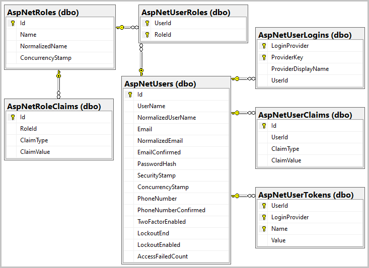

Identity works out-of-the-box without any customization. The standard Identity UI components are packaged in a .NET Standard Razor Class Library (RCL). Because an RCL is used, few files are added to the project.

After applying the initial EF Core migration, the supporting database tables are created. The following diagram depicts the schemas of the supporting tables:



  > [!NOTE] 
  >  The above image shows the key(s) and relationships in the database. The key is a one, and the infinity (sideways 8) is a many.  A database can have 1 to 1, 1 to many, and many to many relationship types.  Keys are unique.  The diagram shows how these joins are created, and the relationships. 

In this unit, Identity will be added to the existing ASP.NET Core Razor Pages project.

## Add Identity to the project

1. Install the ASP.NET Core code scaffolder:

    ```dotnetcli
    dotnet tool install dotnet-aspnet-codegenerator --version 3.1.2
    ```

    The following output appears:

    ```console
    You can invoke the tool from this directory using the following commands: 'dotnet tool run dotnet-aspnet-codegenerator' or 'dotnet dotnet-aspnet-codegenerator'.
    Tool 'dotnet-aspnet-codegenerator' (version '3.1.2') was successfully installed. Entry is added to the manifest file /home/<USER>/aspnet-learn/src/ContosoPets.Ui/.config/dotnet-tools.json.
    ```

    The scaffolder is a .NET Core tool that will:

    * Be used to add the default Identity components to the project.
    * Enable customization of Identity UI components in the next unit.
    * Be invoked via `dotnet aspnet-codegenerator` in this module.

1. Add the following NuGet packages to the project:

    ```dotnetcli
    dotnet add package Microsoft.VisualStudio.Web.CodeGeneration.Design --version 3.1.2 && \
        dotnet add package Microsoft.AspNetCore.Identity.EntityFrameworkCore --version 3.1.3 && \
        dotnet add package Microsoft.AspNetCore.Identity.UI --version 3.1.3 && \
        dotnet add package Microsoft.EntityFrameworkCore.Design --version 3.1.3 && \
        dotnet add package Microsoft.EntityFrameworkCore.SqlServer --version 3.1.3
    ```

    These packages install code generation templates and dependencies that are used by the scaffolder.

    > [!TIP]
    > To view the available generators:
    >
    > * In the command shell, run `dotnet aspnet-codegenerator -h`.
    > * When in Visual Studio, right-click the project in **Solution Explorer** and select **Add** > **New Scaffolded Item**.

1. Use the scaffolder to add the default Identity components to the project. Run the following command from the project root:

    ```dotnetcli
    dotnet aspnet-codegenerator identity \
        --useDefaultUI \
        --dbContext ContosoPetsAuth
    ```

    In the preceding command:

    * The generator identified as `identity` is used to add the Identity framework to the project.
    * The `--useDefaultUI` option indicates that an RCL containing the default UI elements will be used. Bootstrap will be used to style the components.
    * The `--dbContext` option to indicate the name of an EF Core database context class to generate.

1. [!INCLUDE[refresh file explorer](../../includes/refresh-file-explorer.md)]

    An *:::no-loc text="Areas":::* directory structure appears in the project root:

    * *:::no-loc text="Areas":::*
        * *:::no-loc text="Identity":::*
            * *:::no-loc text="Data":::*
                * *:::no-loc text="ContosoPetsAuth.cs":::*
            * *:::no-loc text="Pages":::*
                * *:::no-loc text="_ValidationScriptsPartial.cshtml":::*
                * *:::no-loc text="_ViewStart.cshtml":::*
            * *:::no-loc text="IdentityHostingStartup.cs":::*

    Areas provide a way to partition an ASP.NET Core web app into smaller functional groups.

::: zone pivot="pg"

## Add the PostgreSQL database provider

Run the following command from the project root to install the PostgreSQL database provider for EF Core:

```dotnetcli
dotnet add package Npgsql.EntityFrameworkCore.PostgreSQL --version 3.1.3
```

This NuGet package provides EF Core with knowledge of how to interact with a PostgreSQL database.

::: zone-end

## Configure the database connection

1. Replace the `Configure` method of *:::no-loc text="Areas/Identity/IdentityHostingStartup.cs":::* with the following code:

    ::: zone pivot="pg"

    ```csharp
    public void Configure(IWebHostBuilder builder)
    {
        builder.ConfigureServices((context, services) => {
            var connBuilder = new NpgsqlConnectionStringBuilder(
                context.Configuration.GetConnectionString("ContosoPetsAuthConnection"))
            {
                Username = context.Configuration["DbUsername"],
                Password = context.Configuration["DbPassword"]
            };

            services.AddDbContext<ContosoPetsAuth>(options =>
                options.UseNpgsql(connBuilder.ConnectionString));

            services.AddDefaultIdentity<IdentityUser>()
                .AddDefaultUI()
                .AddEntityFrameworkStores<ContosoPetsAuth>();
        });
    }
    ```

    ::: zone-end

    ::: zone pivot="sql"

    ```csharp
    public void Configure(IWebHostBuilder builder)
    {
        builder.ConfigureServices((context, services) => {
            var connBuilder = new SqlConnectionStringBuilder(
                context.Configuration.GetConnectionString("ContosoPetsAuthConnection"))
            {
                UserID = context.Configuration["DbUsername"],
                Password = context.Configuration["DbPassword"]
            };

            services.AddDbContext<ContosoPetsAuth>(options =>
                options.UseSqlServer(connBuilder.ConnectionString));

            services.AddDefaultIdentity<IdentityUser>()
                .AddDefaultUI()
                .AddEntityFrameworkStores<ContosoPetsAuth>();
        });
    }
    ```

    ::: zone-end

    In the preceding code:

    * The Azure Key Vault configuration provider is implicitly used to retrieve the database username and password:

        ::: zone pivot="pg"

        ```csharp
        Username = context.Configuration["DbUsername"],
        Password = context.Configuration["DbPassword"]
        ```

        ::: zone-end

        ::: zone pivot="sql"

        ```csharp
        UserID = context.Configuration["DbUsername"],
        Password = context.Configuration["DbPassword"]
        ```

        ::: zone-end

    * The database username and password are injected into the connection string stored in *:::no-loc text="appsettings.json":::*.
    * The EF Core database context class, named `ContosoPetsAuth`, is configured with the appropriate connection string.
    * The Identity services are registered, including the default UI, token providers, and cookie-based authentication.

1. Also in *:::no-loc text="IdentityHostingStartup.cs":::*, add the following code to the block of `using` statements at the top. Save your changes.

    ::: zone pivot="pg"

    ```csharp
    using Npgsql;
    ```

    The preceding code resolves the reference to the `NpgsqlConnectionStringBuilder` class in the `Configure` method.

    ::: zone-end

    ::: zone pivot="sql"

    ```csharp
    using Microsoft.Data.SqlClient;
    ```

    The preceding code resolves the reference to the `SqlConnectionStringBuilder` class in the `Configure` method.

    ::: zone-end

1. In the `Configure` method of *:::no-loc text="Startup.cs":::*, replace the `// Add the app.UseAuthentication code` comment with the following code. Save your changes.

    ```csharp
    app.UseAuthentication();
    ```

    The preceding code enables authentication capabilities. More specifically, an instance of the ASP.NET Core authentication middleware is added to the app's HTTP request-handling pipeline.

1. Run the following command to print the database connection string to the console. Copy the connection string to your clipboard.

    ```bash
    echo $dbConnectionString
    ```

1. In *:::no-loc text="appsettings.json":::*, replace the connection string for `ContosoPetsAuthConnection` with the connection string from the previous step. Save your changes. 

    The `ConnectionStrings` section should look similar to the following JSON:

    ::: zone pivot="pg"

    ```json
    "ConnectionStrings": {
        "ContosoPetsAuthConnection": "Server={HOST NAME}.postgres.database.azure.com;Database=contosopets;Port=5432;Ssl Mode=Require;"
    }
    ```

    ::: zone-end

    ::: zone pivot="sql"

    ```json
    "ConnectionStrings": {
        "ContosoPetsAuthConnection": "Data Source={HOST NAME}.database.windows.net;Initial Catalog=ContosoPets;Connect Timeout=30;Encrypt=True;TrustServerCertificate=False;ApplicationIntent=ReadWrite;MultiSubnetFailover=False"
    }
    ```

    ::: zone-end

1. [!INCLUDE[dotnet build command](../../includes/dotnet-build-command.md)]

## Update the database

1. Install the Entity Framework Core migration tool:

    ```dotnetcli
    dotnet tool install dotnet-ef --version 3.1.3
    ```

    The following output appears:

    ```console
    You can invoke the tool from this directory using the following commands: 'dotnet tool run dotnet-ef' or 'dotnet dotnet-ef'.
    Tool 'dotnet-ef' (version '3.1.3') was successfully installed. Entry is added to the manifest file /home/<USER>/aspnet-learn/src/ContosoPets.Ui/.config/dotnet-tools.json.
    ```

    The migration tool is a .NET Core tool that will:

    * Generate code called a migration to create and update the database that supports the Identity entity model.
    * Execute migrations against an existing database.
    * Be invoked via `dotnet ef` in this module.

1. Create and run an EF Core migration to update the database:

    ```dotnetcli
    dotnet ef migrations add CreateIdentitySchema && \
        dotnet ef database update
    ```

    The `CreateIdentitySchema` EF Core migration applied a Data Definition Language (DDL) change script to create the tables supporting Identity. For example, the following excerpt depicts a `CREATE TABLE` statement generated by the migration:

    ::: zone pivot="pg"

    ```console
    info: Microsoft.EntityFrameworkCore.Database.Command[20101]
      Executed DbCommand (329ms) [Parameters=[], CommandType='Text', CommandTimeout='30']
      CREATE TABLE "AspNetUsers" (
          "Id" text NOT NULL,
          "UserName" character varying(256) NULL,
          "NormalizedUserName" character varying(256) NULL,
          "Email" character varying(256) NULL,
          "NormalizedEmail" character varying(256) NULL,
          "EmailConfirmed" boolean NOT NULL,
          "PasswordHash" text NULL,
          "SecurityStamp" text NULL,
          "ConcurrencyStamp" text NULL,
          "PhoneNumber" text NULL,
          "PhoneNumberConfirmed" boolean NOT NULL,
          "TwoFactorEnabled" boolean NOT NULL,
          "LockoutEnd" timestamp with time zone NULL,
          "LockoutEnabled" boolean NOT NULL,
          "AccessFailedCount" integer NOT NULL,
          CONSTRAINT "PK_AspNetUsers" PRIMARY KEY ("Id")
      );
    ```

    ::: zone-end

    ::: zone pivot="sql"

    ```console
    info: Microsoft.EntityFrameworkCore.Database.Command[20101]
          Executed DbCommand (98ms) [Parameters=[], CommandType='Text', CommandTimeout='30']
          CREATE TABLE [AspNetUsers] (
              [Id] nvarchar(450) NOT NULL,
              [UserName] nvarchar(256) NULL,
              [NormalizedUserName] nvarchar(256) NULL,
              [Email] nvarchar(256) NULL,
              [NormalizedEmail] nvarchar(256) NULL,
              [EmailConfirmed] bit NOT NULL,
              [PasswordHash] nvarchar(max) NULL,
              [SecurityStamp] nvarchar(max) NULL,
              [ConcurrencyStamp] nvarchar(max) NULL,
              [PhoneNumber] nvarchar(max) NULL,
              [PhoneNumberConfirmed] bit NOT NULL,
              [TwoFactorEnabled] bit NOT NULL,
              [LockoutEnd] datetimeoffset NULL,
              [LockoutEnabled] bit NOT NULL,
              [AccessFailedCount] int NOT NULL,
              CONSTRAINT [PK_AspNetUsers] PRIMARY KEY ([Id])
          );
    ```

    ::: zone-end

1. Run the following command to list the tables in the database:

    ::: zone pivot="pg"

    ```bash
    db -c "SELECT tablename FROM pg_catalog.pg_tables WHERE schemaname != 'pg_catalog' AND schemaname != 'information_schema' ORDER BY tablename"
    ```

    The output confirms the creation of the tables:

    ```console
           tablename
    -----------------------
     AspNetRoleClaims
     AspNetRoles
     AspNetUserClaims
     AspNetUserLogins
     AspNetUserRoles
     AspNetUserTokens
     AspNetUsers
     __EFMigrationsHistory
    (8 rows)
    ```

    ::: zone-end

    ::: zone pivot="sql"

    ```bash
    db -Q "SELECT TABLE_NAME FROM INFORMATION_SCHEMA.TABLES WHERE TABLE_SCHEMA='dbo' ORDER BY TABLE_NAME" -Y 25
    ```

    The following output appears, which confirms the creation of the tables.

    ```console
    TABLE_NAME
    -------------------------
    __EFMigrationsHistory
    AspNetRoleClaims
    AspNetRoles
    AspNetUserClaims
    AspNetUserLogins
    AspNetUserRoles
    AspNetUsers
    AspNetUserTokens

    (8 rows affected)
    ```

    ::: zone-end

## Add the login and registration links

1. In *:::no-loc text="Pages/Shared/_Layout.cshtml":::*, replace the `@* Add the _LoginPartial partial view *@` comment with the following. Save your changes.

    ```cshtml
    <partial name="_LoginPartial" />
    ```

    The preceding markup renders the `_LoginPartial` partial view within the header of any page that uses the default layout. `_LoginPartial` was added by the Identity scaffold. This partial view presents the user with **Login** and **Register** links if the user isn't signed in.

1. [!INCLUDE[dotnet build command](../../includes/dotnet-build-no-restore-command.md)]

1. [!INCLUDE[az webapp up command](../../includes/az-webapp-up-command.md)]

    > [!NOTE]
    > The *:::no-loc text=".azure/config":::* file in the project root contains the configuration values used by `az webapp up`.

1. Run the following command to view the app's URL. Navigate to that URL in your browser.

    ```bash
    echo $webAppUrl
    ```

1. Click the **Register** link in the app's header. Complete the form to create a new account.

    After successful registration:

    * You're redirected to the homepage.
    * The app's header displays **Hello [Email address]!** and a **Logout** link.
    * A cookie named *:::no-loc text=".AspNetCore.Identity.Application":::* is created. Identity preserves user sessions with cookie-based authentication.

1. Click the **Logout** link in the app's header.

    After successfully logging out, the *:::no-loc text=".AspNetCore.Identity.Application":::* cookie is deleted to terminate the user session.
