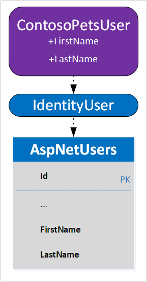

By default, Identity represents a user with an `IdentityUser` class. One way to extend the data being captured at registration time is to create a class deriving from `IdentityUser`. In this unit, a derived class named `ContosoPetsUser` is created. `ContosoPetsUser` will contain properties to store the user's first and last name.



UI changes are also required to collect the additional user profile information. The following steps explain the process of collecting a first and last name for the registered user.

## Customize the user account data

1. Add the user registration files to be modified to the project:

    ```dotnetcli
    dotnet aspnet-codegenerator identity \
        --dbContext ContosoPetsAuth \
        --files "Account.Manage.EnableAuthenticator;Account.Manage.Index;Account.Register" \
        --userClass ContosoPetsUser \
        --force
    ```

    In the preceding command:

    * The `--dbContext` option provides the tool with knowledge of the existing `DbContext`-derived class named `ContosoPetsAuth`.
    * The `--files` option specifies a semicolon-delimited list of unique files to be added to the *Identity* area.
    * The `--userClass` option results in the creation of an `IdentityUser`-derived class named `ContosoPetsUser`.
    * The `--force` option causes existing files in the *:::no-loc text="Identity":::* area to be overwritten.

    > [!TIP]
    > Run the following command from the project root to view valid values for the `--files` option:
    >
    > ```dotnetcli
    > dotnet aspnet-codegenerator identity --listFiles
    > ```

    The following files are added to the *:::no-loc text="Areas/Identity":::* directory:

    * **:::no-loc text="Data/":::**
        * *:::no-loc text="ContosoPetsUser.cs":::*
    * **:::no-loc text="Pages/":::**
        * *:::no-loc text="_ViewImports.cshtml":::*
        * **:::no-loc text="Account/":::**
            * *:::no-loc text="_ViewImports.cshtml":::*
            * *:::no-loc text="Register.cshtml":::*
            * *:::no-loc text="Register.cshtml.cs":::*
            * **:::no-loc text="Manage/":::**
                * *:::no-loc text="_ManageNav.cshtml":::*
                * *:::no-loc text="_ViewImports.cshtml":::*
                * *:::no-loc text="EnableAuthenticator.cshtml":::*
                * *:::no-loc text="EnableAuthenticator.cshtml.cs":::*
                * *:::no-loc text="Index.cshtml":::*
                * *:::no-loc text="Index.cshtml.cs":::*
                * *:::no-loc text="ManageNavPages.cs":::*

    Additionally, the *:::no-loc text="Data/ContosoPetsAuth.cs":::* file, which existed before running the preceding command, was overwritten because the `--force` option was used. The `ContosoPetsAuth` class declaration now references the newly created user type of `ContosoPetsUser`:

    ```csharp
    public class ContosoPetsAuth : IdentityDbContext<ContosoPetsUser>
    ```

    The *:::no-loc text="EnableAuthenticator":::* Razor page was scaffolded, though it won't be modified until later in the module.

1. In the `Configure` method of *:::no-loc text="Areas/Identity/IdentityHostingStartup.cs":::*, the call to `AddDefaultIdentity` needs to be made aware of the new Identity user type. Incorporate the following highlighted change, and save the file.

<!-->
    [!code-csharp[](../code/areas/identity/identityhostingstartup.cs?name=snippet_configureadddefaultidentity&highlight=1)]
-->
1. Update *:::no-loc text="Pages/Shared/_LoginPartial.cshtml":::* to incorporate the following highlighted changes. Save your changes.

    [!code-cshtml[](../code/pages/shared/4-loginpartial.cshtml?range=1-6&highlight=2-4)]

    The preceding changes update the user type passed to both `SignInManager<T>` and `UserManager<T>` in the `@inject` directives. Instead of the default `IdentityUser` type, `ContosoPetsUser` user is now referenced. The `@using` directive was added to resolve the `ContosoPetsUser` references.

    *:::no-loc text="Pages/Shared/_LoginPartial.cshtml":::* is physically located outside of the *:::no-loc text="Identity":::* area. Consequently, the file wasn't updated automatically by the scaffold tool. The appropriate changes had be made manually.

    > [!TIP]
    > As an alternative to manually editing the *:::no-loc text="_LoginPartial.cshtml":::* file, it can be deleted prior to running the scaffold tool. The *:::no-loc text="_LoginPartial.cshtml":::* file will be recreated with references to the new `ContosoPetsUser` class.

1. Update *:::no-loc text="Areas/Identity/Data/ContosoPetsUser.cs":::* to support storage and retrieval of the additional user profile data. Make the following changes:
    1. Add the `FirstName` and `LastName` properties:

        [!code-csharp[](../code/areas/identity/data/contosopetsuser.cs?highlight=3-5,7-9)]

        The properties in the preceding snippet represent additional columns to be created in the underlying `AspNetUsers` table. Both properties are required and are therefore annotated with the `[Required]` attribute. The `[Required]` attribute also results in a non-null constraint in the underlying database table column. Additionally, the `[MaxLength]` attribute indicates that a maximum length of 100 characters is allowed. The underlying table column's data type is defined accordingly.

    1. Add the following `using` statement to the top of the file. Save your changes.

        ```csharp
        using System.ComponentModel.DataAnnotations;
        ```

        The preceding code resolves the data annotation attributes applied to the `FirstName` and `LastName` properties.

## Update the database

1. Create and apply an EF Core migration to update the underlying data store:

    ```dotnetcli
    dotnet ef migrations add UpdateUser && \
        dotnet ef database update
    ```

    The `UpdateUser` EF Core migration applied a DDL change script to the `AspNetUsers` table's schema. Specifically, `FirstName` and `LastName` columns were added, as seen in the following migration output excerpt:

    ```console
    info: Microsoft.EntityFrameworkCore.Database.Command[20101]
        Executed DbCommand (37ms) [Parameters=[], CommandType='Text', CommandTimeout='30']
        ALTER TABLE [AspNetUsers] ADD [FirstName] nvarchar(100) NOT NULL DEFAULT N'';
    info: Microsoft.EntityFrameworkCore.Database.Command[20101]
        Executed DbCommand (36ms) [Parameters=[], CommandType='Text', CommandTimeout='30']
        ALTER TABLE [AspNetUsers] ADD [LastName] nvarchar(100) NOT NULL DEFAULT N'';
    ```

    Complete the following steps to analyze the impact of the `UpdateUser` EF Core migration on the `AspNetUsers` table's schema. You'll gain an understanding of the impact extending the Identity data model has on the underlying data store.

2. Run the following command to view the table schema:

    ```bash
    db -Q "SELECT COLUMN_NAME, IS_NULLABLE, DATA_TYPE, CHARACTER_MAXIMUM_LENGTH AS MAX_LENGTH FROM INFORMATION_SCHEMA.COLUMNS WHERE TABLE_NAME='AspNetUsers'" -Y 20
    ```

    The following output displays:

    ```console
    COLUMN_NAME          IS_NULLABLE DATA_TYPE            MAX_LENGTH
    -------------------- ----------- -------------------- -----------
    Id                   NO          nvarchar                     450
    UserName             YES         nvarchar                     256
    NormalizedUserName   YES         nvarchar                     256
    Email                YES         nvarchar                     256
    NormalizedEmail      YES         nvarchar                     256
    EmailConfirmed       NO          bit                         NULL
    PasswordHash         YES         nvarchar                      -1
    SecurityStamp        YES         nvarchar                      -1
    ConcurrencyStamp     YES         nvarchar                      -1
    PhoneNumber          YES         nvarchar                      -1
    PhoneNumberConfirmed NO          bit                         NULL
    TwoFactorEnabled     NO          bit                         NULL
    LockoutEnd           YES         datetimeoffset              NULL
    LockoutEnabled       NO          bit                         NULL
    AccessFailedCount    NO          int                         NULL
    FirstName            NO          nvarchar                     100
    LastName             NO          nvarchar                     100
    ```

    The `FirstName` and `LastName` properties in the `ContosoPetsUser` class correspond to the `FirstName` and `LastName` columns in the preceding output. A data type of `nvarchar(100)` was assigned to each of the two columns because of the `[MaxLength(100)]` attributes. The non-null constraint was added because of the `[Required]` attributes. Existing rows show empty strings in the new columns.

3. Run the following command to view the primary key for the table:

    ```bash
    db -i $setupWorkingDirectory/list-aspnetusers-pk.sql -Y 15
    ```

    The following output shows that the `Id` column is the unique identifier for a user account:

    ```console
    Table           Column          Primary key
    --------------- --------------- ---------------
    AspNetUsers     Id              PK_AspNetUsers
    ```

## Customize the user registration form

1. In *:::no-loc text="Areas/Identity/Pages/Account/Register.cshtml":::*, add the following highlighted markup:

    [!code-cshtml[](../code/areas/identity/pages/account/4-register-firstandlastname.cshtml?range=1-19&highlight=5-14)]

    With the preceding markup, **First name** and **Last name** text boxes are added to the user registration form.

1. In *:::no-loc text="Areas/Identity/Pages/Account/Register.cshtml.cs":::*, add support for the name text boxes.
    1. Add the `FirstName` and `LastName` properties to the `InputModel` nested class:

        [!code-csharp[](../code/areas/identity/pages/account/4-register-firstandlastname.cshtml.cs?name=snippet_inputmodel&highlight=3-6,8-11)]

        The `[Display]` attributes define the label text to be associated with the text boxes.

    1. Modify the `OnPostAsync` method to set the `FirstName` and `LastName` properties on the `ContosoPetsUser` object. Make the following highlighted changes:

        [!code-csharp[](../code/areas/identity/pages/account/4-register-firstandlastname.cshtml.cs?name=snippet_onpostasync&highlight=6-12)]

        The preceding change sets the `FirstName` and `LastName` properties to the user input from the registration form.

## Customize the site header

Update *:::no-loc text="Pages/Shared/_LoginPartial.cshtml":::* to display the first and last name collected during user registration. The highlighted lines in the following snippet are needed:

[!code-cshtml[](../code/pages/shared/4-loginpartial.cshtml?highlight=9-10,13)]

## Customize the profile management form

1. In *:::no-loc text="Areas/Identity/Pages/Account/Manage/Index.cshtml":::*, add the following highlighted markup. Save your changes.

    [!code-cshtml[](../code/areas/identity/pages/account/manage/4-index-firstandlastname.cshtml?range=1-16&highlight=3-12)]

1. In *:::no-loc text="Areas/Identity/Pages/Account/Manage/Index.cshtml.cs":::*, make the following changes to support the name text boxes.
    1. Add the `FirstName` and `LastName` properties to the `InputModel` nested class:

        [!code-csharp[](../code/areas/identity/pages/account/manage/4-index.cshtml.cs?name=snippet_firstandlastnameinputmodel&highlight=3-6,8-11)]

    1. Incorporate the highlighted changes in the `LoadAsync` method:

        [!code-csharp[](../code/areas/identity/pages/account/manage/4-index.cshtml.cs?name=snippet_loadasync&highlight=10-12)]

        The preceding code supports retrieving the first and last names for display in the corresponding text boxes of the profile management form.

    1. Incorporate the highlighted changes in the `OnPostAsync` method. Save your changes.

        [!code-csharp[](../code/areas/identity/pages/account/manage/4-index.cshtml.cs?name=snippet_onpostasync&highlight=15-17)]

        The preceding code supports updating the first and last names in the database's `AspNetUsers` table.

## Build, deploy, and test

1. [!INCLUDE[dotnet build command](../../includes/dotnet-build-no-restore-command.md)]

1. [!INCLUDE[az webapp up command](../../includes/az-webapp-up-command.md)]

1. In your browser, navigate to the app. Select **Logout** if you're still logged in.

    > [!TIP]
    > If you need the URL to your app, display it with the following command:
    >
    > ```bash
    > echo $webAppUrl
    > ```

1. Select **Register** and use the updated form to register a new user.

    > [!NOTE]
    > The validation constraints on the **First name** and **Last name** fields reflect the data annotations on the `FirstName` and `LastName` properties of `InputModel`.

    After registering, you're redirected to the homepage. The app's header now contains **Hello, [First name] [Last name]!**.

1. Run the following command to confirm that the first and last names are stored in the database:

    ```bash
    db -Q "SELECT UserName, Email, FirstName, LastName FROM dbo.AspNetUsers" -Y 25
    ```

    A variation of the following output displays:

    ```console
    UserName                  Email                     FirstName                 LastName
    ------------------------- ------------------------- ------------------------- -------------------------
    kai.klein@contoso.com     kai.klein@contoso.com
    jana.heinrich@contoso.com jana.heinrich@contoso.com Jana                      Heinrich
    ```

    The first user registered prior to adding `FirstName` and `LastName` to the schema. Consequently, the associated `AspNetUsers` table record doesn't have data in those columns.

## Test the changes to the profile management form

1. In the web app, log in with the first user you created.

1. Click the **Hello, !** link to navigate to the profile management form.

    > [!NOTE]
    > The link doesn't display correctly because the `AspNetUsers` table's row for this user doesn't contain values for `FirstName` and `LastName`.

1. Enter valid values for **First name** and **Last name**. Select **Save**.

    The app's header updates to **Hello, [First name] [Last name]!**.
